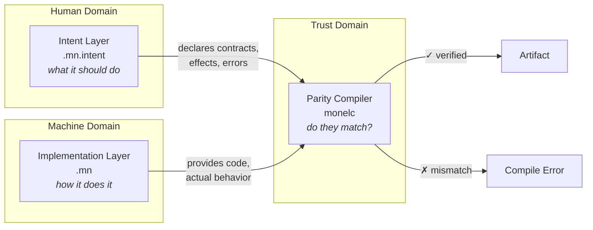
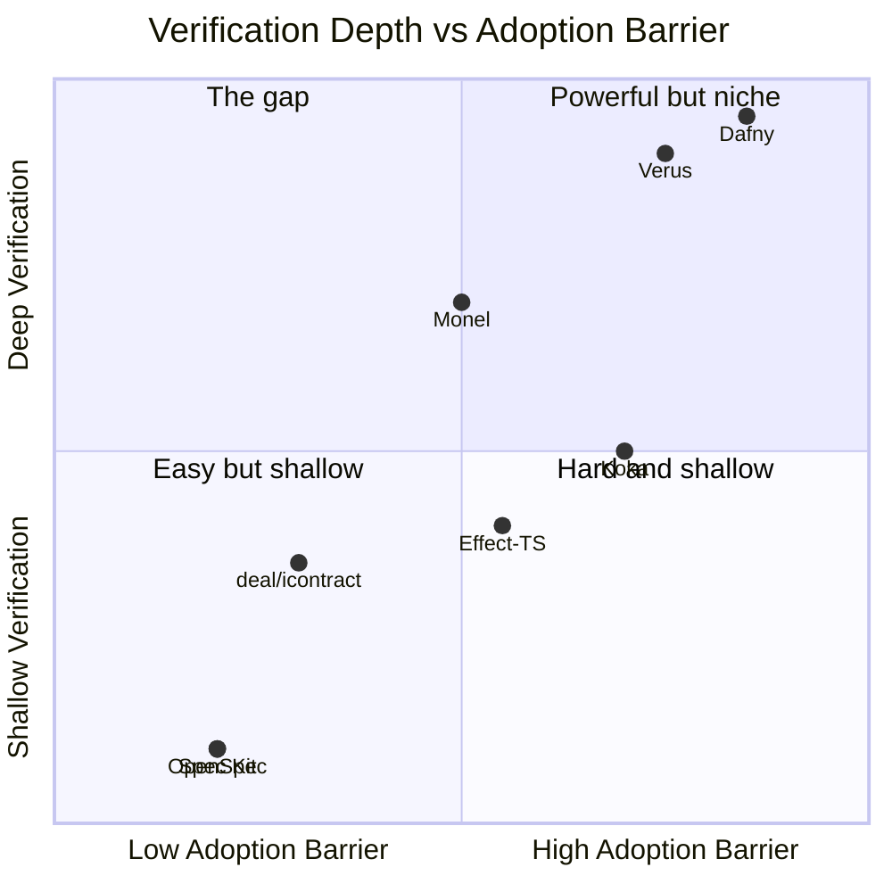
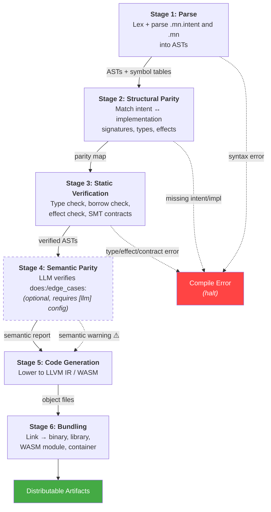
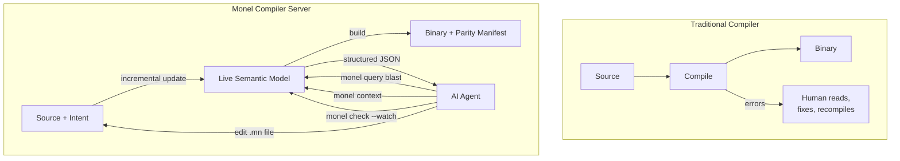

# 1. Overview

**Version:** 0.1.0-draft
**Status:** Working Draft
**Domain:** monel.io
**Date:** 2026-03-12

---

## 1.1 Purpose of This Document

This chapter defines the philosophy, design principles, and architectural structure of the Monel programming language. It establishes the conceptual foundation upon which the remaining specification chapters build. Implementors, tool authors, and language users should treat this chapter as the authoritative source for understanding Monel's design rationale and system boundaries.

---

## 1.2 Brand and Artifacts

| Artifact | Value |
|---|---|
| Language name | Monel |
| Domain | monel.io |
| CLI binary | `monel` |
| Compiler binary | `monelc` |
| Implementation files | `.mn` |
| Intent files | `.mn.intent` |
| Test files | `.mn.test` |
| Project manifest | `monel.project` |
| Policy file | `monel.policy` |
| Team config | `monel.team` |

A Monel project is a directory containing a `monel.project` file. All paths in the project are relative to this root. The compiler discovers `.mn`, `.mn.intent`, and `.mn.test` files by walking the directory tree from the project root.

---

## 1.3 The Problem

Programming languages optimize for the human-as-author workflow: the developer writes code, and the compiler checks it.

As AI agents take on more code generation, review becomes a larger part of the development workflow. Several problems emerge when the reviewer cannot easily verify whether code matches its intended behavior:

1. **Rubber-stamping.** Code that is syntactically valid and passes tests may be approved without deep understanding. Defects can accumulate silently.

2. **Tracing burden.** Reviewers may need to reverse-engineer intent from code — reading hundreds of lines to answer "does this do what I wanted?" This scales poorly.

3. **Specification drift.** When intent lives only in natural language (comments, tickets, chat messages), there is no mechanism to detect divergence between specification and implementation.

4. **Auditability.** Without a structured link between what was requested and what was produced, compliance and security review rely on manual inspection.

These problems share a root cause: mainstream languages conflate *what the program should do* with *how it does it* into a single artifact.

---

## 1.4 The Core Insight

Monel separates **intent** from **implementation**, and the compiler enforces the boundary between them.



- **Intent** is what the program should do: its contracts, invariants, error behaviors, side effects, and purpose. Intent is written and reviewed by humans. It is the specification layer.

- **Implementation** is how the program does it: the algorithms, data structures, control flow, and expressions that realize the intent. The language does not mandate authorship. It is the execution layer.

- **Parity** — the parity compiler verifies that implementation corresponds to intent. It checks structural alignment, type-level contracts, effect correctness, error exhaustiveness, and (optionally, with an LLM backend) semantic correspondence.

The compiler enforces the intent/implementation boundary. An implementation file without a corresponding intent file is a compilation error. An intent declaration without a matching implementation is a compilation error. Mismatches between declared and actual effects are compilation errors.

Because the compiler verifies parity, reviewers can focus on intent and parity reports rather than tracing through implementation line by line.

### 1.4.1 Competitive Landscape and Positioning

The problem Monel addresses — verifying that code does what a specification says — is approached from several directions today.

#### Spec-Driven Development Tools (OpenSpec, GitHub Spec Kit, Kiro, Tessl)

The SDD movement has produced 30+ tools with over 100k combined GitHub stars. OpenSpec (31k stars, YC-backed), GitHub Spec Kit (77k stars), AWS Kiro, and Tessl all organize specifications as markdown documents that AI coding agents are instructed to follow.

**What they do:** Structure how AI agents receive and process specifications. Create planning workflows (propose, apply, archive). Generate task breakdowns from specs.

**What they do not do:** Verify that the resulting code matches the specification. Martin Fowler's team confirmed this directly: agents frequently ignored instructions and created duplicates despite elaborate spec documentation. The Fowler analysis identified a risk of "false sense of control" despite elaborate workflows.

These tools validate the demand — developers want spec-first AI workflows — but they share a fundamental limitation: **enforcement is by convention, not by compiler**. An agent can ignore a spec, generate code that contradicts it, or silently drift from it over time. No tool in the SDD stack detects this divergence.

#### Design-by-Contract Libraries (deal, icontract, Rust `contracts`)

Languages like Python and Rust have libraries that add preconditions, postconditions, and invariants to functions. Python's `deal` (875 stars) includes a static linter. Python's `icontract` integrates with CrossHair for SMT-based symbolic verification. Rust's `contracts` crate (29 stars) provides `#[requires]`/`#[ensures]` macros.

Rust is adding official contract support (MCP-759) to annotate unsafe stdlib functions — but only for `unsafe` code, not general specification enforcement.

**What they do:** Add runtime assertions for pre/post conditions. Some offer partial static checking.

**What they do not do:** Verify behavioral parity between a specification and implementation. They verify individual assertions, not "does this function do what the spec says it should do." They also do not track side effects.

#### Formal Verification Languages (Dafny, Verus)

Dafny (3.3k stars, Microsoft Research) and Verus (2.4k stars) provide true static verification — they prove code correctness for all possible inputs using SMT solvers.

**What they do:** Prove that code satisfies formal specifications. Verus works on a subset of Rust. Dafny compiles to C#, Go, Python, Java. Both use Z3 for proof.

**What they do not do:** Scale to everyday development. Both require heavy annotation (proof obligations, ghost code, loop invariants). Verus supports only a Rust subset. Dafny is a separate language. Neither has achieved mainstream adoption. Martin Kleppmann's influential thesis (Dec 2025) argues AI will eventually make formal verification mainstream, but this has not happened yet.

#### Effect Systems (Effect-TS, Koka, Effekt)

Effect-TS (13.6k stars) adds algebraic effects to TypeScript. Koka (3.8k stars, Microsoft Research) is a research language with first-class effects. Effekt is a research language from academia.

**What they do:** Track side effects at the type level. Koka has the most complete effect system of any language.

**What they do not do:** Work with existing mainstream languages. Effect-TS requires rewriting all code in its monadic style. Koka is explicitly "not ready for production use." Rust closed its effect system RFC (#1631) with no follow-up. Nobody has successfully added a real effect system to an existing language as a tool or library.

#### AI Code Review Tools (Qodo, Augment Code Intent)

Qodo (formerly CodiumAI) and Augment Code Intent use LLMs to review code, including checking against requirements. Augment's "Intent" product uses multi-agent orchestration with a verifier agent.

**What they do:** LLM-based probabilistic code review. Check code against specs using AI judgment.

**What they do not do:** Provide deterministic verification. An LLM reviewer can miss issues, hallucinate passes, or produce different results on different runs.

#### Where Monel Sits



The SDD tools occupy the bottom-left: easy to adopt, no real verification. Formal verification tools occupy the top-right: deep verification, high barrier. Monel targets the gap: **the compiler verifies meaningfully without demanding formal methods expertise from the developer**.

#### Why a Language, Not a Tool

Three capabilities suggest a language rather than a tool:

1. **Effect tracking needs compiler integration.** Rust closed its effect system RFC. Effect-TS requires rewriting all code in monadic style. Adding effects to an existing language as a library has not been demonstrated successfully.

2. **Spec-implementation correspondence needs compilation constraints.** A linter can check annotations, but enforcing that every public function has a matching specification, that signatures agree, and that declared effects cover actual effects requires compiler-level enforcement.

3. **Tiered verification is a syntax decision.** Lightweight `does:`/`fails:` by default, `@strict` with SMT where needed — this graduated approach requires the verification tier to be part of the declaration syntax.

The closest related project is Verus (formal verification for Rust). Verus proves properties of existing Rust code for critical sections; Monel enforces spec-implementation correspondence as a default workflow.

#### Comparison Table

| | SDD Tools | DbC Libraries | Formal Verification | Monel |
|---|---|---|---|---|
| **Spec format** | Markdown | Decorators/macros | Proof annotations | Typed intent syntax |
| **Enforcement** | Convention | Runtime assertions | Static proof | Compiler-enforced parity |
| **Effect tracking** | None | `@pure` only (deal) | N/A | First-class effect system |
| **Verification depth** | None | Pre/post conditions | Full correctness proof | Structural + optional semantic |
| **Annotation burden** | Low | Medium | High | Low (lightweight) to Medium (@strict) |
| **Works with existing languages** | Yes | Yes | Partial (Verus/Rust) | No |
| **Deterministic** | N/A | Yes (runtime) | Yes (static) | Yes (Stages 1-3), advisory (Stage 4) |
| **AI-agent optimized** | Workflow only | No | No | Query oracle, context gathering, edit-compatible errors |

Convention-based SDD tools are Monel's natural on-ramp: teams already using spec-first workflows are the ideal early adopters.

---

## 1.5 Target Domain

Monel is a general-purpose systems programming language. Its performance target is parity with Rust (zero-cost abstractions, no garbage collector, deterministic resource management). Its ergonomics target is parity with Python (minimal boilerplate, type inference within functions, indentation-based scope, readable syntax).

Monel compiles to native code via LLVM, to WebAssembly, and (in future) to other targets. The implementation language for the Monel toolchain is Rust.

### 1.5.1 First Projects

The language will be validated by building three substantial applications:

1. **Terminal emulator** — a replacement for kitty, exercising GPU rendering, PTY management, and low-level system interaction.
2. **Terminal multiplexer** — a replacement for zellij, exercising layout management, IPC, plugin systems, and session persistence.
3. **Text editor** — a replacement for vim, exercising modal input handling, buffer management, syntax highlighting, and extensibility.

These projects are chosen because they demand systems-level performance, have rich UI requirements, and are complex enough to stress-test the intent/implementation separation at scale.

---

## 1.6 The Three Layers

Monel's architecture consists of three co-equal layers. No layer is subordinate to another; each has a distinct purpose, a distinct audience, and distinct tooling.

### 1.6.1 Intent Layer (`.mn.intent`)

**Audience:** Humans — product managers, architects, security engineers, designers, SREs.

**Purpose:** Declare *what* each module, function, type, and component should do, without specifying *how*.

**Contents:**
- Function contracts: purpose (`does:`), error variants (`fails:`), side effects (`effects:`), edge cases (`edge_cases:`)
- Formal contracts (when `@strict`): preconditions (`requires:`), postconditions (`ensures:`), invariants (`invariant:`), panic freedom (`panics: never`), complexity bounds (`complexity:`)
- Type specifications: refinement types, algebraic data type shapes, distinct type declarations
- Module specifications: exported API surface, internal boundaries
- Diagrammatic specifications: state machines, data flows, protocol sequences
- Domain-specific specifications: layout intent (designers), deploy intent (SREs), build intent (DevOps), interaction intent (designers), theme intent (designers)

**Syntax:** Declarative, keyword-driven, indentation-based. Designed to be readable by non-programmers. See Chapter 2 (Intent Syntax).

**Authorship:** Written and reviewed by humans. LLMs may propose intent, but a human must approve it. The `monel generate` command never modifies `.mn.intent` files without explicit human confirmation.

### 1.6.2 Implementation Layer (`.mn`)

**Audience:** LLMs (primary generators), engineers (reviewers and occasional authors).

**Purpose:** Express *how* each module, function, type, and component works — the executable logic.

**Contents:**
- Module declarations and imports
- Function definitions with `@intent("name")` cross-references
- Type definitions (structs, enums, traits)
- Expression-oriented bodies: `let` bindings, `match` expressions, `if`/`else`, function calls, closures
- `unsafe` blocks, `async`/`await`, error propagation via `try`

**Syntax:** Hybrid indentation-based syntax. Minimal delimiters. One canonical way to express each construct. Edit-friendly: function signatures are unique anchors, no wildcard imports, no ambiguous formatting. See Chapter 3 (Implementation Syntax).

**Authorship:** The language makes no distinction based on authorship — all implementation is verified against intent equally. `monel generate` can produce implementation from intent, but hand-written code is treated identically.

### 1.6.3 Parity Compiler (`monelc`)

**Audience:** The build system, CI pipelines, and (through its reports) humans.

**Purpose:** Verify that implementation corresponds to intent. Produce executable artifacts.

**Mechanism:** A six-stage compilation pipeline (see Section 1.7). The compiler is the source of truth for whether an implementation satisfies its intent. It replaces the human burden of tracing generated code with automated, reproducible verification.

**Output:**
- Parity reports: per-function and per-module summaries of verification results
- Diagnostics: edit-friendly error messages with precise source locations in both `.mn.intent` and `.mn` files
- Executable artifacts: native binaries, WASM modules, libraries

---

## 1.7 The Six-Stage Pipeline

The Monel compiler (`monelc`) processes a project through six sequential stages. Each stage may produce diagnostics. Compilation halts at the first stage that produces an error.



### Stage 1: Parse

**Input:** `.mn.intent` files, `.mn` files, `.mn.test` files.

**Operation:** Lexical analysis and parsing of all source files into abstract syntax trees (ASTs). Intent files produce Intent ASTs. Implementation files produce Implementation ASTs. Test files produce Test ASTs.

**Verification:**
- Syntactic correctness of all files
- Well-formedness of indentation structure
- Valid use of keywords and operators

**Output:** Typed ASTs for all source files. Symbol tables for names, types, and cross-references.

**Failure mode:** Syntax errors with line/column locations. Suggestions for common mistakes.

### Stage 2: Structural Parity

**Input:** Intent ASTs, Implementation ASTs.

**Operation:** Verify one-to-one correspondence between intent declarations and implementation definitions.

**Verification:**
- Every `intent fn` has a matching `fn` with identical signature (name, parameters, return type)
- Every `fn` with `@intent("name")` has a matching `intent fn` declaration
- Every `intent type` has a matching type definition
- Every `intent module` has a matching module with correct exports
- Every `intent state_machine` has corresponding implementation types and transition functions
- No orphan intents (intent without implementation)
- No orphan implementations (implementation without intent, unless explicitly marked `@no_intent`)

**Output:** A structural parity map linking each intent declaration to its implementation counterpart.

**Failure mode:** "Missing implementation for intent `authenticate`" or "No intent found for function `helper_fn` — add intent or mark `@no_intent`."

### Stage 3: Static Verification

**Input:** Implementation ASTs, structural parity map.

**Operation:** Type checking, effect verification, error exhaustiveness checking, and (for `@strict` declarations) SMT-based contract verification.

**Verification:**
- Full type checking of implementation code
- Effect verification: actual side effects in function bodies must be a subset of declared `effects:` in intent
- Error exhaustiveness: every error variant declared in `fails:` or `errors:` must be producible by the implementation, and the implementation must not produce undeclared error variants
- Borrow checking and ownership verification (Rust-equivalent lifetime analysis)
- `@strict` contracts: `requires:` and `ensures:` clauses are translated to SMT queries and verified via Z3 or equivalent solver
- `panics: never` verification: compiler proves that no code path in the function can panic (no unchecked array access, no unwrap on fallible values, no integer overflow in default mode)
- `invariant:` verification: type invariants hold at all public API boundaries
- Refinement type verification: values assigned to refinement types satisfy their predicates

**Output:** Verified implementation ASTs. Diagnostic report of all contract verification results.

**Failure mode:** Type errors, effect violations, missing error variants, unsatisfiable contracts, potential panics in `panics: never` functions.

### Stage 4: Semantic Parity (LLM-Assisted, Optional)

**Input:** Intent ASTs (specifically `does:` and `edge_cases:` clauses), Implementation ASTs, structural parity map.

**Operation:** Use a configured LLM to verify that the semantic meaning of the implementation corresponds to the natural-language descriptions in `does:` and `edge_cases:` clauses.

**Activation:** This stage runs only when an LLM backend is configured in the project manifest under `[llm]`. It is skipped entirely when:
- No `[llm]` section is present in `monel.project`
- The `--no-semantic` flag is passed to `monel build`
- The build is running in offline mode

**Verification:**
- For each function with a `does:` clause, the LLM is prompted with the function's implementation and asked whether the implementation fulfills the stated purpose
- For each function with `edge_cases:` entries, the LLM verifies that the implementation handles the described edge cases
- The LLM's responses are structured (not free-form) and parsed into pass/warn/fail verdicts
- Confidence scores below a configurable threshold produce warnings rather than errors

**Configuration (in `monel.project`):**
```
[llm]
provider = "anthropic"            # or "openai", "local", etc.
model = "claude-sonnet-4-20250514"
semantic_threshold = 0.8          # minimum confidence for pass
max_concurrent = 4                # parallel verification requests
cache = true                      # cache results for unchanged pairs
```

**Output:** Semantic parity report: per-function pass/warn/fail with LLM-generated explanations.

**Failure mode:** Semantic mismatch warnings or errors. Always advisory in nature — the LLM is a second opinion, not a proof. Projects may configure semantic failures as warnings or errors.

**Design principle:** The LLM is always optional. A Monel project must compile and verify correctly without any LLM. Stage 4 adds a layer of semantic assurance but is never required for correctness. Core compilation (Stages 1-3, 5-6) works fully offline.

### Stage 5: Code Generation (AI-Native)

**Input:** Verified Implementation ASTs, intent ASTs, effect analysis, parity map.

Monel's code generation stage has access to the full intent layer — both the implementation code and the intent declarations. This enables intent-aware optimizations.

**Operation:** Lower the verified ASTs to the target backend, guided by intent metadata.

**Targets:**
- **Cranelift** — for fast debug builds and development iteration
- **LLVM IR** — for optimized release builds on all LLVM-supported architectures
- **WASM** — for browser and edge deployment

**Standard operations:**
- Monomorphization of generic functions
- Deterministic resource cleanup insertion (drop glue)
- Optimization passes (configurable via build profiles)

**Intent-guided operations (unique to Monel):**

- **`panics: never` elimination.** When Stage 3 has proven a function panic-free, codegen removes all panic infrastructure (unwinding tables, panic formatting, abort paths). The proof has already been done — codegen exploits it. This produces smaller, faster binaries for verified functions.

- **`complexity:` bound enforcement.** When a function declares `complexity: O(n)`, the optimizer rejects transformations that would violate the bound (e.g., an optimization that introduces an inner loop). The complexity contract constrains the optimizer, not just the programmer.

- **Effect-aware optimization.** The effect system enables optimizations that require whole-program knowledge in traditional compilers:
  - `effects: [pure]` → automatic memoization candidates, safe to parallelize, safe to reorder or eliminate if result is unused
  - `effects: [Db.read]` (read-only) → safe to execute concurrently with other read-only calls to the same resource
  - `effects: [Crypto.verify]` → security-sensitive: disable timing-dependent optimizations to prevent side-channel attacks (constant-time code generation)
  - Effect budgets (e.g., `Db.write max_per_second = 1000`) → compile into lightweight runtime instrumentation (rate limiters, counters, circuit breakers injected by the compiler)

- **Intent-tagged debug info.** In addition to standard debug info (source locations, variable names), Monel emits intent-mapped debug info: which `does:` description each instruction range corresponds to, which `@strict` contract governs each code path, and which effect is active at each point. This enables AI-native debugging (Section 1.7.1).

**Output:** Target-specific object files or bytecode, plus intent-mapped debug metadata.

### Stage 6: Bundling

**Input:** Object files, project manifest, deploy intent (if present), parity verification results.

**Operation:** Link object files into final artifacts. Package for distribution with verification metadata.

**Artifacts:**
- Executable binaries
- Static and dynamic libraries
- WASM modules with JavaScript bindings
- Container images (when deploy intent specifies containerization)
- **Parity manifest** — a signed, machine-readable record of all verification results embedded in the artifact:

```json
{
  "monel_version": "0.1.0",
  "build_hash": "sha256:abc123...",
  "intent_hash": "sha256:def456...",
  "parity": {
    "structural": "pass",
    "static_verification": "pass",
    "semantic": {"status": "pass", "model": "claude-sonnet-4-20250514", "cached": true},
    "strict_functions": 12,
    "smt_proofs": 12,
    "panic_free_functions": 8,
    "effect_budgets": "all within limits"
  }
}
```

This manifest is a compliance artifact. Auditors can verify "this binary was built from code that passed all parity checks" without reading source code. CI/CD pipelines can gate deployments on parity status.

**Output:** Distributable artifacts in the `target/` directory, each containing an embedded or sidecar parity manifest.

### 1.7.1 AI-Native Compiler Architecture

Traditional compilers are batch processors: source files in, binary out, done. Monel's compiler is designed as a **persistent semantic server** that AI coding tools interact with continuously.



**Key architectural properties:**

**1. The compiler maintains a live semantic model.**

After initial compilation, the compiler keeps the full AST, type information, effect analysis, parity map, and dependency graph in memory. Queries (`monel query`, `monel context`) read from this model without recompilation. Edits trigger incremental updates — only the affected portion of the model is recomputed.

The compiler and the query server are the same process, sharing the same data structures.

**2. Speculative analysis without compilation.**

An AI agent can ask "what would happen if I changed this?" without actually making the change:

```bash
monel query blast --fn authenticate --hypothetical "return_type: Result<Token, AuthError>"
```

The compiler evaluates the hypothetical against the live model and returns the impact — broken callers, parity violations, effect changes — in milliseconds. The agent uses this to plan changes before making them, reducing the edit-compile-fix cycle from minutes to a single query.

**3. Intent-mapped diagnostics.**

When a runtime error occurs, Monel's debug info maps the crash site back to intent:

```
PANIC at src/auth.mn:58 (fn authenticate @intent("authenticate"))
  INTENT: "verify credentials against database and return session"
  CONTRACT: ensures ok => result.user_id > 0
  VIOLATION: result.user_id was 0
  PARITY: @strict ensures clause not satisfied

  RELEVANT INTENT CONTEXT:
    errors:
      InvalidCreds: "invalid username or password"
      Locked: "account locked after 5+ failed attempts"
```

An AI debugger receives structured context: which intent was violated, which contract failed, and what the function was supposed to do.

**4. Effect-aware hot-swap.**

During development (`monel dev`), the compiler uses effect information to determine which functions can be safely hot-swapped without restarting the process:

| Effect | Hot-swap safety |
|--------|----------------|
| `pure` | Always safe — no state, no side effects |
| `Db.read` | Safe if no cursor/connection is mid-transaction |
| `Fs.write` | Safe if no file handle is open in the function |
| `unsafe` | **Never auto-swapped** — requires explicit confirmation |

The compiler generates swap stubs for safe functions and blocks on unsafe ones, using the effect system as a static safety classifier.

**5. Parity-preserving builds.**

The parity manifest embedded in every artifact creates a chain of trust from intent through compilation to deployment:

```
Intent (.mn.intent)
  ↓  [Stage 2: structural match proven]
Implementation (.mn)
  ↓  [Stage 3: types, effects, contracts verified]
  ↓  [Stage 4: semantic match confirmed (optional)]
Binary (with embedded parity manifest)
  ↓  [manifest: all checks passed, signed]
Deployment (parity manifest checked by CI/CD gate)
```

The build system embeds these artifacts in each binary, so auditors can trace any binary back to its verified specification.

---

## 1.8 Design Principles

The following principles govern Monel's syntax and semantics. They are binding constraints on the language design. When a design decision could go multiple ways, these principles determine the outcome.

### 1.8.1 One Canonical Form

Every construct in Monel has exactly one syntactic representation. There is no syntactic sugar. There are no alternative spellings. There are no shorthand forms.

**Rationale:** LLMs produce more consistent code when the target language has fewer valid representations of the same concept. Reviewers can rely on pattern recognition when syntax is predictable. Diff-based review is more reliable when formatting is deterministic.

**Examples of what this prohibits:**
- No `unless` (use `if not`)
- No implicit returns (all functions use explicit expression-as-last-value, but the form is always the same)
- No operator overloading beyond trait-defined operators
- No method chaining syntax alternatives (always dot notation)

### 1.8.2 Indentation-Based Scope

Scope is defined by indentation, using exactly 2 spaces per level. There are no braces, no `end` keywords, no `begin`/`end` blocks.

**Rationale:** Indentation-based scope removes formatting choices and reduces visual noise. The 2-space indent is chosen for density — systems code tends to be deeply nested, and 4-space indents consume too much horizontal space.

**Rules:**
- Tabs are a syntax error
- Mixed indentation is a syntax error
- The formatter (`monel fmt`) is authoritative — it produces the one canonical indentation
- Blank lines within a block do not reset indentation
- Continuation lines are indented one additional level beyond the opening line

### 1.8.3 Type Inference Within Functions

Type annotations are required on all function signatures (parameters and return types). Within function bodies, types are inferred. Programmers may add optional type annotations within bodies for documentation.

**Rationale:** Signatures are the contract boundary — they must be explicit for both human readers and the parity compiler. Bodies are implementation detail — inference reduces noise without sacrificing safety.

### 1.8.4 Edit-Friendly Syntax

The syntax is designed for programmatic editing by LLMs and tools. Specific rules support this:

- **Function signatures on one line.** A function signature is always a single line, making it a unique anchor for search and replacement. If a signature is too long for one line, the language provides a multi-line parameter block (indented under the `params:` keyword), but the `fn name` declaration is always on its own line.

- **No wildcard imports.** `use http/server {Config, serve}` — never `use http/server *`. Every imported name is explicit, making dependency analysis trivial.

- **Each `let` binding on its own line.** No multiple bindings per line. No destructuring into multiple variables on one line (destructuring uses a `let` per variable or a `match`).

- **No significant trailing commas.** Lists use newlines as separators when multi-line. Single-line lists use commas. The formatter decides which form to use based on line length.

- **Binary operators stay on the same line as the left operand.** Line breaks in expressions occur after operators, not before.

### 1.8.5 Explicit Effects

Every function declares its side effects. The compiler verifies that the implementation's actual effects are a subset of the declared effects. Effect declarations use a fixed vocabulary of effect kinds (e.g., `Fs.read`, `Fs.write`, `Net.connect`, `Db.read`, `Db.write`, `Atomic.write`, `Log.write`).

**Rationale:** Effects are a common source of surprise in code review. Making them explicit in both layers and verifying their correspondence helps catch unintended side effects early.

### 1.8.6 Errors Are Values

Monel has no exceptions. All fallible operations return `Result<T, E>`. Error types are algebraic data types. Error propagation uses the `try` expression (similar to Rust's `?` operator but as a keyword for readability and edit-friendliness).

**Rationale:** With exceptions, a function's error behavior is not apparent from its signature. Value-based errors make failure paths explicit and verifiable.

---

## 1.9 The Key Workflow

The primary development workflow in Monel proceeds as follows:

### Step 1: Human Writes Intent

A human (product manager, architect, engineer, designer, SRE) authors or modifies `.mn.intent` files. These files declare what the program should do.

```
intent fn authenticate
  does: "verifies user credentials and creates a session"
  fails: InvalidCredentials, AccountLocked, RateLimited
  effects: [Db.read, Db.write, Log.write]
  edge_cases:
    - "expired password prompts forced reset"
    - "concurrent login attempts are serialized per user"
```

### Step 2: LLM Generates Implementation

The human runs `monel generate` (or an IDE action). The compiler reads the intent files, constructs a prompt with full project context (types, dependencies, existing code, policy constraints), and sends it to the configured LLM. The LLM produces `.mn` implementation files.

```
monel generate src/auth.mn.intent
```

The generated code appears as a diff in the developer's editor or as a new `.mn` file.

### Step 3: Compiler Verifies Parity

The compiler runs the six-stage pipeline automatically (or the developer runs `monel build`). It verifies that the generated implementation matches the intent:

- Structural parity: every intent has an implementation and vice versa
- Effects: the implementation only performs declared effects
- Errors: every declared error variant is reachable and no undeclared variants exist
- Contracts: `@strict` preconditions and postconditions are SMT-verified
- Semantics (optional): the LLM confirms the implementation matches `does:` descriptions

```
monel build

  Stage 1: Parse ........................ OK
  Stage 2: Structural Parity ........... OK
  Stage 3: Static Verification ......... OK
  Stage 4: Semantic Parity ............. OK (3 functions verified)
  Stage 5: Code Generation ............. OK
  Stage 6: Bundling .................... OK

  Parity Report: 12/12 functions verified. 0 warnings.
```

### Step 4: Human Reviews Intent Diff and Parity Report

The human reviews:
1. The intent diff — did the intent change in the way they expected?
2. The parity report — did the compiler confirm that the implementation matches?

The human does **not** need to read the generated `.mn` code line-by-line. The parity report provides the assurance that would otherwise require manual tracing.

For critical changes, the human may also review the implementation code. But the default workflow trusts the compiler's parity verification, just as developers today trust the type checker without manually verifying type safety.

---

## 1.10 Roles

Monel's three-layer architecture enables different team roles to interact with the codebase through different file types. Each role has a primary artifact they author and review.

### Product Manager

**Primary artifact:** `.mn.intent` — function-level and module-level intent declarations.

**Activities:**
- Write `does:` clauses describing business requirements
- Define error variants that correspond to user-facing failure modes
- Review intent diffs to confirm changes match product requirements
- Read parity reports to confirm implementation matches intent

### Engineer

**Primary artifact:** `.mn` — implementation files.

**Activities:**
- Review LLM-generated implementation for correctness
- Write implementation manually when needed
- Write `@strict` contracts for critical code paths
- Debug parity failures
- Optimize performance-critical functions

### Architect

**Primary artifact:** `monel.policy`, `monel.team` — project-wide policy and team configuration.

**Activities:**
- Define effect budgets (which modules may use which effects)
- Define module boundaries and visibility rules
- Configure parity verification levels (which modules require `@strict`, which allow `--no-semantic`)
- Define coding standards enforced by the compiler

**`monel.policy` example:**
```
[effects]
src/auth/* = [Db.read, Db.write, Log.write, Net.connect]
src/ui/*   = [Fs.read, Log.write]
src/core/* = []

[parity]
src/auth/* = "strict"
src/ui/*   = "lightweight"

[modules]
src/auth/internal/* = { visibility = "auth" }
```

### Designer

**Primary artifact:** `.mn.intent` — layout, interaction, and theme intent declarations.

**Activities:**
- Define layout intent: regions, proportions, focus order, responsive rules
- Define interaction intent: state machines for UI flows, accessibility requirements
- Define theme intent: color palettes, contrast requirements, spacing scales
- Review generated UI code through parity reports

### Security Engineer

**Primary artifact:** `.mn.intent` with `@strict` — formal contracts for security-critical code.

**Activities:**
- Write `requires:` and `ensures:` contracts for authentication, authorization, and cryptographic code
- Define `panics: never` constraints for security-critical paths
- Write `invariant:` declarations for security-critical types
- Configure effect policies that restrict network and filesystem access
- Review parity reports for security-critical modules

### SRE / Operations

**Primary artifact:** `.mn.intent` — deploy intent, operational constraints.

**Activities:**
- Define deploy intent: replicas, health checks, circuit breakers, resource limits
- Define SLA requirements as verifiable constraints
- Define effects budgets for operational contexts
- Review parity reports for operational correctness

---

## 1.11 Compiler as Query Oracle

Beyond compilation, the Monel compiler serves as a query oracle for AI coding tools. The `monel query` and `monel context` commands provide structured information about the codebase that LLMs need to generate correct code.

### `monel query`

Returns structured information about any symbol, module, or relationship in the codebase.

```
monel query "what effects does module auth use?"
monel query "which functions have @strict contracts?"
monel query "show the intent for fn authenticate"
```

### `monel context`

Generates a context bundle for an LLM — all the information needed to generate or modify a specific piece of code.

```
monel context src/auth.mn.intent --for-generation
```

This produces a structured bundle containing:
- The intent declarations to implement
- All types referenced by the intent
- All imported modules' public APIs
- Relevant policy constraints
- Example implementations of similar functions in the project

### `monel refactor`

Coordinates a multi-file refactoring operation through intent changes.

```
monel refactor --rename-type Session AuthSession
```

This updates all intent files, then regenerates affected implementations, then verifies parity across all changes.

---

## 1.12 Summary of Invariants

The following invariants hold for every valid Monel project:

1. Every `.mn` file with public functions has a corresponding `.mn.intent` file (or functions are marked `@no_intent`).
2. Every `intent fn` declaration has a matching `fn` definition with an identical signature.
3. The actual effects of every function are a subset of its declared effects.
4. Every declared error variant is reachable in the implementation.
5. No undeclared error variants are produced by the implementation.
6. All `@strict` contracts are verified by the SMT solver before code generation.
7. All `panics: never` functions are proven panic-free.
8. All refinement type assignments satisfy their predicates.
9. The compiler produces identical output for identical input (deterministic compilation).
10. The compiler produces correct output without any LLM (LLM is always optional).
