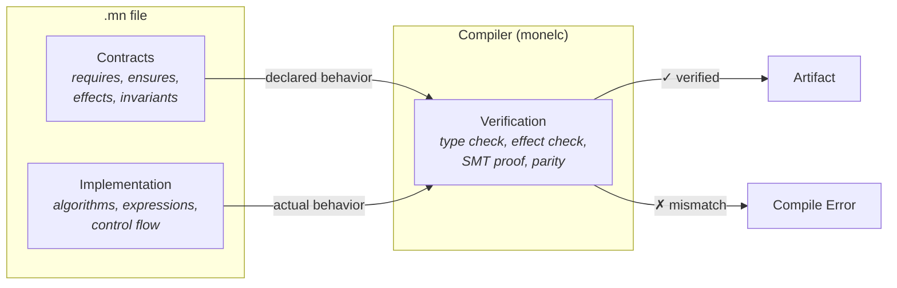
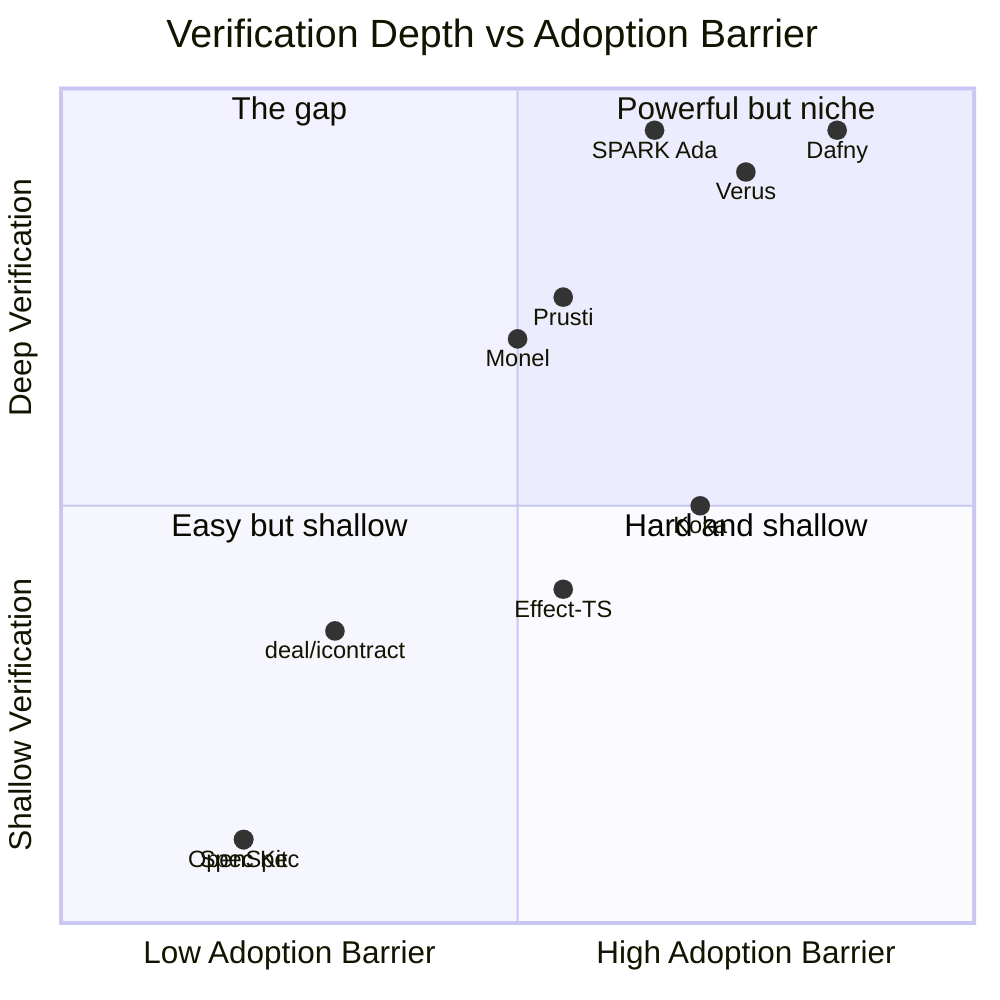
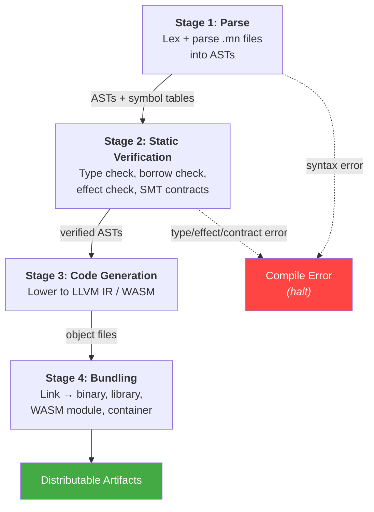
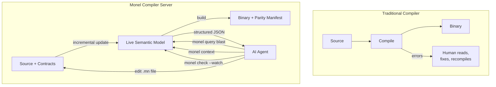

# 1. Overview

**Version:** 0.1.0-draft
**Status:** Working Draft
**Domain:** monel.io
**Date:** 2026-03-12

---

## 1.1 Purpose of This Document

This chapter defines the philosophy, design principles, and architectural structure of the Monel programming language. It establishes the conceptual foundation upon which the remaining specification chapters build. Implementors, tool authors, and language users should treat this chapter as the authoritative source for understanding Monel's design rationale and system boundaries.

---

## 1.2 Brand and Artifacts

| Artifact | Value |
|---|---|
| Language name | Monel |
| Domain | monel.io |
| CLI binary | `monel` |
| Compiler binary | `monelc` |
| Source files | `.mn` |
| Test files | `.mn.test` |
| Project manifest | `monel.project` |
| Policy file | `monel.policy` |
| Team config | `monel.team` |

A Monel project is a directory containing a `monel.project` file. All paths in the project are relative to this root. The compiler discovers `.mn` and `.mn.test` files by walking the directory tree from the project root.

---

## 1.3 The Problem

Programming languages optimize for the human-as-author workflow: the developer writes code, and the compiler checks it.

As AI agents take on more code generation, review becomes a larger part of the development workflow. Several problems emerge when the reviewer cannot easily verify whether code matches its intended behavior:

1. **Rubber-stamping.** Code that is syntactically valid and passes tests may be approved without deep understanding. Defects can accumulate silently.

2. **Tracing burden.** Reviewers may need to reverse-engineer intent from code — reading hundreds of lines to answer "does this do what I wanted?" This scales poorly.

3. **Specification drift.** When intent lives only in natural language (comments, tickets, chat messages), there is no mechanism to detect divergence between specification and implementation.

4. **Auditability.** Without a structured link between what was requested and what was produced, compliance and security review rely on manual inspection.

These problems share a root cause: mainstream languages conflate *what the program should do* with *how it does it* into a single artifact.

---

## 1.4 The Core Insight

Every function in Monel declares **contracts** alongside its **implementation**, and the compiler verifies the relationship between them — deterministically, with no LLM in the pipeline.



- **Contracts** declare what a function must do: preconditions (`requires:`), postconditions (`ensures:`), type invariants (`invariant:`), side effects (`effects:`), panic freedom (`panics: never`). Contracts are the specification layer.

- **Implementation** is how the function does it: algorithms, data structures, control flow. Contracts and code live in the same `.mn` file, co-located for readability.

- **Verification** — the compiler checks that implementation satisfies its contracts. Effect inference verifies declared effects. SMT solving (Z3) proves `requires:`/`ensures:` clauses. Type checking and borrow checking enforce safety. All verification is deterministic and reproducible.

A function whose implementation violates its contracts is a compilation error. A declared effect not present in the code is a warning. An undeclared effect in the code is an error. All of this happens at compile time with no external dependencies.

Because the compiler verifies contracts, reviewers can focus on the contracts rather than tracing through implementation line by line.

### 1.4.1 Competitive Landscape and Positioning

The problem Monel addresses — verifying that code does what a specification says — is approached from several directions today.

#### Spec-Driven Development Tools (OpenSpec, GitHub Spec Kit, Kiro, Tessl)

The SDD movement has produced 30+ tools with over 100k combined GitHub stars. OpenSpec (31k stars, YC-backed), GitHub Spec Kit (77k stars), AWS Kiro, and Tessl all organize specifications as markdown documents that AI coding agents are instructed to follow.

**What they do:** Structure how AI agents receive and process specifications. Create planning workflows (propose, apply, archive). Generate task breakdowns from specs.

**What they do not do:** Verify that the resulting code matches the specification. Martin Fowler's team confirmed this directly: agents frequently ignored instructions and created duplicates despite elaborate spec documentation. The Fowler analysis identified a risk of "false sense of control" despite elaborate workflows.

These tools validate the demand — developers want spec-first AI workflows — but they share a fundamental limitation: **enforcement is by convention, not by compiler**. An agent can ignore a spec, generate code that contradicts it, or silently drift from it over time. No tool in the SDD stack detects this divergence.

#### Design-by-Contract Libraries (deal, icontract, Rust `contracts`, Prusti)

Languages like Python and Rust have libraries that add preconditions, postconditions, and invariants to functions. Python's `deal` (875 stars) includes a static linter. Python's `icontract` integrates with CrossHair for SMT-based symbolic verification. Rust's `contracts` crate (29 stars) provides `#[requires]`/`#[ensures]` macros. Prusti (1.6k stars) verifies Rust code against pre/postconditions via SMT, including `old()` references and panic freedom proofs.

Rust is adding official contract support (MCP-759) to annotate unsafe stdlib functions — but only for `unsafe` code, not general specification enforcement.

**What they do:** Add pre/postconditions to existing languages. Range from runtime assertions (deal, contracts crate) to full SMT verification (Prusti, icontract+CrossHair).

**What they do not do:** Track side effects or provide an integrated effect system. Contract annotations are bolted onto an existing language's syntax — they work within the host language's type system and toolchain rather than co-designing both together.

#### Formal Verification Languages and Tools (SPARK Ada, Dafny, Verus)

SPARK Ada is the most established production formal verification system, used in avionics, rail, and defense since 2014. It proves absence of runtime errors, verifies pre/postconditions via SMT (Z3/CVC5), supports `old()` references in postconditions, and since SPARK 2024 provides per-exception postconditions via `Exceptional_Cases`. SPARK is not a separate language — it is a formally verifiable subset of Ada with an industrial-grade toolchain (GNAT/GNATprove).

Dafny (3.3k stars, Microsoft Research) and Verus (2.4k stars) provide SMT-based static verification. Verus works on a subset of Rust. Dafny compiles to C#, Go, Python, Java. Both use Z3 for proof.

**What they do:** Prove that code satisfies formal specifications for all valid inputs. SPARK has decades of production deployment. Dafny and Verus are newer but have strong academic backing.

**What they do not do:** Integrate effect tracking. SPARK verifies contracts and absence of runtime errors but does not have a first-class effect system. Dafny and Verus require heavy annotation (proof obligations, ghost code). Verus supports only a Rust subset. Martin Kleppmann's influential thesis (Dec 2025) argues AI will eventually make formal verification mainstream, but adoption outside safety-critical domains remains limited.

#### Effect Systems (Effect-TS, Koka, Effekt)

Effect-TS (13.6k stars) adds algebraic effects to TypeScript. Koka (3.8k stars, Microsoft Research) is a research language with first-class effects. Effekt is a research language from academia.

**What they do:** Track side effects at the type level. Koka has the most complete effect system of any language.

**What they do not do:** Work with existing mainstream languages. Effect-TS requires rewriting all code in its monadic style. Koka is explicitly "not ready for production use." Rust closed its effect system RFC (#1631) with no follow-up. Nobody has successfully added a real effect system to an existing language as a tool or library.

#### AI Code Review Tools (Qodo, Augment Code Intent)

Qodo (formerly CodiumAI) and Augment Code Intent use LLMs to review code, including checking against requirements. Augment's "Intent" product uses multi-agent orchestration with a verifier agent.

**What they do:** LLM-based probabilistic code review. Check code against specs using AI judgment.

**What they do not do:** Provide deterministic verification. An LLM reviewer can miss issues, hallucinate passes, or produce different results on different runs.

#### Where Monel Sits



The SDD tools occupy the bottom-left: easy to adopt, no real verification. Formal verification tools occupy the top-right: deep verification, high barrier. Prusti occupies the middle — strong verification on existing Rust, but no effect tracking and limited to Rust's syntax. Monel targets a similar depth with lower annotation burden by co-designing the language and verification system together, and adds a first-class effect system that no existing tool provides.

#### Why a Language, Not a Tool

Three capabilities suggest a language rather than a tool:

1. **Effect tracking needs compiler integration.** Rust closed its effect system RFC. Effect-TS requires rewriting all code in monadic style. Adding effects to an existing language as a library has not been demonstrated successfully.

2. **Spec-implementation correspondence needs compilation constraints.** A linter can check annotations, but enforcing that every public function has a matching specification, that signatures agree, and that declared effects cover actual effects requires compiler-level enforcement.

3. **Inline contracts are a syntax decision.** `requires:`/`ensures:` with SMT verification, `effects:` with inference checking, `panics: never` with static proof — these need to be part of the function declaration syntax, not bolted on as annotations.

The closest related projects are SPARK Ada (production formal verification with per-exception postconditions), Prusti (SMT verification for Rust with `old()` and panic freedom), and Verus (proof-oriented Rust subset). These verify properties of existing language code. Monel's bet is that co-designing the language, contract system, and effect system together — rather than bolting verification onto an existing language — produces lower annotation burden and enables optimizations (effect-aware codegen, contract-driven test generation) that external tools cannot perform.

#### Comparison Table

| | SDD Tools | DbC Libraries | Formal Verification (SPARK, Dafny, Verus) | Monel |
|---|---|---|---|---|
| **Spec format** | Markdown | Decorators/macros | Proof annotations / aspects | Inline contracts |
| **Enforcement** | Convention | Runtime or static (varies) | Static proof | Compiler-verified contracts |
| **Effect tracking** | None | `@pure` only (deal) | None | First-class effect system |
| **Contract verification** | None | Runtime (deal) to SMT (Prusti) | Full SMT proof | SMT proof |
| **Per-error postconditions** | No | No | SPARK (since 2024) | Yes |
| **Annotation burden** | Low | Medium | High | Low to Medium |
| **Works with existing languages** | Yes | Yes | Yes (SPARK/Ada, Verus/Rust, Prusti/Rust) | No (new language) |
| **Production track record** | Varied | Limited | SPARK: decades in safety-critical | None |
| **AI-agent optimized** | Workflow only | No | No | Query oracle, context gathering, edit-compatible errors |

Convention-based SDD tools are Monel's natural on-ramp: teams already using spec-first workflows are the ideal early adopters.

---

## 1.5 Target Domain

Monel is a general-purpose systems programming language. Its performance target is parity with Rust (zero-cost abstractions, no garbage collector, deterministic resource management). Its ergonomics target is parity with Python (minimal boilerplate, type inference within functions, indentation-based scope, readable syntax).

Monel compiles to native code via LLVM, to WebAssembly, and (in future) to other targets. The implementation language for the Monel toolchain is Rust.

### 1.5.1 First Projects

The language will be validated by building three substantial applications:

1. **Terminal emulator** — a replacement for kitty, exercising GPU rendering, PTY management, and low-level system interaction.
2. **Terminal multiplexer** — a replacement for zellij, exercising layout management, IPC, plugin systems, and session persistence.
3. **Text editor** — a replacement for vim, exercising modal input handling, buffer management, syntax highlighting, and extensibility.

These projects are chosen because they demand systems-level performance, have rich UI requirements, and are complex enough to stress-test the contract/verification system at scale.

---

## 1.6 Architecture

Monel has two layers: **source** and **compiler**. Contracts and implementation live together in `.mn` files.

### 1.6.1 Source Layer (`.mn`)

**Contents:**
- Function signatures with inline contracts (`requires:`, `ensures:`, `effects:`, `panics: never`)
- Type definitions with invariants (`invariant:`)
- Implementation code: `let` bindings, `match` expressions, `if`/`else`, function calls, closures
- State machine declarations, layout specifications
- `unsafe` blocks, `async`/`await`, error propagation via `try`

**Syntax:** Indentation-based, expression-oriented, one canonical form per construct. Contracts appear between the function signature and the body — the grammar distinguishes them without a separator. See Chapter 2 (Contract Syntax) and Chapter 3 (Implementation Syntax).

**Compact form** for trivial functions: `fn len(self: Stack<T>) -> Int = self.len`

**Authorship:** The language makes no distinction based on authorship. Contracts and code may be written by humans, AI agents, or both. The compiler verifies them equally.

### 1.6.2 Compiler (`monelc`)

**Audience:** The build system, CI pipelines, and (through its reports) humans.

**Purpose:** Verify that implementation corresponds to intent. Produce executable artifacts.

**Mechanism:** A four-stage compilation pipeline (see Section 1.7). The compiler is the source of truth for whether an implementation satisfies its contracts. It replaces the human burden of tracing generated code with automated, reproducible verification.

**Output:**
- Parity reports: per-function and per-module summaries of verification results
- Diagnostics: edit-friendly error messages with precise source locations
- Executable artifacts: native binaries, WASM modules, libraries

---

## 1.7 The Four-Stage Pipeline

The Monel compiler (`monelc`) processes a project through four sequential stages. Each stage may produce diagnostics. Compilation halts at the first stage that produces an error.



### Stage 1: Parse

**Input:** `.mn` files, `.mn.test` files.

**Operation:** Lexical analysis and parsing of all source files into abstract syntax trees (ASTs). Each function's contracts (`requires:`, `ensures:`, `effects:`, etc.) and body are parsed into a single AST node.

**Verification:**
- Syntactic correctness of all files
- Well-formedness of indentation structure
- Valid use of keywords and operators

**Output:** Typed ASTs for all source files. Symbol tables for names, types, and cross-references.

**Failure mode:** Syntax errors with line/column locations. Suggestions for common mistakes.

### Stage 2: Static Verification

**Input:** Parsed ASTs.

**Operation:** Type checking, effect verification, contract verification, and ownership analysis.

**Verification:**
- Full type checking of implementation code
- Effect verification: the compiler infers actual side effects from function bodies and checks them against declared `effects:`. Undeclared effects are errors; unused declared effects are warnings.
- Borrow checking and ownership verification (Rust-equivalent lifetime analysis)
- `requires:` and `ensures:` clauses are translated to SMT queries and verified via Z3
- Per-error-variant postconditions: `err(Overflow) => self == old(self)` is verified for each error path
- `panics: never` verification: compiler proves no code path can panic
- `invariant:` verification: type invariants hold after every constructor and every `mut self` method
- Refinement type verification: values assigned to refinement types satisfy their predicates
- State machine verification: transitions match declared state machine, no illegal transitions

**Output:** Verified ASTs. Diagnostic report of all verification results.

**Failure mode:** Type errors, effect violations, unsatisfiable contracts, potential panics in `panics: never` functions.

### Stage 3: Code Generation

**Input:** Verified ASTs, effect analysis, contract metadata.

Monel's code generation stage has access to verified contracts alongside implementation code. This enables contract-guided optimizations.

**Operation:** Lower the verified ASTs to the target backend, guided by contract metadata.

**Targets:**
- **Cranelift** — for fast debug builds and development iteration
- **LLVM IR** — for optimized release builds on all LLVM-supported architectures
- **WASM** — for browser and edge deployment

**Standard operations:**
- Monomorphization of generic functions
- Deterministic resource cleanup insertion (drop glue)
- Optimization passes (configurable via build profiles)

**Contract-guided codegen operations:**

- **`panics: never` elimination.** When Stage 3 has proven a function panic-free, codegen removes all panic infrastructure (unwinding tables, panic formatting, abort paths). The proof has already been done — codegen exploits it. This produces smaller, faster binaries for verified functions.

- **`complexity:` bound enforcement.** When a function declares `complexity: O(n)`, the optimizer rejects transformations that would violate the bound (e.g., an optimization that introduces an inner loop). The complexity contract constrains the optimizer, not just the programmer.

- **Effect-aware optimization.** The effect system enables optimizations that require whole-program knowledge in traditional compilers:
  - `effects: [pure]` → automatic memoization candidates, safe to parallelize, safe to reorder or eliminate if result is unused
  - `effects: [Db.read]` (read-only) → safe to execute concurrently with other read-only calls to the same resource
  - `effects: [Crypto.verify]` → security-sensitive: disable timing-dependent optimizations to prevent side-channel attacks (constant-time code generation)
  - Effect budgets (e.g., `Db.write max_per_second = 1000`) → compile into lightweight runtime instrumentation (rate limiters, counters, circuit breakers injected by the compiler)

- **Contract-tagged debug info.** In addition to standard debug info (source locations, variable names), Monel emits contract-mapped debug info: which `ensures:` clause governs each code path, which effect is active at each point, and which `invariant:` applies. This enables contract-aware debugging (Section 1.7.1).

**Output:** Target-specific object files or bytecode, plus contract-mapped debug metadata.

### Stage 4: Bundling

**Input:** Object files, project manifest, verification results.

**Operation:** Link object files into final artifacts. Package for distribution with verification metadata.

**Artifacts:**
- Executable binaries
- Static and dynamic libraries
- WASM modules with JavaScript bindings
- Container images (when project manifest specifies containerization)
- **Parity manifest** — a signed, machine-readable record of all verification results embedded in the artifact:

```json
{
  "monel_version": "0.1.0",
  "build_hash": "sha256:abc123...",
  "source_hash": "sha256:def456...",
  "verification": {
    "contracts_verified": 12,
    "smt_proofs": 12,
    "panic_free_functions": 8,
    "effect_check": "pass",
    "effect_budgets": "all within limits"
  }
}
```

This manifest is a compliance artifact. Auditors can verify "this binary was built from code that passed all parity checks" without reading source code. CI/CD pipelines can gate deployments on parity status.

**Output:** Distributable artifacts in the `target/` directory, each containing an embedded or sidecar parity manifest.

### 1.7.1 AI-Native Compiler Architecture

Traditional compilers are batch processors: source files in, binary out, done. Monel's compiler is designed as a **persistent semantic server** that AI coding tools interact with continuously.



**Key architectural properties:**

**1. The compiler maintains a live semantic model.**

After initial compilation, the compiler keeps the full AST, type information, effect analysis, parity map, and dependency graph in memory. Queries (`monel query`, `monel context`) read from this model without recompilation. Edits trigger incremental updates — only the affected portion of the model is recomputed.

The compiler and the query server are the same process, sharing the same data structures.

**2. Speculative analysis without compilation.**

An AI agent can ask "what would happen if I changed this?" without actually making the change:

```bash
monel query blast --fn authenticate --hypothetical "return_type: Result<Token, AuthError>"
```

The compiler evaluates the hypothetical against the live model and returns the impact — broken callers, parity violations, effect changes — in milliseconds. The agent uses this to plan changes before making them, reducing the edit-compile-fix cycle from minutes to a single query.

**3. Contract-mapped diagnostics.**

When a runtime error occurs, Monel's debug info maps the crash site back to its contracts:

```
PANIC at src/auth.mn:58 (fn authenticate)
  CONTRACT: ensures ok => result.user_id > 0
  VIOLATION: result.user_id was 0

  RELEVANT CONTRACTS:
    requires: creds.username.len > 0
    ensures: ok => result.user_id > 0
    ensures: err(Locked) => Db.failed_attempts(creds.username) >= 5
    effects: [Db.read, Db.write, Crypto.verify, Log.write]
    panics: never
```

An AI debugger receives structured context: which contract was violated and what the function was supposed to guarantee.

**4. Effect-aware hot-swap.**

During development (`monel dev`), the compiler uses effect information to determine which functions can be safely hot-swapped without restarting the process:

| Effect | Hot-swap safety |
|--------|----------------|
| `pure` | Always safe — no state, no side effects |
| `Db.read` | Safe if no cursor/connection is mid-transaction |
| `Fs.write` | Safe if no file handle is open in the function |
| `unsafe` | **Never auto-swapped** — requires explicit confirmation |

The compiler generates swap stubs for safe functions and blocks on unsafe ones, using the effect system as a static safety classifier.

**5. Parity-preserving builds.**

The verification manifest embedded in every artifact creates a chain of trust from source through compilation to deployment:

```
Source (.mn) — contracts + implementation
  ↓  [Stage 2: types, effects, contracts verified via SMT]
Binary (with embedded verification manifest)
  ↓  [manifest: all checks passed, signed]
Deployment (verification manifest checked by CI/CD gate)
```

The build system embeds these artifacts in each binary, so auditors can trace any binary back to its verified specification.

---

## 1.8 Design Principles

The following principles govern Monel's syntax and semantics. They are binding constraints on the language design. When a design decision could go multiple ways, these principles determine the outcome.

### 1.8.1 One Canonical Form

Every construct in Monel has exactly one syntactic representation. There is no syntactic sugar. There are no alternative spellings. There are no shorthand forms.

**Rationale:** LLMs produce more consistent code when the target language has fewer valid representations of the same concept. Reviewers can rely on pattern recognition when syntax is predictable. Diff-based review is more reliable when formatting is deterministic.

**Examples of what this prohibits:**
- No `unless` (use `if not`)
- No implicit returns (all functions use explicit expression-as-last-value, but the form is always the same)
- No operator overloading beyond trait-defined operators
- No method chaining syntax alternatives (always dot notation)

### 1.8.2 Indentation-Based Scope

Scope is defined by indentation, using exactly 2 spaces per level. There are no braces, no `end` keywords, no `begin`/`end` blocks.

**Rationale:** Indentation-based scope removes formatting choices and reduces visual noise. The 2-space indent is chosen for density — systems code tends to be deeply nested, and 4-space indents consume too much horizontal space.

**Rules:**
- Tabs are a syntax error
- Mixed indentation is a syntax error
- The formatter (`monel fmt`) is authoritative — it produces the one canonical indentation
- Blank lines within a block do not reset indentation
- Continuation lines are indented one additional level beyond the opening line

### 1.8.3 Type Inference Within Functions

Type annotations are required on all function signatures (parameters and return types). Within function bodies, types are inferred. Programmers may add optional type annotations within bodies for documentation.

**Rationale:** Signatures are the contract boundary — they must be explicit for both human readers and the parity compiler. Bodies are implementation detail — inference reduces noise without sacrificing safety.

### 1.8.4 Edit-Friendly Syntax

The syntax is designed for programmatic editing by LLMs and tools. Specific rules support this:

- **Function signatures on one line.** A function signature is always a single line, making it a unique anchor for search and replacement. If a signature is too long for one line, the language provides a multi-line parameter block (indented under the `params:` keyword), but the `fn name` declaration is always on its own line.

- **No wildcard imports.** `use http/server {Config, serve}` — never `use http/server *`. Every imported name is explicit, making dependency analysis trivial.

- **Each `let` binding on its own line.** No multiple bindings per line. No destructuring into multiple variables on one line (destructuring uses a `let` per variable or a `match`).

- **No significant trailing commas.** Lists use newlines as separators when multi-line. Single-line lists use commas. The formatter decides which form to use based on line length.

- **Binary operators stay on the same line as the left operand.** Line breaks in expressions occur after operators, not before.

### 1.8.5 Explicit Effects

Every function declares its side effects. The compiler verifies that the implementation's actual effects are a subset of the declared effects. Effect declarations use a fixed vocabulary of effect kinds (e.g., `Fs.read`, `Fs.write`, `Net.connect`, `Db.read`, `Db.write`, `Atomic.write`, `Log.write`).

**Rationale:** Effects are a common source of surprise in code review. Making them explicit in both layers and verifying their correspondence helps catch unintended side effects early.

### 1.8.6 Errors Are Values

Monel has no exceptions. All fallible operations return `Result<T, E>`. Error types are algebraic data types. Error propagation uses the `try` expression (similar to Rust's `?` operator but as a keyword for readability and edit-friendliness).

**Rationale:** With exceptions, a function's error behavior is not apparent from its signature. Value-based errors make failure paths explicit and verifiable.

---

## 1.9 The Key Workflow

### Step 1: Write Contracts

A human or AI agent writes the function signature and contracts:

```
fn authenticate(creds: Credentials) -> Result<Session, AuthError>
  requires:
    creds.username.len > 0
    creds.password.len > 0
  ensures:
    ok => result.user_id > 0
    ok => result.expires_at > Clock.now()
    err(Locked) => Db.failed_attempts(creds.username) >= 5
  effects: [Db.read, Db.write, Crypto.verify, Log.write]
  panics: never
```

The contracts specify *what* without specifying *how*. An AI agent can generate these from a natural-language description — the English never enters the compiler.

### Step 2: Write Implementation

The implementation goes directly below the contracts in the same file:

```
  let user = Db.find_user_by_username(creds.username)
  match user
    | None => Err(AuthError.InvalidCreds)
    | Some(u) =>
      if u.failed_attempts >= 5
        Err(AuthError.Locked)
      else
        ...
```

### Step 3: Compiler Verifies

The compiler verifies that the implementation satisfies all contracts:

```
monel build

  Stage 1: Parse ........................ OK
  Stage 2: Static Verification ......... OK (12 functions, 8 SMT proofs)
  Stage 3: Code Generation ............. OK
  Stage 4: Bundling .................... OK

  Verification: 12/12 functions verified. 0 warnings.
```

No LLM. No network. Deterministic and reproducible.

### Step 4: Review Contracts

The reviewer reads contracts, not implementation. If `ensures: ok => result.user_id > 0` and the compiler says "verified," the reviewer knows the implementation returns a valid user ID on success — without reading the code that does it.

---

## 1.10 Roles

Monel's three-layer architecture enables different team roles to interact with the codebase through different file types. Each role has a primary artifact they author and review.

### Product Manager

**Primary artifact:** Contracts in `.mn` files (with AI agent assistance).

**Activities:**
- Describe requirements in natural language; AI agent generates formal contracts
- Review contracts (`ensures:`, error variants, effects) to confirm they match product requirements
- Read verification reports to confirm implementation satisfies contracts

### Engineer

**Primary artifact:** `.mn` — implementation files.

**Activities:**
- Review LLM-generated implementation for correctness
- Write implementation manually when needed
- Write `requires:`/`ensures:` contracts for critical code paths
- Debug parity failures
- Optimize performance-critical functions

### Architect

**Primary artifact:** `monel.policy`, `monel.team` — project-wide policy and team configuration.

**Activities:**
- Define effect budgets (which modules may use which effects)
- Define module boundaries and visibility rules
- Configure verification levels per module
- Define coding standards enforced by the compiler

**`monel.policy` example:**
```
[effects]
src/auth/* = [Db.read, Db.write, Log.write, Net.connect]
src/ui/*   = [Fs.read, Log.write]
src/core/* = []

[parity]
src/auth/* = "strict"
src/ui/*   = "lightweight"

[modules]
src/auth/internal/* = { visibility = "auth" }
```

### Designer

**Primary artifact:** Layout and interaction declarations in `.mn` files.

**Activities:**
- Define layout declarations: regions, proportions, focus order, responsive rules
- Define interaction declarations: state machines for UI flows, accessibility requirements
- Define theme declarations: color palettes, contrast requirements, spacing scales
- Review generated UI code through parity reports

### Security Engineer

**Primary artifact:** Contracts with `requires:`/`ensures:`/`panics: never` on security-critical functions.

**Activities:**
- Write `requires:` and `ensures:` contracts for authentication, authorization, and cryptographic code
- Define `panics: never` constraints for security-critical paths
- Write `invariant:` declarations for security-critical types
- Configure effect policies that restrict network and filesystem access
- Review parity reports for security-critical modules

### SRE / Operations

**Primary artifact:** Effect policies, deploy configuration, operational constraints.

**Activities:**
- Define deploy configuration: replicas, health checks, circuit breakers, resource limits
- Define SLA requirements as verifiable constraints
- Define effects budgets for operational contexts
- Review parity reports for operational correctness

---

## 1.11 Compiler as Query Oracle

Beyond compilation, the Monel compiler serves as a query oracle for AI coding tools. The `monel query` and `monel context` commands provide structured information about the codebase that LLMs need to generate correct code.

### `monel query`

Returns structured information about any symbol, module, or relationship in the codebase.

```
monel query "what effects does module auth use?"
monel query "which functions have panics: never?"
monel query "show the contracts for fn authenticate"
```

### `monel context`

Generates a context bundle for an LLM — all the information needed to generate or modify a specific piece of code.

```
monel context src/auth.mn --for-generation
```

This produces a structured bundle containing:
- The contracts to implement
- All types referenced by the contracts
- All imported modules' public APIs
- Relevant policy constraints
- Example implementations of similar functions in the project

### `monel refactor`

Coordinates a multi-file refactoring operation.

```
monel refactor --rename-type Session AuthSession
```

This updates all affected files, then re-verifies contracts across all changes.

---

## 1.12 Summary of Invariants

The following invariants hold for every valid Monel project:

1. Every exported function has contracts or is explicitly marked contract-free.
2. The compiler-inferred effects of every function are a subset of its declared effects.
3. Every declared error variant is reachable in the implementation.
4. No undeclared error variants are produced by the implementation.
5. All `requires:` and `ensures:` contracts are verified by the SMT solver before code generation.
6. All `panics: never` functions are proven panic-free.
7. All refinement type assignments satisfy their predicates.
8. The compiler produces identical output for identical input (deterministic compilation).
9. The compiler produces correct output without any LLM (LLM is always optional).
