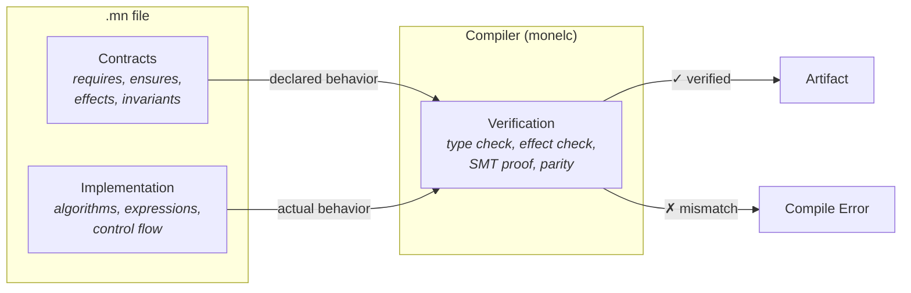
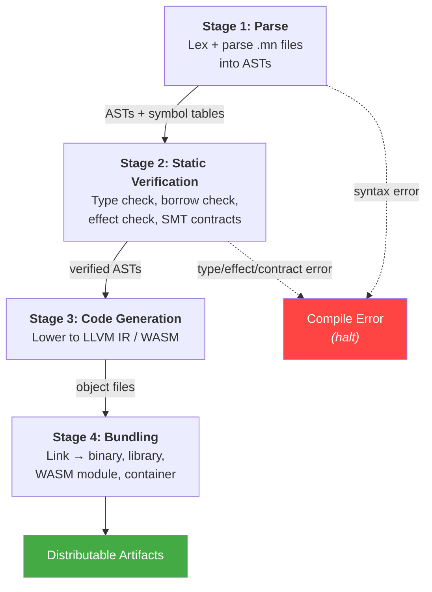

# 1. Overview

## 1.1 Artifacts

| Artifact | Value |
|---|---|
| Language name | Monel |
| CLI binary | `monel` |
| Compiler binary | `monelc` |
| Source files | `.mn` |
| Test files | `.mn.test` |
| Project manifest | `monel.project` |
| Policy file | `monel.policy` |
| Team config | `monel.team` |

A Monel project is a directory containing a `monel.project` file. The compiler discovers `.mn` and `.mn.test` files by walking the directory tree from the project root.

## 1.2 Model

A Monel function declares contracts alongside its implementation in the same `.mn` file. The compiler verifies the relationship between them.



- **Contracts**: `requires:`, `ensures:`, `invariant:`, `effects:`, `panics: never`, `complexity:`, `fails:`, `doc:`
- **Implementation**: algorithms, data structures, control flow
- **Verification**: type checking, effect inference, SMT contract proof (Z3), borrow checking

An implementation that violates its contracts is a compile error. A declared effect absent from the code is a warning. An undeclared effect in the code is an error.

Performance target: parity with Rust (zero-cost abstractions, no GC). Ergonomics target: parity with Python (minimal boilerplate, type inference within functions, indentation-based scope). Targets: native via LLVM/Cranelift, WebAssembly.

For prior art comparison (SPARK Ada, Dafny, Verus, Prusti), see [claims.md](claims.md#prior-art-honesty).

## 1.3 Four-Stage Pipeline



| Stage | Input | Output | Verification |
|---|---|---|---|
| 1. Parse | `.mn`, `.mn.test` files | ASTs + symbol tables | Syntax, indentation |
| 2. Static Verification | ASTs | Verified ASTs | Types, borrows, effects, SMT contracts, panic freedom, invariants, refinements |
| 3. Code Generation | Verified ASTs | Object files | Contract-guided codegen (panic elision, effect-aware opts, complexity bounds) |
| 4. Bundling | Object files | Artifacts + parity manifest | — |

Stage 2 details are in [Chapter 6 (Verification)](06-parity.md). Code generation exploits verified contracts: `panics: never` functions skip unwinding infrastructure, `complexity:` bounds constrain the optimizer, effect annotations enable memoization and safe concurrency.

The parity manifest (embedded in every artifact) records all verification results for downstream audit:

```json
{
  "monel_version": "0.1.0",
  "build_hash": "sha256:abc123...",
  "source_hash": "sha256:def456...",
  "verification": {
    "contracts_verified": 12,
    "smt_proofs": 12,
    "panic_free_functions": 8,
    "effect_check": "pass"
  }
}
```

## 1.4 Invariants

The following hold for every valid Monel project:

1. Every exported function has contracts or is explicitly marked contract-free.
2. The compiler-inferred effects of every function are a subset of its declared effects.
3. Every declared error variant is reachable in the implementation.
4. No undeclared error variants are produced by the implementation.
5. All `requires:` and `ensures:` contracts are verified by the SMT solver before code generation.
6. All `panics: never` functions are proven panic-free.
7. All refinement type assignments satisfy their predicates.
8. The compiler produces identical output for identical input.
