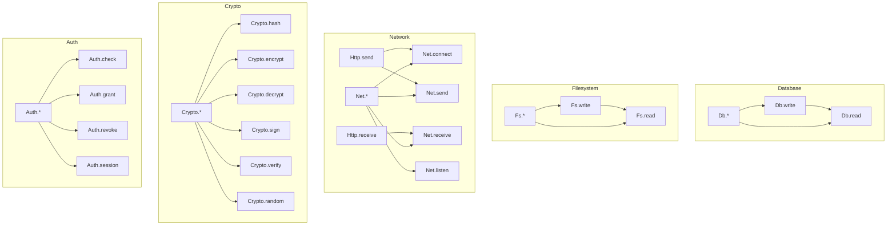

# 5. Effect System

This chapter specifies how developers declare side effects and how the compiler tracks, verifies, and constrains them.

---

## 5.1 Effect Declarations

### 5.1.1 Syntax

Effects are declared on function signatures using the `effects:` field:

```
fn save_user(user: User) -> Result<Unit, DbError>
  doc: "Persist a user record to the database"
  effects: [Db.write, Log.write]

  log.info("Saving user {user.id}")
  db.users.insert(user)?
  Ok(())
```

The `effects:` declaration lists the maximum set of effects this function may perform. The compiler infers the actual effects from the function body and verifies they do not exceed the declared set.

### 5.1.2 Pure Functions

A function with no `effects:` declaration is pure:

```
fn add(a: Int, b: Int) -> Int
  a + b
```

This is equivalent to writing `effects: [pure]`, though the explicit form is rarely used. Pure functions:
- Cannot call functions that have effects.
- Are referentially transparent.
- Are always safe for hot-swapping.
- Can be memoized by the compiler.
- Can be evaluated at compile time if their inputs are const.

### 5.1.3 Effect Syntax

Effects are written as `Category.operation` or just `Category.*` to indicate all operations in a category:

```
effects: [Db.read]           // single effect
effects: [Db.read, Db.write] // multiple effects
effects: [Db.*]              // all database effects (read + write)
effects: [Net.*]             // all network effects
effects: [unsafe]            // raw pointers, FFI
effects: [async]             // asynchronous operations
```

---

## 5.2 Built-in Effect Categories

Monel defines the following built-in effect categories. These cover the fundamental classes of side effects that any systems programming language must handle.

### 5.2.1 `pure`

No effects. The function is a pure computation.

- Implied when `effects:` is absent.
- Cannot be combined with any other effect.
- Guaranteed referentially transparent.

### 5.2.2 Database Effects: `Db`

| Effect     | Description                                      |
|------------|--------------------------------------------------|
| `Db.read`  | Read from a database (queries, lookups)           |
| `Db.write` | Write to a database (inserts, updates, deletes)   |

`Db.write` implies `Db.read`. A function that writes to the database is assumed to also be able to read.

### 5.2.3 Network Effects: `Http` and `Net`

| Effect        | Description                                    |
|---------------|------------------------------------------------|
| `Http.send`   | Send an HTTP request                           |
| `Http.receive` | Receive/handle an incoming HTTP request       |
| `Net.connect` | Establish a network connection                 |
| `Net.listen`  | Listen on a network port for connections       |
| `Net.send`    | Send data over a network socket                |
| `Net.receive` | Receive data from a network socket             |

`Http.send` implies `Net.connect` and `Net.send`. `Http.receive` implies `Net.receive`.

### 5.2.4 Filesystem Effects: `Fs`

| Effect     | Description                               |
|------------|-------------------------------------------|
| `Fs.read`  | Read files, list directories              |
| `Fs.write` | Write files, create/delete directories    |

`Fs.write` implies `Fs.read`.

### 5.2.5 Logging: `Log`

| Effect      | Description              |
|-------------|--------------------------|
| `Log.write` | Write to a log sink      |

Logging is a separate effect because it is pervasive but has different risk characteristics than filesystem I/O. SRE policies often allow `Log.write` broadly while restricting `Fs.write`.

### 5.2.6 Cryptographic Operations: `Crypto`

| Effect          | Description                              |
|-----------------|------------------------------------------|
| `Crypto.hash`   | Compute cryptographic hashes            |
| `Crypto.encrypt` | Encrypt data                           |
| `Crypto.decrypt` | Decrypt data                           |
| `Crypto.sign`   | Create digital signatures               |
| `Crypto.verify` | Verify digital signatures               |
| `Crypto.random` | Generate cryptographically secure random numbers |

Crypto effects exist because cryptographic operations are security-critical and auditable. Even though `Crypto.hash` is technically pure, it is tracked as an effect for policy and auditability purposes.

### 5.2.7 Authentication and Authorization: `Auth`

| Effect          | Description                                |
|-----------------|--------------------------------------------|
| `Auth.check`    | Check authentication credentials           |
| `Auth.grant`    | Grant access/permissions                   |
| `Auth.revoke`   | Revoke access/permissions                  |
| `Auth.session`  | Create/destroy/modify sessions             |

Auth effects enable security policies that restrict which modules can perform authentication and authorization.

### 5.2.8 Atomic Operations: `Atomic`

| Effect         | Description                                |
|----------------|--------------------------------------------|
| `Atomic.read`  | Atomic read (load with memory ordering)    |
| `Atomic.write` | Atomic write (store with memory ordering)  |
| `Atomic.cas`   | Compare-and-swap                           |

Atomic effects track lock-free concurrent operations.

### 5.2.9 Process and System: `Process`, `Signal`

| Effect          | Description                        |
|-----------------|------------------------------------|
| `Process.spawn` | Spawn a child process             |
| `Process.exit`  | Exit the current process          |
| `Process.env`   | Read/write environment variables  |
| `Signal.handle` | Register signal handlers          |
| `Signal.send`   | Send signals to processes         |

### 5.2.10 Asynchronous Operations: `async`

The `async` effect marks functions that perform asynchronous operations and return futures:

```
fn fetch_data(url: String) -> Future<Result<Response, HttpError>>
  effects: [async, Http.send]
  // ...
```

The `async` effect:
- Indicates the function returns a `Future<T>` (or is itself `async`).
- Must be declared on any function that `await`s.
- Propagates transitively: calling an `async` function requires `async`.
- Is orthogonal to other effects: `async` + `Db.read` is a function that asynchronously reads a database.

### 5.2.11 Unsafe Operations: `unsafe`

The `unsafe` effect covers operations that bypass Monel's safety guarantees:

```
fn raw_memcpy(dst: MutPtr<Byte>, src: Ptr<Byte>, len: UInt)
  effects: [unsafe]
  unsafe
    for i in 0..len
      *(dst.offset(i)) = *(src.offset(i))
```

The `unsafe` effect is required for:
- Dereferencing raw pointers (`Ptr<T>`, `MutPtr<T>`)
- Calling foreign functions (FFI)
- Implementing `unsafe` traits
- Transmuting between types
- Inline assembly

`unsafe` is the most restrictive effect. Policies can forbid it entirely for application-level code.

### 5.2.12 Memory Allocation: `Alloc`

| Effect        | Description                    |
|---------------|--------------------------------|
| `Alloc.heap`  | Heap memory allocation         |
| `Alloc.free`  | Explicit memory deallocation   |

Most code implicitly allocates via `Vec`, `String`, `Box`, etc. The `Alloc` effect category exists for no-alloc contexts (embedded systems, real-time code) where heap allocation must be forbidden.

In normal compilation, `Alloc` effects are not tracked; they are implicitly allowed. A project can enable explicit allocation tracking with:

```toml
# monel.project
[effects]
track_alloc = true
```

### 5.2.13 Time: `Time`

| Effect       | Description                       |
|--------------|-----------------------------------|
| `Time.read`  | Read the system clock             |
| `Time.sleep` | Sleep/delay for a duration        |
| `Time.timer` | Create or interact with timers    |

Time effects exist because functions that depend on the current time are not pure and are harder to test deterministically.

---

## 5.3 Custom Effects

Teams can define custom effects in `monel.project` to track domain-specific side effects:

```toml
[effects.custom]
DatadogMetric = { category = "observability", risk = "low" }
KafkaPublish = { category = "messaging", risk = "medium" }
StripeCharge = { category = "payments", risk = "high" }
S3Upload = { category = "storage", risk = "medium" }
SlackNotify = { category = "notifications", risk = "low" }
```

### 5.3.1 Custom Effect Properties

Each custom effect declaration specifies:

| Field      | Type   | Description |
|------------|--------|-------------|
| `category` | String | Logical grouping for policy and reporting |
| `risk`     | `"low"` \| `"medium"` \| `"high"` | Risk level for policy enforcement |
| `implies`  | List   | (Optional) Other effects this implies |
| `requires` | List   | (Optional) Effects that must also be declared when this is used |

```toml
[effects.custom]
KafkaPublish = { category = "messaging", risk = "medium", implies = ["Net.send"], requires = ["Log.write"] }
```

With this declaration, a function declaring `effects: [KafkaPublish]` implicitly has `Net.send` and must also declare `Log.write`.

### 5.3.2 Using Custom Effects

Custom effects are used exactly like built-in effects:

```
fn publish_order_event(order: Order)
  effects: [KafkaPublish, Log.write]
  log.info("Publishing order event for {order.id}")
  kafka.publish("orders", order.to_event())
```

The compiler verifies that `kafka.publish` is annotated with `KafkaPublish` in its signature (typically via a library binding).

### 5.3.3 Custom Effect Hierarchies

Custom effects can form hierarchies using dot notation:

```toml
[effects.custom]
"Payment.charge" = { category = "payments", risk = "high" }
"Payment.refund" = { category = "payments", risk = "high" }
"Payment.query" = { category = "payments", risk = "low" }
```

The wildcard `Payment.*` matches all three.

---

## 5.4 Effect Checking Rules

### 5.4.1 Declaration and Inference

Every function must declare all effects it may perform. The compiler infers the actual effects from the function body and checks that they are a subset of the declared set:

```
fn save_and_notify(user: User) -> Result<Unit, Error>
  effects: [Db.write, Http.send, Log.write]

  log.info("Saving user")            // Log.write - OK
  db.users.insert(user)?             // Db.write - OK
  slack.notify("New user: {user}")   // Http.send - OK
  Ok(())
```

If the compiler infers an effect from the function body that is not in the declaration, compilation fails:

```
fn save_user(user: User) -> Result<Unit, Error>
  effects: [Db.write]

  db.users.insert(user)?
  slack.notify("Saved")      // ERROR: Http.send effect not declared
  Ok(())
```

### 5.4.2 Transitive Propagation

Effects propagate transitively through the call graph. If `f` calls `g`, and `g` declares `effects: [Db.read]`, then `f` must declare `Db.read` (or a superset like `Db.*`):

```
fn get_user(id: UserId) -> Result<User, DbError>
  effects: [Db.read]
  db.users.find(id)

fn get_user_name(id: UserId) -> Result<String, DbError>
  effects: [Db.read]  // required because get_user has Db.read
  let user = get_user(id)?
  Ok(user.name)

fn process() -> Result<Unit, Error>
  effects: [Db.read]  // required transitively
  let name = get_user_name(UserId(1))?
  println(name)   // println is pure (writes to stdout, but stdout is special -- see 5.5.5)
  Ok(())
```

### 5.4.3 Subset Rule for Pure Functions

A pure function (no `effects:` declaration) cannot call any function that has effects:

```
fn compute(x: Int) -> Int
  // pure -- no effects
  let y = x * 2
  log.info("computed")  // ERROR: cannot call Log.write from a pure function
  y
```

### 5.4.4 Superset Rule for Callers

A function may declare more effects than it actually uses. This is useful when the function's behavior depends on runtime conditions:

```
fn maybe_save(user: User, persist: Bool) -> Result<Unit, Error>
  effects: [Db.write, Log.write]  // Db.write may not actually be used

  log.info("Processing user")
  if persist
    db.users.insert(user)?
  Ok(())
```

The compiler issues a warning (not an error) for declared-but-unused effects, since they may be needed in future code paths.

### 5.4.5 Standard I/O Exception

`println`, `eprintln`, `print`, and `eprint` are special: they write to stdout/stderr but do not require an effect declaration. This exception exists because:
- Debug printing should not require effect annotations during development.
- Production code should use `Log.write` instead; linters can enforce this.

This exception can be disabled project-wide:

```toml
# monel.project
[effects]
stdio_is_effect = true  # makes println require Fs.write
```

### 5.4.6 Effect Implication Rules

Certain effects imply others. The complete implication graph:



Expressed as rules:

```
Db.write     implies  Db.read
Fs.write     implies  Fs.read
Http.send    implies  Net.connect, Net.send
Http.receive implies  Net.receive
Net.*        implies  Net.connect, Net.listen, Net.send, Net.receive
Db.*         implies  Db.read, Db.write
Fs.*         implies  Fs.read, Fs.write
Crypto.*     implies  Crypto.hash, Crypto.encrypt, Crypto.decrypt, Crypto.sign, Crypto.verify, Crypto.random
Auth.*       implies  Auth.check, Auth.grant, Auth.revoke, Auth.session
```

When a function declares `effects: [Db.write]`, it may perform both `Db.read` and `Db.write` operations. Declaring the more specific effect is preferred for clarity, but declaring the broader category is valid.

---

## 5.5 Effect Polymorphism

Functions can be generic over effects, allowing the same function to work with both pure and effectful callbacks:

### 5.5.1 Syntax

```
fn map_items<T, U, E>(items: &Vec<T>, f: fn(T) -> U with effects E) -> Vec<U>
  effects: E
  items.iter().map(f).collect()
```

The `with effects E` clause on a function type parameter introduces an effect variable `E`. The enclosing function declares `effects: E` to propagate whatever effects `f` has.

### 5.5.2 Example

```
fn transform<T, U, E>(input: T, f: fn(T) -> U with effects E) -> U
  effects: E
  f(input)

// Called with a pure function:
let result = transform(42, |x| x * 2)     // effects: pure

// Called with an effectful function:
let result = transform(42, |x|             // effects: [Db.read]
  db.lookup(x)
)
```

The effect variable `E` is inferred at each call site from the actual effects of the provided callback.

### 5.5.3 Bounded Effect Polymorphism

Effect variables can be constrained:

```
fn safe_transform<T, U, E: not unsafe>(input: T, f: fn(T) -> U with effects E) -> U
  effects: E
  f(input)
```

The bound `E: not unsafe` ensures the callback cannot perform unsafe operations. Available bounds:

| Bound                  | Meaning                                      |
|------------------------|----------------------------------------------|
| `E: pure`              | Only pure callbacks allowed                  |
| `E: not unsafe`        | Unsafe operations forbidden                  |
| `E: subset [Db.read, Log.write]` | Only these effects allowed          |
| `E: not [Db.write, Fs.write]` | These effects forbidden                |

---

## 5.6 Effect Inference

### 5.6.1 Within Function Bodies

The compiler infers the effects of each expression within a function body and verifies they are within the declared set:

```
fn process(data: &Vec<Record>) -> Result<Summary, Error>
  effects: [Db.read, Log.write]

  // Compiler infers:
  // log.info(...)        -> Log.write
  // db.query(...)        -> Db.read
  // pure computations    -> pure
  // total inferred set: {Db.read, Log.write} ⊆ {Db.read, Log.write} ✓

  log.info("Processing {data.len()} records")
  let results = db.query("SELECT * FROM summary")?
  let summary = compute_summary(results)  // pure
  Ok(summary)
```

### 5.6.2 For Closures

Closures inherit effect context from their enclosing function but may have a narrower set:

```
fn process(items: &Vec<Item>) -> Vec<String>
  effects: [Db.read]

  items.iter().map(|item|
    // This closure's effects are inferred as Db.read
    db.lookup_name(item.id)
  ).collect()
```

### 5.6.3 Effect Suggestion

When the compiler infers effects not in the function's declaration, it suggests the correct declaration:

```
fn update_user(user: User) -> Result<Unit, Error>
  effects: [Db.write]

  db.users.update(user)?
  log.info("Updated user {user.id}")   // ERROR

// Compiler output:
// error[E0401]: effect `Log.write` not declared
//   --> src/users.mn:5:3
//   |
// 5 |   log.info("Updated user {user.id}")
//   |   ^^^ this call requires `Log.write`
//   |
//   = help: add `Log.write` to the effects declaration
//   = old_string: effects: [Db.write]
//   = new_string: effects: [Db.write, Log.write]
```

Errors include `old_string`/`new_string` fix suggestions for AI coding tools.

---

## 5.7 Effect Budgets

Effect budgets allow SRE teams to set quantitative limits on effects. This is a runtime enforcement mechanism configured in `monel.project`:

### 5.7.1 Configuration

```toml
[effects.budgets]
"Db.write" = { max_per_second = 1000, max_per_request = 10 }
"Db.read" = { max_per_second = 5000, max_per_request = 50 }
"Http.send" = { max_per_second = 200, max_per_request = 5 }
"KafkaPublish" = { max_per_second = 500 }
```

### 5.7.2 Budget Properties

| Property           | Type | Description |
|--------------------|------|-------------|
| `max_per_second`   | Int  | Maximum invocations per second across all requests |
| `max_per_request`  | Int  | Maximum invocations per logical request/transaction |
| `max_per_minute`   | Int  | Maximum invocations per minute |
| `max_concurrent`   | Int  | Maximum concurrent invocations |
| `alert_threshold`  | Float | Fraction of budget (0.0-1.0) that triggers a warning |

### 5.7.3 Enforcement

Effect budgets generate runtime instrumentation. The compiler inserts counters at each effect site. When a budget is exceeded:

1. The call returns an error (`EffectBudgetExceeded`) if the function returns `Result`.
2. A warning is logged if the function does not return `Result`.
3. Metrics are emitted for monitoring (DataDog, Prometheus, etc.).

Budget enforcement is disabled in tests by default and can be disabled globally with `--no-budgets`.

### 5.7.4 Budget Queries

```
$ monel query budgets user_service
Effect         Budget            Current    Utilization
─────────────────────────────────────────────────────────
Db.write       1000/s            342/s      34.2%
Db.read        5000/s            1205/s     24.1%
Http.send      200/s             18/s       9.0%
```

---

## 5.8 Effect Policies

Effect policies are organizational rules that restrict which effects are allowed in which modules. They are configured in `monel.policy` or `monel.project`.

### 5.8.1 Forbidden Effect Combinations

Certain effect combinations can be forbidden:

```toml
[effects.policy]
forbidden_combinations = [
  ["Crypto.decrypt", "Net.send"],      # prevent exfiltration
  ["Auth.grant", "Db.write"],          # separation of concerns
  ["unsafe", "Net.*"],                 # no unsafe in network code
]
```

If a function (directly or transitively) uses both effects in a forbidden pair, compilation fails.

### 5.8.2 Module-Level Restrictions

Effects can be restricted per module:

```toml
[effects.policy.modules]
"app::handlers" = { allowed = ["Db.read", "Db.write", "Log.write", "Http.receive"] }
"app::auth" = { allowed = ["Auth.*", "Crypto.*", "Db.read", "Log.write"] }
"app::utils" = { allowed = [] }  # must be pure
"app::infra" = { forbidden = ["Auth.*"] }
```

### 5.8.3 Risk-Based Policies

Policies can reference the risk level of custom effects:

```toml
[effects.policy]
require_review_for = ["high"]     # high-risk effects require code review annotation
max_risk_per_function = "medium"  # no function may combine high-risk effects
```

### 5.8.4 Policy Inheritance

Policies are inherited: a child module inherits its parent's restrictions unless explicitly overridden. A child module can only narrow restrictions (remove allowed effects), never broaden them.

---

## 5.9 Effect Interaction with Other Language Features

### 5.9.1 Effects and Hot-Swapping

Monel supports hot-swapping of modules in running systems. The effect system determines the safety level:

| Effect Category | Hot-Swap Safety | Notes |
|-----------------|-----------------|-------|
| `pure` | Always safe | No side effects, no state |
| `*.read` (any read) | Safe | Read-only, idempotent |
| `Log.write` | Safe | Append-only, idempotent |
| `*.write` (any write) | Warn | May affect in-flight operations |
| `Atomic.*` | Warn | May affect concurrent state |
| `unsafe` | Block | Manual approval required |

The hot-swap system uses this classification:

```
$ monel deploy --hot-swap
Analyzing module changes...
  user_service::validate  (pure)         → safe, swapping
  user_service::get_user  (Db.read)      → safe, swapping
  user_service::save_user (Db.write)     → WARNING: write effects, drain first? [y/N]
  user_service::ffi_bind  (unsafe)       → BLOCKED: unsafe, requires --force
```

### 5.9.2 Effects and Concurrency

The effect system interacts with concurrency in two ways:

1. **Race detection**: Functions with `*.write` effects on the same resource, called from concurrent contexts, generate a compile-time warning.
2. **Deadlock prevention**: `Atomic.*` effects are tracked to detect potential deadlocks (advisory, not sound).

### 5.9.3 Effects and Testing

In test modules, effects can be mocked:

```
#[test]
fn test_save_user()
  mock effects: [Db.write] with TestDb
  mock effects: [Log.write] with TestLogger

  let result = save_user(test_user())
  assert(result.is_ok())
  assert(TestDb.last_insert() == test_user())
```

The `mock effects:` directive intercepts effect sites and redirects them to test implementations.

### 5.9.4 Effects and Const Evaluation

`const fn` cannot have effects. This is enforced statically:

```
const fn factorial(n: Int) -> Int      // OK: pure
  if n <= 1 then 1 else n * factorial(n - 1)

const fn bad() -> Int                  // ERROR: const fn cannot have effects
  effects: [Log.write]
  log.info("computing")
  42
```

---

## 5.10 Effect Queries

The `monel query` command exposes effect information for programmatic consumption.

### 5.10.1 Function Effects

```
$ monel query effects user_service::save_user
Function: user_service::save_user
Declared effects: [Db.write, Log.write]
Transitive effects:
  Db.write    ← user_service::save_user (direct)
              ← db::users::insert (called at line 5)
  Log.write   ← user_service::save_user (direct)
              ← log::info (called at line 4)
```

### 5.10.2 Module Effects

```
$ monel query effects user_service
Module: user_service
Functions: 12
Effect summary:
  pure:       5 functions
  Db.read:    3 functions
  Db.write:   2 functions
  Log.write:  7 functions
  Http.send:  1 function
```

### 5.10.3 Effect Graph

```
$ monel query effect-graph user_service::save_user --format dot
digraph {
  "save_user" -> "db::users::insert" [label="Db.write"]
  "save_user" -> "log::info" [label="Log.write"]
  "db::users::insert" -> "db::connection::execute" [label="Db.write"]
}
```

### 5.10.4 JSON Output

All queries support `--format json` for programmatic consumption:

```
$ monel query effects user_service::save_user --format json
{
  "function": "user_service::save_user",
  "declared_effects": ["Db.write", "Log.write"],
  "transitive_effects": {
    "Db.write": [
      {"source": "user_service::save_user", "kind": "direct"},
      {"source": "db::users::insert", "kind": "transitive", "call_site": "src/user_service.mn:5:3"}
    ],
    "Log.write": [
      {"source": "user_service::save_user", "kind": "direct"},
      {"source": "log::info", "kind": "transitive", "call_site": "src/user_service.mn:4:3"}
    ]
  }
}
```

---

## 5.11 Live Effect Visualization

During development, `monel dev --effects` provides a real-time effect trace:

```
$ monel dev --effects
[14:32:01.003] user_service::save_user        Db.write   db::users::insert      45ms
[14:32:01.048] user_service::save_user        Log.write  log::info              1ms
[14:32:01.102] order_service::create_order    Db.write   db::orders::insert     38ms
[14:32:01.140] order_service::create_order    KafkaPublish  kafka::publish      12ms
[14:32:01.152] order_service::create_order    Log.write  log::info              1ms
```

### 5.11.1 Filtering

```
$ monel dev --effects --filter "Db.*"          # only database effects
$ monel dev --effects --filter "risk:high"     # only high-risk effects
$ monel dev --effects --module user_service    # only this module
```

### 5.11.2 Effect Dashboard

```
$ monel dev --effects --dashboard
┌─────────────────────────────────────────────────┐
│ Effect Dashboard (last 60s)                     │
├──────────────────┬──────────┬──────────┬────────┤
│ Effect           │ Count    │ Avg (ms) │ Budget │
├──────────────────┼──────────┼──────────┼────────┤
│ Db.read          │ 1,205    │ 12       │ 24.1%  │
│ Db.write         │ 342      │ 45       │ 34.2%  │
│ Http.send        │ 18       │ 230      │ 9.0%   │
│ Log.write        │ 3,401    │ 0.5      │ n/a    │
│ KafkaPublish     │ 89       │ 15       │ 17.8%  │
└──────────────────┴──────────┴──────────┴────────┘
```

---

## 5.12 Effect Verification

The compiler verifies that declared effects are consistent with the function body.

### 5.12.1 Subset Rule

The compiler infers the actual effects from the function body and checks that they are a subset of the declared effects:

```
fn save_user(user: User) -> Result<Unit, Error>
  effects: [Db.write, Log.write]

  log.info("Saving user {user.id}")
  db.users.insert(user)?
  Ok(())
```

The inferred effects `{Db.write, Log.write}` are a subset of the declared effects `{Db.write, Log.write}`, so compilation succeeds.

### 5.12.2 Violation: Excess Effects

If the body performs effects beyond the declaration, the compiler reports an error:

```
fn save_user(user: User) -> Result<Unit, Error>
  effects: [Db.write, Log.write]

  db.users.insert(user)?
  log.info("Saved user")
  fs.write("audit.log", "saved {user.id}")  // ERROR: Fs.write not declared

// Compiler output:
// error[E0401]: effect `Fs.write` not declared
//   --> src/user_service.mn:5:3
//   |
// 5 |   fs.write("audit.log", "saved {user.id}")
//   |   ^^^ this call requires `Fs.write`
//   |
//   = help: add `Fs.write` to the effects declaration
```

### 5.12.3 Unused Effects Warning

If the declaration includes effects that the compiler does not infer from the body, a warning is issued:

```
// warning[W0302]: declared effect `Http.send` is not used in function body
//   = note: consider removing `Http.send` from the effects declaration if it is no longer needed
```

---

## 5.13 Grammar (Informative)

```
effect_decl    = "effects:" "[" effect_list "]"
effect_list    = effect ("," effect)*
effect         = "pure"
               | "async"
               | "unsafe"
               | effect_path
effect_path    = IDENT "." (IDENT | "*")
               | IDENT

effect_bound   = "not" effect
               | "not" "[" effect_list "]"
               | "subset" "[" effect_list "]"
               | "pure"

effect_poly    = "with" "effects" IDENT
fn_type_effect = "fn" "(" params ")" "->" type "with" "effects" IDENT
```
