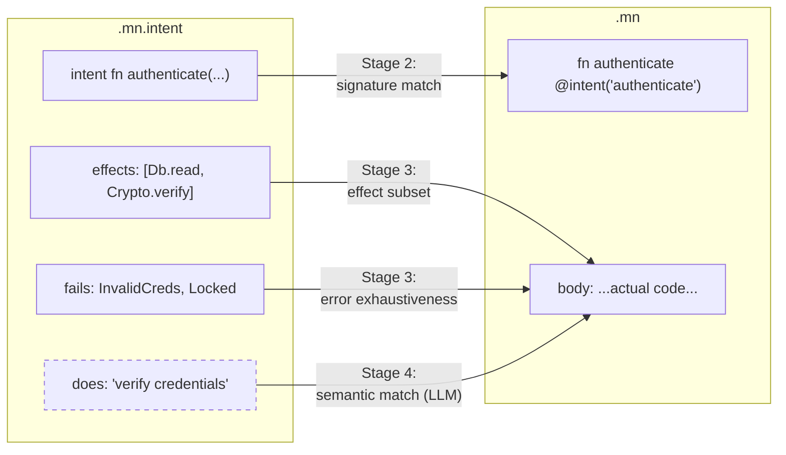
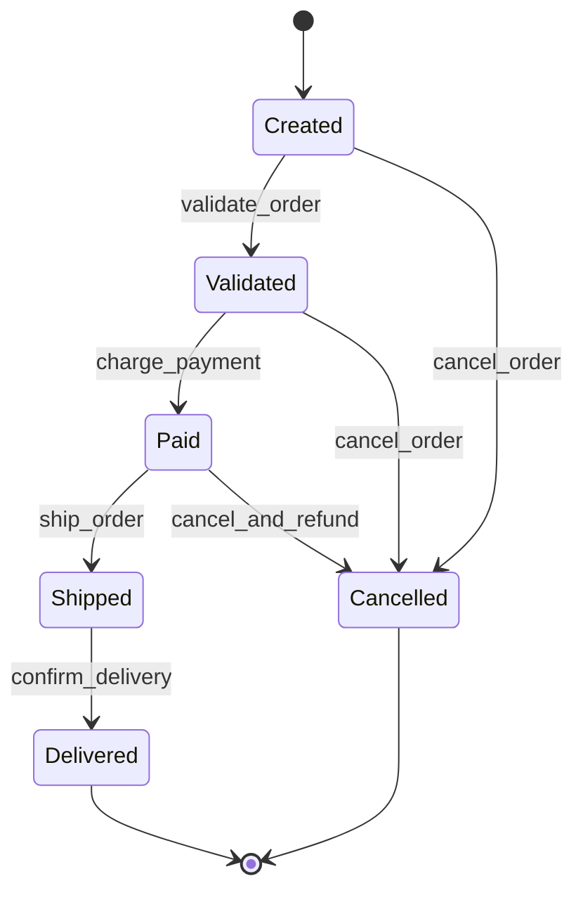

# 6. Parity Checking

This chapter specifies how the parity compiler verifies that intent and implementation correspond.

---

## 6.1 Overview

Parity checking answers the question: *does the implementation match the intent?*



This question decomposes into two levels:

1. **Structural parity** — Do the shapes match? Are the right functions implemented with the right signatures, types, effects, and error variants? This is a deterministic, compiler-enforced check.

2. **Semantic parity** — Does the behavior match? Does the implementation actually do what the `does:` description says? Does it handle the specified edge cases? This is an LLM-assisted, advisory check.

Both levels are integrated into a single 6-stage compiler pipeline. Structural parity is mandatory and blocks compilation. Semantic parity is configurable and defaults to advisory.

---

## 6.2 The 6-Stage Compiler Pipeline

The Monel compiler (`monelc`) processes code through six stages:

### Stage 1: Parse

Both `.mn.intent` and `.mn` files are parsed independently into ASTs.

- The intent parser produces an Intent AST: a tree of module declarations, function intents, type intents, state machines, layout declarations, and interaction specifications.
- The implementation parser produces an Implementation AST: a standard program AST with functions, types, expressions, and `@intent("name")` annotations.
- Parse errors in either layer halt compilation with diagnostics.
- The two parsers are independent — a syntax error in the intent file does not prevent parsing the implementation file, and vice versa. Both error sets are reported.

### Stage 2: Structural Parity

The compiler matches every intent AST node to its corresponding implementation AST node and verifies structural agreement.

This stage is **mandatory** and **deterministic**. It requires no external tools (no LLM, no SMT solver). It is a pure syntactic/type-level comparison.

Details: Section 6.3.

### Stage 3: Static Verification

Standard compiler analyses run on the implementation AST:

- Type checking (Chapter 4)
- Effect checking (Chapter 5)
- Borrow checking (Chapter 4, Section 4.10)
- Exhaustiveness checking for pattern matches
- Refinement type verification:
  - In lightweight mode: runtime check insertion
  - In `@strict` mode: SMT solver verification (Z3)
- `@strict` contract checking:
  - `requires:` as preconditions
  - `ensures:` as postconditions
  - `invariant:` at all mutation points
  - `panics: never` as absence-of-panic proof

Details: Section 6.5.

### Stage 4: Semantic Parity

If an LLM is configured (`[llm]` in `monel.project`), the compiler invokes it to verify that the implementation's behavior matches the intent's semantic descriptions.

This stage is **optional**, **advisory by default**, and **cached**.

Details: Section 6.6.

### Stage 5: Code Generation

The verified implementation AST is lowered to the target representation:

- WASM (default target for portability)
- LLVM IR (for native compilation)
- Native machine code (via LLVM backend)

Code generation is standard compiler backend work and is not specific to the parity system. See Chapter 9 (Code Generation).

### Stage 6: Bundling

The compiler packages:

- Compiled artifacts (WASM module, native binary, etc.)
- Intent files (for documentation and re-verification)
- Parity manifest (Section 6.9): a JSON record of all parity checks and their results

This bundle is the deployable unit. The parity manifest enables downstream tools to verify that parity was checked without re-running the compiler.

---

## 6.3 Structural Parity (Stage 2)

Structural parity is the deterministic verification that intent and implementation shapes match. It is performed entirely within the compiler with no external dependencies.

### 6.3.1 Function Parity

Every `intent fn` declaration must have a corresponding implementation function tagged with `@intent("name")`:

```yaml
# users.mn.intent
intent fn get_user
  does: "Retrieve a user by ID from the database"
  params:
    id: UserId
  returns: Result<User, UserError>
  effects: [Db.read]
  fails:
    - UserError.NotFound: "no user with this ID exists"
    - UserError.ConnectionLost: "database connection failed"
```

```
// users.mn
fn get_user(id: UserId) -> Result<User, UserError>
  @intent("get_user")
  effects: [Db.read]

  let user = db.users.find(id)?
  match user
    Some(u) => Ok(u)
    None => Err(UserError.NotFound)
```

The structural parity checker verifies:

| Check | Rule | Error if violated |
|-------|------|-------------------|
| Existence | Every `intent fn` has a matching `@intent("name")` | `P0101: missing implementation for intent fn 'name'` |
| Orphan detection | Every `@intent("name")` has a matching `intent fn` | `P0102: @intent("name") has no matching intent declaration` |
| Parameter types | Parameter types match exactly (by name and type) | `P0103: parameter type mismatch` |
| Parameter names | Parameter names match exactly | `P0104: parameter name mismatch` |
| Parameter count | Same number of parameters | `P0105: parameter count mismatch` |
| Return type | Return type matches exactly | `P0106: return type mismatch` |
| Effect subset | Implementation effects are a subset of intent effects | `P0107: effect not declared in intent` |
| Error exhaustiveness | Implementation handles all `fails:` / `errors:` variants | `P0108: unhandled error variant` |

### 6.3.2 Signature Matching Rules

**Exact type match**: Parameter and return types must be identical, not merely structurally equivalent. If the intent says `id: UserId`, the implementation must use `UserId`, not `Int` (even if `UserId` is a `distinct type` over `Int`).

**Parameter order**: Parameters must appear in the same order in both layers.

**Effect subset**: The implementation's declared effects must be a subset of the intent's. The implementation may declare fewer effects (it may not use all permissions granted by the intent). It must not declare effects outside the intent's set.

**Error exhaustiveness**: For every variant listed in `fails:` or `errors:` in the intent, the implementation must have at least one code path that can produce that error. The compiler performs reachability analysis on error-producing paths to verify this.

### 6.3.3 Type Parity

Every `intent type` declaration must have a corresponding implementation type:

```yaml
intent type Port
  does: "A valid TCP/UDP port number"
  base: Int
  where: value >= 1 and value <= 65535
```

```
type Port = Int where value >= 1 and value <= 65535
```

Type parity checks:

| Check | Rule | Error if violated |
|-------|------|-------------------|
| Existence | Every `intent type` has a corresponding implementation type | `P0201: missing implementation for intent type 'name'` |
| Base type | Underlying type matches | `P0202: base type mismatch` |
| Fields | Struct fields match in name, type, and order | `P0203: field mismatch` |
| Variants | Enum variants match | `P0204: variant mismatch` |
| Refinement compatibility | Implementation refinement is at least as restrictive | `P0205: refinement weakened` |
| Nominal agreement | Semantically distinct intent types use `distinct type` | `P0206: expected distinct type` |

**Refinement compatibility**: The implementation's `where` clause must logically imply the intent's `where` clause. Formally, for intent refinement `P_i` and implementation refinement `P_impl`, the check verifies `P_impl => P_i`. The implementation may be stricter (e.g., `value >= 1 and value <= 1023` satisfies `value >= 1 and value <= 65535`).

### 6.3.4 Module Parity

The compiler verifies that the module's exports match:

| Check | Rule | Error if violated |
|-------|------|-------------------|
| Export completeness | Every intent-declared public function is exported | `P0301: intent fn 'name' not exported` |
| No extra exports | Implementation does not export functions without intent declarations | `P0302: exported fn 'name' has no intent` (warning) |
| Module structure | Intent module hierarchy matches implementation module hierarchy | `P0303: module structure mismatch` |

The "no extra exports" check is a warning, not an error. Helper functions exported for testing or internal use do not need intent declarations, but the compiler flags them for review.

### 6.3.5 Structural Parity Error Format

All structural parity errors follow a consistent format with edit-compatible fix suggestions:

```
error[P0103]: parameter type mismatch for intent fn 'get_user'
  --> src/users.mn:1:18
   |
 1 | fn get_user(id: Int) -> Result<User, UserError>
   |                  ^^^ expected `UserId`, found `Int`
   |
   = note: intent declares `id: UserId` at users.mn.intent:4:5
   = old_string: fn get_user(id: Int) -> Result<User, UserError>
   = new_string: fn get_user(id: UserId) -> Result<User, UserError>
```

The `old_string` / `new_string` fields enable AI coding tools to apply fixes automatically.

---

## 6.4 Block-Level Parity

For complex functions, parity can be checked at a finer granularity than the whole function. Block-level parity maps intent clauses to implementation blocks.

### 6.4.1 Intent Clauses

An intent function can specify implementation blocks with `steps:`:

```yaml
intent fn process_order
  does: "Process a new customer order end-to-end"
  params:
    order: Order
  returns: Result<OrderConfirmation, OrderError>
  effects: [Db.write, Http.send, KafkaPublish, Log.write]
  steps:
    validate_order:
      does: "Validate order contents and customer eligibility"
      effects: [Db.read]
    reserve_inventory:
      does: "Reserve inventory items for the order"
      effects: [Db.write]
    charge_payment:
      does: "Charge the customer's payment method"
      effects: [Http.send]
    publish_event:
      does: "Publish order creation event to message bus"
      effects: [KafkaPublish]
    confirm:
      does: "Return confirmation to caller"
      effects: []
```

### 6.4.2 Implementation Block Tags

The implementation uses `@intent("block_name")` annotations on blocks:

```
fn process_order(order: Order) -> Result<OrderConfirmation, OrderError>
  @intent("process_order")
  effects: [Db.write, Http.send, KafkaPublish, Log.write]

  @intent("validate_order")
  let validated = validate_order_contents(order)?
  check_customer_eligibility(order.customer_id)?

  @intent("reserve_inventory")
  for item in validated.items
    inventory.reserve(item.sku, item.quantity)?

  @intent("charge_payment")
  let charge = payment_gateway.charge(order.payment_method, validated.total)?

  @intent("publish_event")
  events.publish(OrderCreated { order_id: validated.id, charge_id: charge.id })

  @intent("confirm")
  Ok(OrderConfirmation {
    order_id: validated.id,
    charge_id: charge.id,
    estimated_delivery: estimate_delivery(validated)
  })
```

### 6.4.3 Block Parity Checks

| Check | Rule | Error if violated |
|-------|------|-------------------|
| Coverage | Every intent step has a matching `@intent("step")` block | `P0401: missing block for step 'name'` |
| Order | Blocks appear in the same order as intent steps | `P0402: block order mismatch` (warning) |
| Block effects | Effects used within a block are subset of that step's declared effects | `P0403: block effect violation` |
| No orphan blocks | No `@intent("step")` without a corresponding intent step | `P0404: orphan block tag` |

Block-level parity is optional. If an intent function does not specify `steps:`, no block-level checks are performed.

---

## 6.5 Static Verification for @strict (Stage 3)

Functions or modules annotated with `@strict` undergo formal verification using an SMT solver (Z3).

### 6.5.1 Preconditions: `requires:`

```yaml
intent fn binary_search
  @strict
  does: "Find index of target in sorted array"
  params:
    arr: &Vec<Int>
    target: Int
  returns: Option<UInt>
  requires:
    - arr.is_sorted()
    - arr.len() > 0
```

The compiler generates a Z3 assertion that, at every call site of `binary_search`, the preconditions hold. If the solver cannot prove a precondition, the call site is flagged:

```
error[S0101]: precondition `arr.is_sorted()` not proven at call site
  --> src/search.mn:10:5
   |
10 |   let idx = binary_search(data, key)
   |             ^^^^^^^^^^^^^ cannot prove `data.is_sorted()`
   |
   = help: add a sort before calling, or assert the condition
```

### 6.5.2 Postconditions: `ensures:`

```yaml
intent fn sort
  @strict
  params:
    arr: &mut Vec<Int>
  ensures:
    - arr.is_sorted()
    - arr.len() == old(arr.len())
    - arr.is_permutation_of(old(arr))
```

The compiler generates a Z3 assertion that, at every return point of the function, the postconditions hold. `old(expr)` refers to the value of `expr` at function entry.

### 6.5.3 Invariants: `invariant:`

```yaml
intent type BoundedQueue<T>
  @strict
  invariant:
    - self.len() <= self.capacity
    - self.capacity > 0
```

Invariants are checked:
- After every constructor call
- After every method that takes `&mut self`
- At the beginning of every public method (assumed, not checked — this is the caller's responsibility)

### 6.5.4 Panic Freedom: `panics: never`

```yaml
intent fn safe_divide
  @strict
  params:
    a: Int
    b: Int
  requires:
    - b != 0
  returns: Int
  panics: never
```

The compiler proves that no reachable code path can panic:
- No array index out of bounds
- No integer overflow (in checked mode)
- No unwrap on `None` or `Err`
- No division by zero
- No assertion failures

This is the strongest guarantee and requires all inputs to be constrained via `requires:`.

### 6.5.5 SMT Solver Integration

The compiler translates verification conditions into SMT-LIB format and invokes Z3:

1. Function body is converted to SSA (Static Single Assignment) form.
2. Each statement becomes an SMT assertion.
3. The negation of the property to prove is asserted.
4. If Z3 returns UNSAT, the property holds.
5. If Z3 returns SAT, a counterexample is extracted and reported.
6. If Z3 returns UNKNOWN (timeout), a warning is reported.

The default timeout is 10 seconds per verification condition. It can be configured:

```toml
# monel.project
[strict]
smt_timeout_ms = 30000
smt_memory_limit_mb = 4096
```

### 6.5.6 Limitations of @strict

Not all properties can be verified by SMT:
- Properties involving heap-allocated data structures (e.g., `is_sorted()` on a `Vec`) require loop invariants that the solver may not infer.
- Floating-point arithmetic verification is limited.
- Properties involving string operations are generally undecidable.

When verification fails due to solver limitations (UNKNOWN), the compiler reports a warning with guidance:

```
warning[S0199]: verification inconclusive for `ensures: arr.is_sorted()`
  = note: Z3 returned UNKNOWN after 10000ms
  = help: consider adding a loop invariant or relaxing to runtime check
```

---

## 6.6 Semantic Parity (Stage 4)

Semantic parity uses an LLM to verify that the implementation's behavior matches the intent's natural-language descriptions.

### 6.6.1 What is Checked

The LLM evaluates:

1. **`does:` match** — Does the implementation actually do what the description says?
2. **`edge_cases:` handling** — Does the implementation handle the listed edge cases?
3. **Behavioral consistency** — Does the implementation's behavior match the intent's overall contract?

### 6.6.2 How it Works

For each function with an `@intent` tag, the compiler sends a prompt to the configured LLM containing:

- The complete intent declaration
- The complete implementation code
- The function's type information and effect declarations
- The results of structural parity (all passed)

The LLM returns a structured assessment:

```json
{
  "function": "user_service::get_user",
  "does_match": { "result": "PASS", "confidence": 0.95, "reasoning": "..." },
  "edge_cases": [
    { "case": "user not found", "result": "PASS", "reasoning": "..." },
    { "case": "database timeout", "result": "WARN", "reasoning": "..." }
  ],
  "overall": "PASS",
  "notes": "..."
}
```

### 6.6.3 Result Categories

| Result | Meaning | Default Action |
|--------|---------|----------------|
| `PASS` | Implementation matches intent | Continue |
| `WARN` | Possible mismatch, uncertain | Log warning, continue |
| `FAIL` | Clear mismatch detected | Log error, continue (advisory) or halt (strict semantic mode) |

By default, semantic parity is advisory — `FAIL` results are reported but do not block compilation. This can be changed:

```toml
# monel.project
[semantic_parity]
mode = "strict"  # "advisory" (default) | "strict" | "off"
```

In strict mode, `FAIL` results block compilation.

### 6.6.4 Caching

Semantic parity results are cached using content-addressed hashing:

1. The intent declaration and implementation code are hashed (SHA-256).
2. The hash is looked up in the cache.
3. If found and the cache entry is not expired, the cached result is used.
4. If not found, the LLM is invoked and the result is cached.

Cache location: `.monel/semantic-cache/` in the project root.

Cache invalidation: A cache entry is invalidated when either the intent or the implementation changes (the hash changes). Cache entries can also have a TTL:

```toml
[semantic_parity]
cache_ttl_days = 30  # re-verify after 30 days even if unchanged
```

### 6.6.5 Multi-LLM Committee (Enterprise)

For high-assurance environments, semantic parity can use multiple LLMs:

```toml
[semantic_parity]
mode = "committee"
models = ["claude-opus", "gpt-4", "gemini-ultra"]
agreement_threshold = 2  # 2 out of 3 must agree
```

In committee mode:
- All configured models are queried in parallel.
- Each returns an independent assessment.
- The final result is determined by majority vote.
- Disagreements are logged with full reasoning from each model.

### 6.6.6 Skipping Semantic Parity

Semantic parity can be skipped entirely:

```
$ monel build --no-semantic
```

Or per-function with an annotation:

```
fn performance_critical_inner_loop(data: &Vec<Int>) -> Int
  @intent("inner_loop")
  @skip_semantic  // too complex for LLM to assess meaningfully
  effects: []
  // ...
```

### 6.6.7 LLM Configuration

```toml
# monel.project
[llm]
provider = "anthropic"    # "anthropic" | "openai" | "local" | "custom"
model = "claude-opus"
api_key_env = "ANTHROPIC_API_KEY"
max_tokens = 4096
temperature = 0.0         # deterministic for caching consistency

[llm.custom]
endpoint = "https://llm.internal.company.com/v1/chat"
auth_header = "X-API-Key"
auth_env = "INTERNAL_LLM_KEY"
```

When no `[llm]` section is configured, Stage 4 is skipped silently. The compiler is fully functional without an LLM — semantic parity is an enhancement, not a requirement.

---

## 6.7 Diagrammatic Parity

Intent files can declare state machines. The parity checker verifies that implementation code paths correspond to the declared transitions.

For example, the `OrderLifecycle` state machine below is declared in intent and verified against the implementation's enum types and transition functions:



The parity checker verifies: (1) every declared state exists as an enum variant, (2) every transition has a corresponding function, and (3) no undeclared transitions exist in the implementation.

### 6.7.1 State Machine Intent

```yaml
intent state_machine OrderLifecycle
  does: "Models the lifecycle of a customer order"
  states:
    Created:
      does: "Order has been placed but not yet processed"
    Validated:
      does: "Order contents have been validated"
    Paid:
      does: "Payment has been charged"
    Shipped:
      does: "Order has been shipped"
    Delivered:
      does: "Order has been delivered"
    Cancelled:
      does: "Order has been cancelled"
  transitions:
    Created -> Validated: validate_order
    Created -> Cancelled: cancel_order
    Validated -> Paid: charge_payment
    Validated -> Cancelled: cancel_order
    Paid -> Shipped: ship_order
    Paid -> Cancelled: cancel_and_refund
    Shipped -> Delivered: confirm_delivery
  initial: Created
  terminal: [Delivered, Cancelled]
```

### 6.7.2 Implementation

The implementation represents states as an enum and transitions as functions:

```
enum OrderState
  Created
  Validated
  Paid
  Shipped
  Delivered
  Cancelled

fn validate_order(order: &mut Order) -> Result<Unit, OrderError>
  @intent("OrderLifecycle::validate_order")
  effects: [Db.read]
  assert order.state == OrderState.Created
  // ... validation logic ...
  order.state = OrderState.Validated
  Ok(())
```

### 6.7.3 Diagrammatic Parity Checks

| Check | Rule | Error if violated |
|-------|------|-------------------|
| State coverage | Every declared state exists as an enum variant | `P0501: missing state 'name'` |
| Transition coverage | Every declared transition has a corresponding function | `P0502: missing transition function 'name'` |
| Transition correctness | Each transition function moves from the declared source state to the declared destination state | `P0503: transition 'name' does not produce expected state change` |
| No illegal transitions | No code path produces a state change not declared in the state machine | `P0504: undeclared transition from 'A' to 'B'` |
| Reachability | All states are reachable from the initial state | `P0505: unreachable state 'name'` (warning) |
| Terminal correctness | Terminal states have no outgoing transitions in code | `P0506: transition from terminal state 'name'` |
| Initial state | The initial state is the only state used in constructors | `P0507: object constructed in non-initial state` |

Transition correctness is verified by analyzing the control flow graph of each transition function. The compiler tracks the value of the state field and verifies that:
- At entry, the state field matches the declared source state (or is asserted to).
- At all exits, the state field matches the declared destination state.

---

## 6.8 Layout and Interaction Parity

For UI-related modules, intent files can declare layouts and interactions. These are verified against the implementation.

### 6.8.1 Layout Parity

```yaml
intent layout MainView
  does: "Primary application view with sidebar and content area"
  regions:
    sidebar:
      width: 20%
      min_width: 200px
    content:
      width: 80%
      min_width: 400px
  constraint: sidebar.width + content.width == 100%
```

Layout parity checks:

| Check | Rule | Error if violated |
|-------|------|-------------------|
| Region existence | Every declared region is created in the implementation | `P0601: missing region 'name'` |
| Percentage sum | Regions with percentage widths/heights sum to 100% | `P0602: layout percentages do not sum to 100%` |
| Min size satisfiability | Min sizes are satisfiable given the percentage constraints | `P0603: min sizes unsatisfiable` |
| Custom constraints | Declared constraints are satisfiable | `P0604: layout constraint unsatisfiable` |

### 6.8.2 Interaction Parity

```yaml
intent interaction SearchFlow
  does: "User searches for and selects a result"
  states:
    idle: "Search box empty, no results shown"
    typing: "User is typing, debounce timer running"
    loading: "Search request in flight"
    results: "Results displayed"
    selected: "User has selected a result"
    error: "Search failed"
  transitions:
    idle -> typing: on_keystroke
    typing -> typing: on_keystroke (resets debounce)
    typing -> loading: debounce_expired
    loading -> results: search_success
    loading -> error: search_failure
    results -> typing: on_keystroke
    results -> selected: on_select
    error -> typing: on_keystroke
```

Interaction parity checks:

| Check | Rule | Error if violated |
|-------|------|-------------------|
| State reachability | All states are reachable from the initial state | `P0701: unreachable interaction state 'name'` |
| Transition handling | All transitions have corresponding event handlers | `P0702: unhandled transition 'name'` |
| Dead states | Non-terminal states have at least one outgoing transition | `P0703: dead interaction state 'name'` |
| Event coverage | All declared events are handled in at least one state | `P0704: unused event 'name'` (warning) |

---

## 6.9 Parity Manifest

Every build produces a parity manifest alongside the compiled output. The manifest is a JSON document recording all parity checks and their results.

### 6.9.1 Manifest Structure

```json
{
  "version": "1.0",
  "timestamp": "2026-03-12T14:30:00Z",
  "compiler_version": "0.1.0",
  "project": "my_service",
  "stages": {
    "parse": {
      "status": "PASS",
      "duration_ms": 45,
      "intent_files": 12,
      "impl_files": 15
    },
    "structural_parity": {
      "status": "PASS",
      "duration_ms": 120,
      "checks": 87,
      "passed": 87,
      "warnings": 2,
      "errors": 0,
      "details": [
        {
          "check": "function_parity",
          "function": "user_service::get_user",
          "result": "PASS",
          "checks_performed": ["existence", "signature", "effects", "errors"]
        }
      ]
    },
    "static_verification": {
      "status": "PASS",
      "duration_ms": 3400,
      "type_checks": 342,
      "effect_checks": 87,
      "smt_queries": 5,
      "smt_results": {
        "proved": 4,
        "unknown": 1,
        "failed": 0
      }
    },
    "semantic_parity": {
      "status": "PASS",
      "duration_ms": 8200,
      "functions_checked": 24,
      "cache_hits": 18,
      "cache_misses": 6,
      "results": {
        "pass": 22,
        "warn": 2,
        "fail": 0
      },
      "model": "claude-opus",
      "details": [
        {
          "function": "user_service::get_user",
          "hash": "a1b2c3d4e5f6...",
          "result": "PASS",
          "cached": true
        }
      ]
    }
  },
  "summary": {
    "status": "PASS",
    "total_checks": 498,
    "total_warnings": 4,
    "total_errors": 0
  }
}
```

### 6.9.2 Manifest Usage

The parity manifest enables:

1. **CI/CD verification**: Deployment pipelines can check that parity was verified without re-running the compiler.
2. **Audit trails**: The manifest records exactly what was checked and when.
3. **Incremental builds**: The manifest identifies which functions need re-checking after changes.
4. **Dashboard integration**: Monitoring tools can aggregate parity results across services.

### 6.9.3 Manifest Location

The manifest is written to:
- `target/parity-manifest.json` (default)
- Configurable via `monel.project`:

```toml
[build]
manifest_path = "target/parity-manifest.json"
```

---

## 6.10 Incremental Parity

For large codebases, full parity checking on every build is expensive. Monel supports incremental parity checking.

### 6.10.1 Change Detection

```
$ monel check --changed
```

The `--changed` flag restricts parity checking to files that have changed since the last successful build. Change detection uses:

1. **File timestamps**: Modified `.mn` or `.mn.intent` files are candidates.
2. **Content hashing**: Files with changed timestamps are hashed; only those with actual content changes are re-checked.
3. **Dependency tracking**: If function `f` depends on function `g`, and `g` changed, then `f` is re-checked.

### 6.10.2 Dependency Graph

The compiler maintains a dependency graph mapping each function to:
- Functions it calls
- Types it uses
- Effects it depends on
- Intent declarations it corresponds to

When a node in the dependency graph changes, all dependents are invalidated and re-checked.

### 6.10.3 Incremental Semantic Parity

Semantic parity uses content-addressed caching (Section 6.6.4). Even in a full build, unchanged functions use cached results. The `--changed` flag additionally skips structural and static checks for unchanged functions.

### 6.10.4 Cache Management

```
$ monel cache stats
Semantic parity cache:
  Entries: 342
  Size: 2.4 MB
  Hit rate (last build): 85%
  Oldest entry: 2026-02-15

$ monel cache clear
Cleared 342 cache entries.

$ monel cache clear --older-than 14d
Cleared 45 cache entries older than 14 days.
```

---

## 6.11 Edit-Compatible Errors

Every parity error includes machine-readable fix suggestions in the `old_string` / `new_string` format. This enables AI coding tools to apply fixes automatically.

### 6.11.1 Error Format

```
error[P0103]: parameter type mismatch for intent fn 'save_user'
  --> src/users.mn:1:23
   |
 1 | fn save_user(user: UserRecord) -> Result<Unit, DbError>
   |                    ^^^^^^^^^^ expected `User`, found `UserRecord`
   |
   = note: intent declares `user: User` at users.mn.intent:3:5
   = old_string: fn save_user(user: UserRecord) -> Result<Unit, DbError>
   = new_string: fn save_user(user: User) -> Result<Unit, DbError>
```

### 6.11.2 Multi-Fix Errors

Some errors require multiple fixes. These are presented as an ordered list:

```
error[P0108]: unhandled error variant 'UserError.RateLimited'
  --> src/users.mn:5:3
   |
   = note: intent declares `fails: UserError.RateLimited` but no code path produces it
   = fix[1]:
     = file: src/users.mn
     = old_string: fn get_user(id: UserId) -> Result<User, UserError>
                     @intent("get_user")
                     effects: [Db.read]

                     let user = db.users.find(id)?
     = new_string: fn get_user(id: UserId) -> Result<User, UserError>
                     @intent("get_user")
                     effects: [Db.read]

                     rate_limiter.check()?
                     let user = db.users.find(id)?
```

### 6.11.3 JSON Error Output

For programmatic consumption:

```
$ monel check --format json
```

```json
{
  "errors": [
    {
      "code": "P0103",
      "severity": "error",
      "message": "parameter type mismatch for intent fn 'save_user'",
      "file": "src/users.mn",
      "line": 1,
      "column": 23,
      "fixes": [
        {
          "file": "src/users.mn",
          "old_string": "fn save_user(user: UserRecord) -> Result<Unit, DbError>",
          "new_string": "fn save_user(user: User) -> Result<Unit, DbError>"
        }
      ]
    }
  ],
  "warnings": [],
  "summary": {
    "errors": 1,
    "warnings": 0
  }
}
```

---

## 6.12 Semantic Diff

The `monel diff` command shows what changed between two versions in terms of structural parity:

### 6.12.1 Basic Usage

```
$ monel diff HEAD~1
```

Output:

```
Structural changes since abc1234:

  Modified functions:
    user_service::save_user
      - effects: [Db.write] -> [Db.write, Log.write]  (effect added)
      - return type: unchanged
      - parameters: unchanged

    user_service::get_user
      - parameters: id: Int -> id: UserId  (type changed)

  New functions:
    user_service::delete_user
      - intent: present
      - parity: not yet checked

  Removed functions:
    user_service::archive_user
      - intent: still present (ORPHAN WARNING)

  Type changes:
    UserProfile
      - added field: avatar_url: Option<String>
```

### 6.12.2 Diff Against Intent

```
$ monel diff --intent
```

Shows the current state of parity between intent and implementation without reference to git history:

```
Parity status:

  Matched (32 functions):
    user_service::get_user .............. PASS
    user_service::save_user ............. PASS
    order_service::create_order ......... PASS
    ...

  Mismatched (2 functions):
    user_service::update_email .......... FAIL (signature mismatch)
    payment_service::refund ............. FAIL (missing implementation)

  Unmatched intent (1):
    notification_service::send_alert .... no implementation

  Unmatched implementation (1):
    user_service::_internal_helper ...... no intent (OK, not exported)
```

### 6.12.3 JSON Diff

```
$ monel diff HEAD~1 --format json
```

Returns structured JSON for programmatic consumption.

---

## 6.13 Error Code Reference

All parity-related error codes are in the `P` series (structural parity) and `S` series (static verification):

### Structural Parity (P series)

| Code | Description |
|------|-------------|
| `P0101` | Missing implementation for intent function |
| `P0102` | Orphan `@intent` tag (no matching intent declaration) |
| `P0103` | Parameter type mismatch |
| `P0104` | Parameter name mismatch |
| `P0105` | Parameter count mismatch |
| `P0106` | Return type mismatch |
| `P0107` | Effect not declared in intent |
| `P0108` | Unhandled error variant |
| `P0201` | Missing implementation for intent type |
| `P0202` | Base type mismatch |
| `P0203` | Field mismatch (struct) |
| `P0204` | Variant mismatch (enum) |
| `P0205` | Refinement weakened |
| `P0206` | Expected distinct type |
| `P0301` | Intent function not exported |
| `P0302` | Exported function without intent (warning) |
| `P0303` | Module structure mismatch |
| `P0401` | Missing block for intent step |
| `P0402` | Block order mismatch (warning) |
| `P0403` | Block effect violation |
| `P0404` | Orphan block tag |
| `P0501` | Missing state machine state |
| `P0502` | Missing transition function |
| `P0503` | Incorrect state transition |
| `P0504` | Undeclared state transition |
| `P0505` | Unreachable state (warning) |
| `P0506` | Transition from terminal state |
| `P0507` | Construction in non-initial state |
| `P0601` | Missing layout region |
| `P0602` | Layout percentages do not sum to 100% |
| `P0603` | Min sizes unsatisfiable |
| `P0604` | Layout constraint unsatisfiable |
| `P0701` | Unreachable interaction state |
| `P0702` | Unhandled interaction transition |
| `P0703` | Dead interaction state |
| `P0704` | Unused interaction event (warning) |

### Static Verification (S series)

| Code | Description |
|------|-------------|
| `S0101` | Precondition (`requires:`) not proven at call site |
| `S0102` | Postcondition (`ensures:`) not proven at return site |
| `S0103` | Invariant not maintained after mutation |
| `S0104` | Panic possible in `panics: never` function |
| `S0105` | SMT solver timeout (verification inconclusive) |
| `S0106` | SMT solver reported unknown (verification inconclusive) |

---

## 6.14 Configuration Reference

All parity-related configuration in `monel.project`:

```toml
[parity]
# Structural parity mode: "strict" (errors block) or "warn" (all warnings)
structural_mode = "strict"      # default: "strict"

# Whether to check block-level parity
block_parity = true             # default: true

# Whether to check diagrammatic (state machine) parity
diagram_parity = true           # default: true

# Whether to check layout parity
layout_parity = true            # default: true

# Whether to check interaction parity
interaction_parity = true       # default: true

[semantic_parity]
# Semantic parity mode
mode = "advisory"               # "advisory" | "strict" | "committee" | "off"

# Cache TTL in days
cache_ttl_days = 30             # default: 30

# Models for committee mode
models = []

# Agreement threshold for committee mode
agreement_threshold = 2         # default: 2

[strict]
# SMT solver timeout per verification condition
smt_timeout_ms = 10000          # default: 10000

# SMT solver memory limit
smt_memory_limit_mb = 4096      # default: 4096

# Whether to treat SMT timeout as error or warning
timeout_is_error = false        # default: false

[build]
# Parity manifest output path
manifest_path = "target/parity-manifest.json"

# Whether to generate parity manifest
generate_manifest = true        # default: true

# Error output format
error_format = "human"          # "human" | "json"
```

---

## 6.15 Summary

| Aspect | Behavior |
|--------|----------|
| Structural parity | Mandatory, deterministic, no external dependencies |
| Semantic parity | Optional, LLM-assisted, advisory by default, cached |
| Static verification | SMT-based for `@strict`, optional per-function |
| Block-level parity | Matches intent steps to implementation blocks |
| Diagrammatic parity | State machine transitions verified against code |
| Layout parity | UI regions verified for completeness and constraint satisfaction |
| Interaction parity | UI interaction states verified for reachability and coverage |
| Parity manifest | JSON record of all checks, generated with every build |
| Incremental checking | Only changed functions and their dependents re-checked |
| Error format | Edit-compatible with `old_string` / `new_string` suggestions |
| Semantic diff | `monel diff` shows structural changes between versions |
| Pipeline stages | Parse, Structural Parity, Static Verification, Semantic Parity, Code Generation, Bundling |
