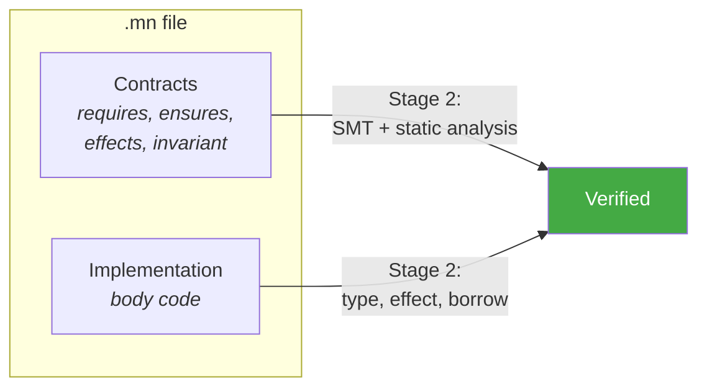
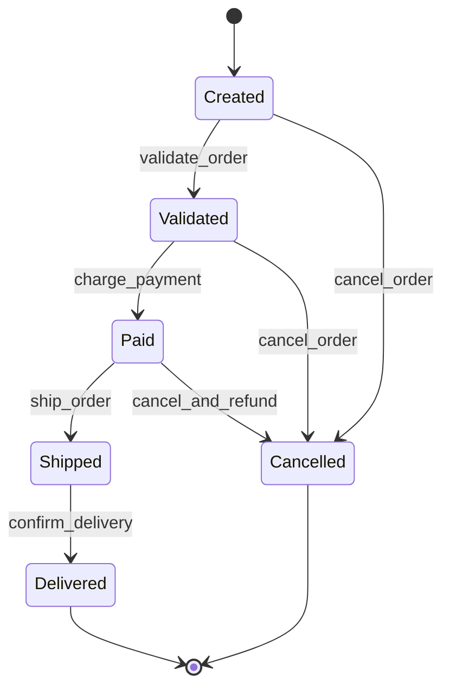

# 6. Verification

The compiler verifies that every function's implementation satisfies its declared `requires:`, `ensures:`, `effects:`, `invariant:`, and `panics: never` contracts. All verification is deterministic and reproducible, with no LLM in the pipeline.



The compiler verifies five kinds of contracts:

| Contract | Verification Method |
|----------|-------------------|
| `requires:` | SMT solver (Z3) proves preconditions hold at every call site |
| `ensures:` | SMT solver proves postconditions hold at every return point |
| `effects:` | Inference checking: inferred effects must be a subset of declared effects |
| `invariant:` | SMT solver proves invariant holds after every mutation point |
| `panics: never` | Static analysis proves no reachable code path can panic |

---

## 6.1 The Four-Stage Compiler Pipeline

The Monel compiler (`monelc`) processes code through four stages:

### Stage 1: Parse

`.mn` and `.mn.test` files are parsed into ASTs. Each function's contracts and body are parsed into a single AST node.

- Parse errors halt compilation with diagnostics.
- The parser is incremental. A syntax error in one file does not prevent parsing other files.

### Stage 2: Static Verification

All verification runs on the parsed ASTs:

- Type checking (Chapter 4)
- Effect checking (Chapter 5)
- Borrow checking (Chapter 4, Section 4.10)
- Exhaustiveness checking for pattern matches
- Contract verification:
  - `requires:` as preconditions (Section 6.3)
  - `ensures:` as postconditions (Section 6.4)
  - Per-error-variant postconditions (Section 6.4.1)
  - `invariant:` at all mutation points (Section 6.5)
  - `panics: never` as absence-of-panic proof (Section 6.6)
- Refinement type verification (Section 6.7)
- State machine verification (Section 6.8)
- Layout and interaction verification (Section 6.9)
- Verification coverage analysis (Section 6.10)

### Stage 3: Code Generation

The verified ASTs are lowered to the target representation:

- Cranelift (fast debug builds)
- LLVM IR (optimized release builds)
- WASM (browser and edge deployment)

See Chapter 9 (Code Generation).

### Stage 4: Bundling

The compiler packages:

- Compiled artifacts (WASM module, native binary, etc.)
- Verification manifest (Section 6.12): a JSON record of all verification checks and their results

The verification manifest enables downstream tools to confirm that contracts were verified without re-running the compiler.

---

## 6.2 Preconditions: `requires:`

A `requires:` clause declares a precondition that must hold at every call site.

```
fn binary_search(arr: &Vec<Int>, target: Int) -> Option<UInt>
  requires:
    arr.is_sorted()
    arr.len() > 0

  let lo = 0
  let hi = arr.len() - 1
  // ... search logic ...
```

The compiler translates each `requires:` clause into an SMT assertion and verifies it at every call site. If the solver cannot prove a precondition, the call site is flagged:

```
error[V0101]: precondition `arr.is_sorted()` not proven at call site
  --> src/search.mn:10:5
   |
10 |   let idx = binary_search(data, key)
   |             ^^^^^^^^^^^^^ cannot prove `data.is_sorted()`
   |
   = help: add a sort before calling, or assert the condition
   = old_string: let idx = binary_search(data, key)
   = new_string: let sorted = data.sorted()
                 let idx = binary_search(sorted, key)
```

---

## 6.3 Postconditions: `ensures:`

An `ensures:` clause declares a postcondition that must hold at every return point.

```
fn sort(arr: &mut Vec<Int>)
  ensures:
    arr.is_sorted()
    arr.len() == old(arr.len())
    arr.is_permutation_of(old(arr))

  // ... sort implementation ...
```

The compiler generates an SMT assertion that, at every return point of the function, the postconditions hold. `old(expr)` refers to the value of `expr` at function entry.

### 6.3.1 Per-Error-Variant Postconditions

Functions returning `Result<T, E>` can specify postconditions per error variant. The compiler verifies each error path separately.

```
fn withdraw(self: &mut Account, amount: Money) -> Result<Receipt, AccountError>
  requires:
    amount > Money(0)
  ensures:
    ok => self.balance == old(self.balance) - amount
    err(InsufficientFunds) => self == old(self)
    err(Frozen) => self == old(self)
  effects: [Db.write, Log.write]

  if self.frozen
    return Err(AccountError.Frozen)
  if self.balance < amount
    return Err(AccountError.InsufficientFunds)
  self.balance = self.balance - amount
  let receipt = Receipt.new(self.id, amount)
  db.transactions.insert(receipt)?
  Ok(receipt)
```

The `ok =>` postcondition applies to success paths. Each `err(Variant) =>` postcondition applies to the specific error path that produces that variant. The compiler uses control flow analysis to identify which return points correspond to which variants and verifies the appropriate postcondition for each.

---

## 6.4 Invariants: `invariant:`

A type can declare invariants that must hold after every mutation.

```
type BoundedQueue<T>
  items: Vec<T>
  capacity: UInt

  invariant:
    self.items.len() <= self.capacity
    self.capacity > 0
```

Invariants are checked at:
- After every constructor call
- After every method that takes `&mut self`
- At the beginning of every public method (assumed, not checked; this is the caller's responsibility via the constructor and mutation checks)

```
error[V0103]: invariant `self.items.len() <= self.capacity` not maintained
  --> src/queue.mn:18:5
   |
18 |   self.items.push(item)
   |   ^^^^^^^^^^^^^^^^^^^^ this mutation may violate the invariant
   |
   = help: check capacity before pushing
   = old_string: self.items.push(item)
   = new_string: if self.items.len() < self.capacity
                   self.items.push(item)
                 else
                   Err(QueueError.Full)
```

---

## 6.5 Panic Freedom: `panics: never`

A function annotated with `panics: never` must be proven free of all panic paths.

```
fn safe_divide(a: Int, b: Int) -> Result<Int, MathError>
  requires:
    b != 0
  panics: never

  Ok(a / b)
```

The compiler proves that no reachable code path can panic:
- No array index out of bounds
- No integer overflow (in checked mode)
- No unwrap on `None` or `Err`
- No division by zero
- No assertion failures

This is the strongest guarantee and typically requires inputs to be constrained via `requires:`.

```
error[V0104]: possible panic in `panics: never` function
  --> src/math.mn:12:5
   |
12 |   arr[idx]
   |   ^^^^^^^^ index may be out of bounds
   |
   = note: `idx` has type `UInt`, `arr` has length `arr.len()`
   = help: use `arr.get(idx)` which returns `Option<T>`, or add `requires: idx < arr.len()`
```

---

## 6.6 Refinement Type Verification

Refinement types attach predicates to base types. The compiler verifies that every assignment to a refinement type satisfies the predicate.

```
type Port = Int where value >= 1 and value <= 65535

fn connect(host: String, port: Port) -> Result<Connection, NetError>
  effects: [Net.connect]
  // ...
```

At every point where a value is assigned to a `Port`, the compiler verifies the predicate:

```
error[V0201]: refinement predicate not satisfied
  --> src/net.mn:5:25
   |
 5 |   let p: Port = user_input
   |                 ^^^^^^^^^^ cannot prove `user_input >= 1 and user_input <= 65535`
   |
   = help: validate the input first
   = old_string: let p: Port = user_input
   = new_string: let p: Port = match Port.try_from(user_input)
                   | Ok(port) => port
                   | Err(_) => return Err(ConfigError.InvalidPort)
```

---

## 6.7 State Machine Verification

`.mn` files can declare state machines. The compiler verifies that implementation code paths correspond to declared transitions.

### 6.7.1 State Machine Declaration

```
state_machine OrderLifecycle
  states:
    Created
    Validated
    Paid
    Shipped
    Delivered
    Cancelled
  transitions:
    Created -> Validated: validate_order
    Created -> Cancelled: cancel_order
    Validated -> Paid: charge_payment
    Validated -> Cancelled: cancel_order
    Paid -> Shipped: ship_order
    Paid -> Cancelled: cancel_and_refund
    Shipped -> Delivered: confirm_delivery
  initial: Created
  terminal: [Delivered, Cancelled]
```



### 6.7.2 Implementation

The implementation represents states as an enum and transitions as functions:

```
type OrderState
  | Created
  | Validated
  | Paid
  | Shipped
  | Delivered
  | Cancelled

fn validate_order(order: &mut Order) -> Result<Unit, OrderError>
  effects: [Db.read]
  requires:
    order.state == OrderState.Created
  ensures:
    ok => order.state == OrderState.Validated

  // ... validation logic ...
  order.state = OrderState.Validated
  Ok(())
```

### 6.7.3 State Machine Checks

| Check | Rule | Error if violated |
|-------|------|-------------------|
| State coverage | Every declared state exists as an enum variant | `V0501: missing state 'name'` |
| Transition coverage | Every declared transition has a corresponding function | `V0502: missing transition function 'name'` |
| Transition correctness | Each transition function moves from the declared source state to the declared destination state | `V0503: transition 'name' does not produce expected state change` |
| No illegal transitions | No code path produces a state change not declared in the state machine | `V0504: undeclared transition from 'A' to 'B'` |
| Reachability | All states are reachable from the initial state | `V0505: unreachable state 'name'` (warning) |
| Terminal correctness | Terminal states have no outgoing transitions in code | `V0506: transition from terminal state 'name'` |
| Initial state | The initial state is the only state used in constructors | `V0507: object constructed in non-initial state` |

Transition correctness is verified by analyzing the control flow graph of each transition function. The compiler tracks the value of the state field and verifies that:
- At entry, the state field matches the declared source state (via `requires:` or assertion).
- At all exits, the state field matches the declared destination state.

---

## 6.8 Layout and Interaction Verification

For UI-related modules, `.mn` files can declare layouts and interactions. The compiler verifies these against the implementation.

### 6.8.1 Layout Verification

```
layout MainView
  regions:
    sidebar:
      width: 20%
      min_width: 200px
    content:
      width: 80%
      min_width: 400px
  constraint: sidebar.width + content.width == 100%
```

Layout checks:

| Check | Rule | Error if violated |
|-------|------|-------------------|
| Region existence | Every declared region is created in the implementation | `V0601: missing region 'name'` |
| Percentage sum | Regions with percentage widths/heights sum to 100% | `V0602: layout percentages do not sum to 100%` |
| Min size satisfiability | Min sizes are satisfiable given the percentage constraints | `V0603: min sizes unsatisfiable` |
| Custom constraints | Declared constraints are satisfiable | `V0604: layout constraint unsatisfiable` |

### 6.8.2 Interaction Verification

```
interaction SearchFlow
  states:
    idle
    typing
    loading
    results
    selected
    error
  transitions:
    idle -> typing: on_keystroke
    typing -> typing: on_keystroke
    typing -> loading: debounce_expired
    loading -> results: search_success
    loading -> error: search_failure
    results -> typing: on_keystroke
    results -> selected: on_select
    error -> typing: on_keystroke
```

Interaction checks:

| Check | Rule | Error if violated |
|-------|------|-------------------|
| State reachability | All states are reachable from the initial state | `V0701: unreachable interaction state 'name'` |
| Transition handling | All transitions have corresponding event handlers | `V0702: unhandled transition 'name'` |
| Dead states | Non-terminal states have at least one outgoing transition | `V0703: dead interaction state 'name'` |
| Event coverage | All declared events are handled in at least one state | `V0704: unused event 'name'` (warning) |

---

## 6.9 Verification Coverage

The compiler tracks the verification status of every public function. Each function is classified into one of three categories:

| Status | Meaning |
|--------|---------|
| **Proven** | All contracts verified via SMT |
| **Tested** | No contracts present, but test coverage exists |
| **Uncovered** | Neither contracts nor tests |

Every public function must be either proven or tested. Uncovered functions are compilation errors.

### 6.9.1 Coverage Rules

A function is **proven** when it has at least one `requires:`, `ensures:`, `invariant:`, or `panics: never` clause, and all clauses pass SMT verification.

A function is **tested** when it has no contract clauses and at least one test in a `.mn.test` file calls it.

A function is **uncovered** when it has neither contracts nor tests.

Private functions do not require coverage. They may still have contracts, in which case those contracts are verified.

### 6.9.2 Configuration

Coverage requirements are configurable in `monel.project`:

```toml
[verification]
# Require contracts, tests, or either for public functions
coverage = "contracts_or_tests"  # "contracts_or_tests" (default) | "contracts_required" | "tests_required" | "off"

# Modules exempt from coverage requirements
coverage_exempt = ["src/generated/*", "src/bindings/*"]
```

| Mode | Requirement |
|------|-------------|
| `contracts_or_tests` | Every public function must have contracts or tests |
| `contracts_required` | Every public function must have at least one contract clause |
| `tests_required` | Every public function must have test coverage |
| `off` | No coverage requirement |

### 6.9.3 Coverage Report

```
$ monel check --coverage

Verification coverage:
  Proven (SMT):     32 functions (64%)
  Tested:           14 functions (28%)
  Uncovered:         4 functions (8%)  ← compilation errors

  Uncovered functions:
    src/handlers.mn:12  fn handle_webhook
    src/handlers.mn:45  fn handle_callback
    src/sync.mn:8       fn sync_remote
    src/sync.mn:30      fn resolve_conflicts
```

---

## 6.10 Contract-Driven Test Generation

The compiler can mechanically generate property tests from contracts. This is useful for functions that have contracts but would benefit from runtime validation in addition to SMT proof.

### 6.10.1 Generation

```
$ monel test --generate-from-contracts
```

For a function:

```
fn clamp(value: Int, low: Int, high: Int) -> Int
  requires:
    low <= high
  ensures:
    result >= low
    result <= high
    (value >= low and value <= high) => result == value

  if value < low then low
  else if value > high then high
  else value
```

The compiler generates property tests:

```
// Auto-generated: do not edit
#[property_test]
fn test_clamp_contracts(value: Int, low: Int, high: Int)
  // Precondition filter
  assume low <= high

  let result = clamp(value, low, high)

  // Postcondition assertions
  assert result >= low
  assert result <= high
  if value >= low and value <= high
    assert result == value
```

### 6.10.2 Configuration

```toml
[verification]
# Generate property tests from contracts
generate_contract_tests = false    # default: false
contract_test_dir = "tests/generated/"
contract_test_iterations = 1000   # property test iterations per function
```

Generated tests run as part of `monel test` and count toward verification coverage.

---

## 6.11 Verification Manifest

Every build produces a verification manifest alongside the compiled output. The manifest is a JSON document recording all verification checks and their results.

### 6.11.1 Manifest Structure

```json
{
  "version": "1.0",
  "timestamp": "2026-03-18T14:30:00Z",
  "compiler_version": "0.1.0",
  "project": "my_service",
  "stages": {
    "parse": {
      "status": "PASS",
      "duration_ms": 45,
      "files": 15
    },
    "static_verification": {
      "status": "PASS",
      "duration_ms": 3400,
      "type_checks": 342,
      "effect_checks": 87,
      "smt_queries": 24,
      "smt_results": {
        "proved": 22,
        "unknown": 2,
        "failed": 0
      },
      "coverage": {
        "proven": 32,
        "tested": 14,
        "uncovered": 0
      }
    }
  },
  "summary": {
    "status": "PASS",
    "total_checks": 498,
    "total_warnings": 4,
    "total_errors": 0
  }
}
```

### 6.11.2 Manifest Usage

The verification manifest enables:

1. **CI/CD gating**: Deployment pipelines can check that all contracts were verified without re-running the compiler.
2. **Audit trails**: The manifest records what was checked and when.
3. **Incremental builds**: The manifest identifies which functions need re-checking after changes.
4. **Dashboard integration**: Monitoring tools can aggregate verification results across services.

### 6.11.3 Manifest Location

The manifest is written to:
- `target/verification-manifest.json` (default)
- Configurable via `monel.project`:

```toml
[build]
manifest_path = "target/verification-manifest.json"
```

---

## 6.12 SMT Solver Integration

The compiler translates verification conditions into SMT-LIB format and invokes Z3.

### 6.12.1 Translation Process

1. Function body is converted to SSA (Static Single Assignment) form.
2. Each statement becomes an SMT assertion.
3. The negation of the property to prove is asserted.
4. If Z3 returns UNSAT, the property holds.
5. If Z3 returns SAT, a counterexample is extracted and reported.
6. If Z3 returns UNKNOWN (timeout), a warning is reported.

### 6.12.2 Configuration

```toml
# monel.project
[verification]
smt_timeout_ms = 10000          # default: 10000
smt_memory_limit_mb = 4096      # default: 4096
timeout_is_error = false         # default: false (treat timeout as warning)
```

### 6.12.3 Limitations

Not all properties can be verified by SMT:
- Properties involving heap-allocated data structures (e.g., `is_sorted()` on a `Vec`) may require loop invariants that the solver cannot infer.
- Floating-point arithmetic verification is limited.
- Properties involving string operations are generally undecidable.

When verification is inconclusive (UNKNOWN), the compiler reports a warning with guidance:

```
warning[V0199]: verification inconclusive for `ensures: arr.is_sorted()`
  = note: Z3 returned UNKNOWN after 10000ms
  = help: consider adding a loop invariant or adding tests for this property
```

---

## 6.13 Incremental Verification

For large codebases, full verification on every build is expensive. Monel supports incremental verification.

### 6.13.1 Change Detection

```
$ monel check --changed
```

The `--changed` flag restricts verification to files that have changed since the last successful build. Change detection uses:

1. **File timestamps**: Modified `.mn` files are candidates.
2. **Content hashing**: Files with changed timestamps are hashed; only those with actual content changes are re-checked.
3. **Dependency tracking**: If function `f` depends on function `g`, and `g` changed, then `f` is re-checked.

### 6.13.2 Dependency Graph

The compiler maintains a dependency graph mapping each function to:
- Functions it calls
- Types it uses
- Effects it depends on
- Contracts that reference shared types or functions

When a node in the dependency graph changes, all dependents are invalidated and re-checked.

---

## 6.14 Edit-Compatible Errors

Every verification error includes machine-readable fix suggestions in the `old_string` / `new_string` format. This enables AI coding tools to apply fixes automatically.

### 6.14.1 Error Format

```
error[V0101]: precondition `balance >= amount` not proven at call site
  --> src/account.mn:22:5
   |
22 |   let receipt = withdraw(account, amount)
   |                 ^^^^^^^^ cannot prove `account.balance >= amount`
   |
   = note: `withdraw` requires `balance >= amount` at account.mn:8:5
   = old_string: let receipt = withdraw(account, amount)
   = new_string: if account.balance >= amount
                   let receipt = withdraw(account, amount)
                 else
                   return Err(PaymentError.InsufficientFunds)
```

### 6.14.2 Multi-Fix Errors

Some errors require multiple fixes. These are presented as an ordered list:

```
error[V0102]: postcondition `result.len() == old(items.len())` not proven
  --> src/transform.mn:15:3
   |
   = fix[1]:
     = file: src/transform.mn
     = old_string: fn transform(items: &Vec<Item>) -> Vec<Output>
                     ensures:
                       result.len() == old(items.len())
     = new_string: fn transform(items: &Vec<Item>) -> Vec<Output>
                     ensures:
                       result.len() <= old(items.len())
```

### 6.14.3 JSON Error Output

For programmatic consumption:

```
$ monel check --format json
```

```json
{
  "errors": [
    {
      "code": "V0101",
      "severity": "error",
      "message": "precondition `balance >= amount` not proven at call site",
      "file": "src/account.mn",
      "line": 22,
      "column": 5,
      "fixes": [
        {
          "file": "src/account.mn",
          "old_string": "let receipt = withdraw(account, amount)",
          "new_string": "if account.balance >= amount\n  let receipt = withdraw(account, amount)\nelse\n  return Err(PaymentError.InsufficientFunds)"
        }
      ]
    }
  ],
  "warnings": [],
  "summary": {
    "errors": 1,
    "warnings": 0
  }
}
```

---

## 6.15 Semantic Diff

The `monel diff` command shows what changed between two versions in terms of contracts and verification:

### 6.15.1 Basic Usage

```
$ monel diff HEAD~1
```

Output:

```
Changes since abc1234:

  Modified functions:
    user_service::save_user
      - effects: [Db.write] -> [Db.write, Log.write]  (effect added)
      - ensures: +1 clause added
      - return type: unchanged

    user_service::get_user
      - parameters: id: Int -> id: UserId  (type changed)

  New functions:
    user_service::delete_user
      - contracts: requires (1), ensures (2)
      - verification: not yet checked

  Removed functions:
    user_service::archive_user

  Type changes:
    UserProfile
      - added field: avatar_url: Option<String>
      - invariant: unchanged
```

### 6.15.2 Verification Status Diff

```
$ monel diff --verification
```

Shows the current verification status of all public functions:

```
Verification status:

  Proven (32 functions):
    user_service::get_user .............. SMT verified
    user_service::save_user ............. SMT verified
    order_service::create_order ......... SMT verified
    ...

  Tested (14 functions):
    handlers::handle_request ............ 3 tests
    handlers::parse_input ............... 2 tests
    ...

  Uncovered (0 functions):
    (none)
```

### 6.15.3 JSON Diff

```
$ monel diff HEAD~1 --format json
```

Returns structured JSON for programmatic consumption.

---

## 6.16 Error Code Reference

All verification-related error codes use the `V` prefix:

### Contract Verification (V01xx)

| Code | Description |
|------|-------------|
| `V0101` | Precondition (`requires:`) not proven at call site |
| `V0102` | Postcondition (`ensures:`) not proven at return site |
| `V0103` | Invariant not maintained after mutation |
| `V0104` | Panic possible in `panics: never` function |
| `V0105` | SMT solver timeout (verification inconclusive) |
| `V0106` | SMT solver returned unknown (verification inconclusive) |
| `V0107` | Per-error-variant postcondition not proven |
| `V0199` | Verification inconclusive (general) |

### Refinement Types (V02xx)

| Code | Description |
|------|-------------|
| `V0201` | Refinement predicate not satisfied |
| `V0202` | Refinement compatibility: implementation weaker than declaration |

### State Machine (V05xx)

| Code | Description |
|------|-------------|
| `V0501` | Missing state machine state |
| `V0502` | Missing transition function |
| `V0503` | Incorrect state transition |
| `V0504` | Undeclared state transition |
| `V0505` | Unreachable state (warning) |
| `V0506` | Transition from terminal state |
| `V0507` | Construction in non-initial state |

### Layout (V06xx)

| Code | Description |
|------|-------------|
| `V0601` | Missing layout region |
| `V0602` | Layout percentages do not sum to 100% |
| `V0603` | Min sizes unsatisfiable |
| `V0604` | Layout constraint unsatisfiable |

### Interaction (V07xx)

| Code | Description |
|------|-------------|
| `V0701` | Unreachable interaction state |
| `V0702` | Unhandled interaction transition |
| `V0703` | Dead interaction state |
| `V0704` | Unused interaction event (warning) |

### Coverage (V08xx)

| Code | Description |
|------|-------------|
| `V0801` | Public function has neither contracts nor tests |
| `V0802` | Public function missing contracts (`contracts_required` mode) |
| `V0803` | Public function missing tests (`tests_required` mode) |

---

## 6.17 Configuration Reference

All verification-related configuration in `monel.project`:

```toml
[verification]
# Verification coverage mode
coverage = "contracts_or_tests"   # "contracts_or_tests" | "contracts_required" | "tests_required" | "off"

# Modules exempt from coverage requirements
coverage_exempt = []

# SMT solver timeout per verification condition (ms)
smt_timeout_ms = 10000            # default: 10000

# SMT solver memory limit (MB)
smt_memory_limit_mb = 4096        # default: 4096

# Whether SMT timeout is treated as error or warning
timeout_is_error = false           # default: false

# Generate property tests from contracts
generate_contract_tests = false    # default: false

# Output directory for generated contract tests
contract_test_dir = "tests/generated/"

# Property test iterations per function
contract_test_iterations = 1000    # default: 1000

# Whether to check state machine verification
state_machine_verification = true  # default: true

# Whether to check layout verification
layout_verification = true         # default: true

# Whether to check interaction verification
interaction_verification = true    # default: true

[build]
# Verification manifest output path
manifest_path = "target/verification-manifest.json"

# Whether to generate verification manifest
generate_manifest = true           # default: true

# Error output format
error_format = "human"             # "human" | "json"
```
