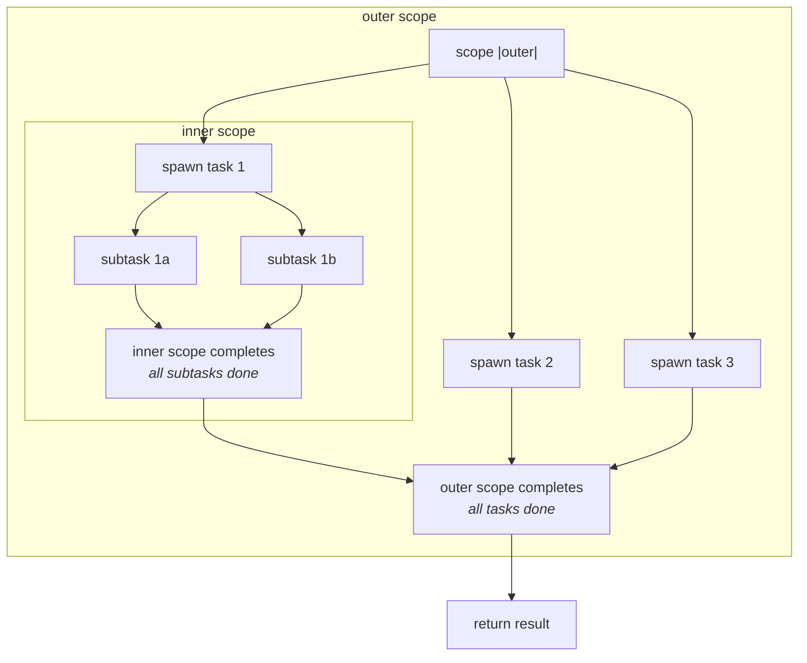

# 9. Concurrency

Monel provides structured concurrency with effect tracking. Asynchronous execution is modeled as the `async` effect on function signatures. Child tasks cannot outlive their parent scope. Data race freedom is guaranteed through ownership. Communication uses typed bounded channels.

## 9.1 The `async` Effect

Asynchronous execution is an effect. Any function that performs asynchronous work must declare the `async` effect.

### 9.1.1 Declaration

```
fn fetch_data(url: Url) -> Result<Data, HttpError>
  doc: "fetches data from a remote URL"
  effects: [async, Http.send]
  // ...
```

The `async` effect is contagious: any function that calls an `async` function must itself be `async`. The compiler verifies this transitively.

### 9.1.2 Colored Functions

Monel uses colored functions -- `async` and non-`async` functions are distinct types. A non-async function cannot call an async function without an explicit bridge. This is intentional: it makes the async boundary visible in the code.

```
# This is a compile error:
fn process(url: Url) -> Result<Data, Error>
  doc: "processes data from URL"
  effects: [Http.send]  # missing `async`!

# The compiler reports:
error: function calls async function but does not declare `async` effect
  --> src/processor/mod.mn:3:14
   |
 3 |   effects: [Http.send]
   |             ^^^^^^^^^ Http.send requires `async`
   |
   = help: add `async` to the effects list:
   |   effects: [async, Http.send]
```

### 9.1.3 `await`

Asynchronous expressions are awaited with the `await` keyword:

```
fn fetch_user(id: UserId) -> Result<User, ApiError>
  let response = await http.get("/users/{id}")
  let user = try response.json::<User>()
  Ok(user)
```

`await` suspends the current task until the asynchronous operation completes. It can only be used inside a function with the `async` effect.

`await` composes with `try` for async operations that return `Result`:

```
fn fetch_user(id: UserId) -> Result<User, ApiError>
  let response = try await http.get("/users/{id}")
  let user = try response.json::<User>()
  Ok(user)
```

The order is `try await expr` -- first await the future, then propagate the error.

## 9.2 Structured Concurrency

All concurrency in Monel is structured. Tasks are launched within scopes, and a scope does not complete until all its child tasks complete. There is no way to launch a detached task that outlives its parent.



### 9.2.1 Task Scopes

The `scope` block creates a concurrency scope:

```
fn process_batch(urls: Vec<Url>) -> Result<Vec<Data>, Error>
  scope |s|
    let handles = urls.map(|url|
      s.spawn(|| fetch_and_process(url))
    )
    let results = try handles.map(|h| await h).collect()
    Ok(results)
```

The scope `s` is a task spawner. Tasks spawned on `s` are guaranteed to complete before the scope exits. If any task panics, the scope cancels all remaining tasks and propagates the panic.

### 9.2.2 Scope Lifetime Rules

1. A scope blocks until all spawned tasks complete.
2. Tasks spawned in a scope cannot reference data that is dropped before the scope ends.
3. The scope's return value is available only after all tasks complete.
4. Scopes can be nested. Inner scopes complete before outer scopes.

```
fn pipeline(input: Vec<Data>) -> Result<Vec<Output>, Error>
  scope |outer|
    # Stage 1: parallel preprocessing
    let preprocessed = scope |inner|
      input.map(|d| inner.spawn(|| preprocess(d)))
        .map(|h| await h)
        .collect()
    # inner scope completes here -- all preprocess tasks done

    # Stage 2: parallel transformation
    let transformed = scope |inner|
      preprocessed.map(|d| inner.spawn(|| transform(d)))
        .map(|h| await h)
        .collect()
    # inner scope completes here

    Ok(transformed)
```

### 9.2.3 Contracts for Scoped Concurrency

Concurrent work is reflected via the `async` effect and descriptive documentation:

```
fn process_batch(urls: Vec<Url>) -> Result<Vec<Data>, Error>
  doc: "fetches and processes all URLs concurrently"
  effects: [async, Http.send]
  // ...
```

The function signature does not need to specify the concurrency strategy (scope, spawn count, etc.). That is an implementation detail. The `async` effect is sufficient to signal that concurrency occurs.

## 9.3 Spawn

`spawn` launches a concurrent task within a scope.

### 9.3.1 Basic Spawn

```
scope |s|
  let handle = s.spawn(|| do_work())
  let result = await handle
```

`spawn` returns a `TaskHandle<T>` that can be awaited to get the task's result.

### 9.3.2 Spawn Captures

Closures passed to `spawn` follow Monel's ownership rules:

1. **Immutable references** can be shared across spawned tasks freely.
2. **Owned values** are moved into the spawned task's closure.
3. **Mutable references** cannot be shared across tasks. The compiler rejects this at compile time.

```
fn process(data: Vec<Item>) -> Vec<Result>
  let config = Config.load()  # immutable, can be shared

  scope |s|
    data.map(|item|
      # `config` is borrowed immutably -- OK, shared across tasks
      # `item` is moved into the closure -- OK, unique ownership
      s.spawn(|| process_item(item, &config))
    ).map(|h| await h).collect()
```

### 9.3.3 Spawn Limits

The runtime limits the number of concurrent tasks per scope. The default limit is determined by the runtime (typically 2x CPU cores for compute-bound, 256 for I/O-bound). Custom limits can be set:

```
scope.with_limit(32) |s|
  # at most 32 concurrent tasks in this scope
  urls.map(|url| s.spawn(|| fetch(url)))
    .map(|h| await h)
    .collect()
```

## 9.4 Channels

Channels provide typed communication between concurrent tasks that cannot share references.

### 9.4.1 Channel Types

Monel provides three channel types:

| Type                   | Behavior                          | Capacity    |
|------------------------|-----------------------------------|-------------|
| `Channel<T>`           | Bounded multi-producer multi-consumer | Fixed       |
| `UnboundedChannel<T>`  | Unbounded multi-producer multi-consumer | Unlimited   |
| `Oneshot<T>`           | Single-value, single-producer single-consumer | 1           |

### 9.4.2 `Channel<T>` -- Bounded MPMC

```
use std/async {Channel}

fn producer_consumer() -> Result<(), Error>
  let (tx, rx) = Channel.new::<Message>(capacity: 100)

  scope |s|
    # Producer
    s.spawn(||
      for item in generate_items()
        await tx.send(item)
    )

    # Consumer
    s.spawn(||
      loop
        match await rx.recv()
          | Some(item) => process(item)
          | None => break  # channel closed
    )
```

**Bounded channel semantics:**
- `send` blocks (suspends the task) when the channel is full.
- `recv` blocks when the channel is empty.
- `recv` returns `None` when all senders have been dropped (channel closed).
- `send` returns `Err(SendError)` when all receivers have been dropped.
- Dropping a sender decrements the sender count. The channel closes when the last sender is dropped.
- Dropping a receiver decrements the receiver count. Sends fail when the last receiver is dropped.

### 9.4.3 `UnboundedChannel<T>`

```
use std/async {UnboundedChannel}

let (tx, rx) = UnboundedChannel.new::<LogEntry>()
```

Unbounded channels never block on `send`. They should be used only when backpressure is not a concern (e.g., logging, metrics). The compiler emits a lint warning if `UnboundedChannel` is used in performance-sensitive code paths.

### 9.4.4 `Oneshot<T>`

```
use std/async {Oneshot}

fn request_response() -> Result<Response, Error>
  let (tx, rx) = Oneshot.new::<Response>()

  scope |s|
    s.spawn(||
      let response = await compute_response()
      tx.send(response)  # can only send once
    )

    let response = await rx.recv()
    Ok(response)
```

Oneshot channels are for single-value communication. Sending more than once is a compile-time error (the `tx` is consumed on send). Receiving more than once is also a compile-time error.

### 9.4.5 Channel Ownership

Channels follow Monel's ownership rules:
- `tx` (sender) can be cloned to create multiple producers.
- `rx` (receiver) can be cloned to create multiple consumers.
- When the last `tx` clone is dropped, the channel closes for receivers.
- When the last `rx` clone is dropped, subsequent sends fail.

## 9.5 Select

`select` waits on multiple asynchronous operations simultaneously, proceeding with the first one that completes.

### 9.5.1 Basic Select

```
use std/async {select}

fn handle_events(input_rx: Channel<Input>, timer: Timer) -> Result<(), Error>
  loop
    select
      msg from input_rx.recv() ->
        try handle_input(msg)
      _ from timer.tick() ->
        try handle_tick()
```

### 9.5.2 Select Syntax

```
select
  <binding> from <async-expr> ->
    <body>
  <binding> from <async-expr> ->
    <body>
  ...
```

Each arm is an asynchronous expression. `select` polls all arms concurrently and executes the body of the first arm that completes. If multiple arms complete simultaneously, one is chosen non-deterministically (but fairly over repeated iterations).

### 9.5.3 Select with Timeout

```
select
  response from fetch(url) ->
    Ok(response)
  _ from timeout(Duration.from_secs(5)) ->
    Err(Error.Timeout("request timed out after 5 seconds"))
```

### 9.5.4 Select with Default

A `default` arm executes immediately if no other arm is ready:

```
select
  msg from rx.try_recv() ->
    process(msg)
  default ->
    # no message available, do other work
    idle_work()
```

### 9.5.5 Biased Select

By default, `select` is fair. Use `select biased` to prioritize earlier arms:

```
select biased
  # High priority: always check shutdown first
  _ from shutdown_rx.recv() ->
    return Ok(())
  # Normal priority
  msg from work_rx.recv() ->
    try handle_work(msg)
  # Low priority
  _ from timer.tick() ->
    try handle_tick()
```

In biased select, if multiple arms are ready, the first listed arm is always chosen.

## 9.6 Concurrent Map

`concurrent_map` is a built-in primitive for parallel iteration:

```
use std/async {concurrent_map}

fn fetch_all(urls: Vec<Url>) -> Result<Vec<Response>, HttpError>
  urls.concurrent_map(|url| fetch(url)).collect()
```

### 9.6.1 Concurrency Limit

```
# Process at most 10 items concurrently
urls.concurrent_map(|url| fetch(url))
  .with_limit(10)
  .collect()
```

### 9.6.2 Ordered vs Unordered

```
# Ordered: results maintain input order (default)
let results = urls.concurrent_map(|url| fetch(url)).collect()

# Unordered: results arrive in completion order (faster)
let results = urls.concurrent_map(|url| fetch(url)).unordered().collect()
```

### 9.6.3 Error Handling in Concurrent Map

```
# Fail fast: stop on first error
let results = try urls.concurrent_map(|url| fetch(url)).collect()

# Collect all results (including errors)
let results: Vec<Result<Response, HttpError>> =
  urls.concurrent_map(|url| fetch(url)).collect_all()
```

## 9.7 Ownership and Data Race Freedom

### 9.7.1 Ownership Model

Monel's ownership model is the foundation of its concurrency safety. The rules are:

1. Every value has exactly one owner.
2. When the owner goes out of scope, the value is dropped.
3. Values can be borrowed immutably (`&T`) any number of times.
4. Values can be borrowed mutably (`&mut T`) exactly once, with no concurrent immutable borrows.
5. These rules apply across task boundaries.

### 9.7.2 Send and Sync Traits

Types are classified by their concurrency properties:

| Trait  | Meaning                                           | Examples                      |
|--------|---------------------------------------------------|-------------------------------|
| `Send` | Value can be transferred to another task           | Most types                    |
| `Sync` | Value can be referenced from multiple tasks        | Immutable types, `Mutex<T>`   |

The compiler automatically derives `Send` and `Sync` for types whose fields are all `Send` and `Sync`. Types containing raw pointers or interior mutability must opt in explicitly.

### 9.7.3 Preventing Data Races

The compiler prevents data races at compile time:

```
fn bad_concurrent_mutation(data: mut Vec<Int32>)
  scope |s|
    s.spawn(|| data.push(1))  # ERROR: cannot move &mut borrow into spawned task
    s.spawn(|| data.push(2))  # ERROR: same
```

```
error: cannot share mutable reference across concurrent tasks
  --> src/example.mn:3:16
   |
 3 |     s.spawn(|| data.push(1))
   |                ^^^^ mutable reference `data` cannot be captured by spawned task
   |
   = help: use a Mutex to synchronize mutable access:
   |   let data = Mutex.new(data)
   |   s.spawn(|| data.lock().push(1))
```

The fix uses explicit synchronization:

```
fn safe_concurrent_mutation(data: Vec<Int32>) -> Vec<Int32>
  let data = Mutex.new(data)

  scope |s|
    s.spawn(||
      data.lock().push(1)
    )
    s.spawn(||
      data.lock().push(2)
    )

  data.into_inner()
```

## 9.8 Synchronization Primitives

### 9.8.1 `Mutex<T>`

A mutual exclusion lock protecting a value of type `T`:

```
use std/sync {Mutex}

let counter = Mutex.new(0)

scope |s|
  for i in 0..10
    s.spawn(||
      let mut guard = counter.lock()
      *guard += 1
    )

assert(counter.into_inner() == 10)
```

**Mutex semantics:**
- `lock()` blocks until the lock is acquired. Returns a guard that auto-releases on drop.
- `try_lock()` returns `Option<MutexGuard<T>>` -- `None` if the lock is held.
- The guard dereferences to `&mut T`, providing exclusive access.
- Deadlock detection: the runtime detects simple deadlocks (two tasks each waiting on the other's lock) and panics with a diagnostic message. Complex deadlocks (cycles of length > 2) are detected in debug mode.

### 9.8.2 `RwLock<T>`

A reader-writer lock allowing concurrent reads or exclusive writes:

```
use std/sync {RwLock}

let cache = RwLock.new(Map.new())

scope |s|
  # Multiple concurrent readers
  for key in keys
    s.spawn(||
      let guard = cache.read()
      if let Some(value) = guard.get(key)
        process(value)
    )

  # Exclusive writer
  s.spawn(||
    let mut guard = cache.write()
    guard.insert("key", "value")
  )
```

**RwLock semantics:**
- `read()` blocks until no writer holds the lock. Multiple readers can hold the lock simultaneously.
- `write()` blocks until no reader or writer holds the lock.
- `try_read()` and `try_write()` are non-blocking variants.
- Writer starvation is prevented: if a writer is waiting, new readers queue behind it.

### 9.8.3 `Atomic<T>`

Lock-free atomic operations for primitive types:

```
use std/sync {Atomic, Ordering}

let counter = Atomic.new(0_u64)

scope |s|
  for i in 0..1000
    s.spawn(||
      counter.fetch_add(1, Ordering.Relaxed)
    )

assert(counter.load(Ordering.SeqCst) == 1000)
```

**Supported types for `Atomic<T>`:** `Bool`, `Int32`, `Int64`, `UInt32`, `UInt64`, `UInt`, `Int`.

**Operations:**
| Method                    | Description                        |
|---------------------------|------------------------------------|
| `load(ordering)`          | Read the value                     |
| `store(val, ordering)`    | Write the value                    |
| `swap(val, ordering)`     | Swap and return old value          |
| `compare_swap(old, new, ordering)` | CAS operation             |
| `fetch_add(val, ordering)` | Atomic add, return old value      |
| `fetch_sub(val, ordering)` | Atomic subtract, return old value |
| `fetch_and(val, ordering)` | Atomic AND, return old value      |
| `fetch_or(val, ordering)`  | Atomic OR, return old value       |

**Memory orderings:** `Relaxed`, `Acquire`, `Release`, `AcqRel`, `SeqCst`. These follow the C++11 memory model semantics.

## 9.9 Cancellation

### 9.9.1 Structured Cancellation

Cancellation propagates structurally: cancelling a scope cancels all its child tasks.

```
fn fetch_with_timeout(url: Url) -> Result<Response, Error>
  select
    response from fetch(url) ->
      Ok(response)
    _ from timeout(Duration.from_secs(10)) ->
      # fetch is automatically cancelled when the select arm is not chosen
      Err(Error.Timeout("request timed out"))
```

When a `select` arm completes, the other arms are cancelled. The cancelled tasks' destructors run, releasing resources.

### 9.9.2 Explicit Cancellation

Tasks can be explicitly cancelled via their handle:

```
scope |s|
  let handle = s.spawn(|| long_running_work())

  # Later, if we need to cancel:
  handle.cancel()

  # await returns Err(Cancelled) after cancellation
  match await handle
    | Ok(result) => use_result(result)
    | Err(TaskError.Cancelled) => log("task was cancelled")
```

### 9.9.3 Cancellation Safety

A function is **cancellation-safe** if being cancelled at any await point does not leave the system in an inconsistent state. The compiler does not verify cancellation safety automatically (it is undecidable in general), but it can be documented:

```
fn transfer_funds(from: Account, to: Account, amount: Money) -> Result<(), TransferError>
  doc: "transfers funds between accounts atomically"
  effects: [async, Db.write]
  requires:
    amount.value > 0
  cancellation: safe  # this function can be safely cancelled at any point

  // implementation...
```

The `cancellation: safe` annotation is a declaration for code reviewers and generators. It signals that the function handles cancellation correctly (e.g., by using database transactions).

### 9.9.4 Cancellation Tokens

For fine-grained cancellation control, use cancellation tokens:

```
use std/async {CancellationToken}

fn long_running_job(token: CancellationToken) -> Result<Output, Error>
  for chunk in data.chunks(100)
    if token.is_cancelled()
      return Err(Error.Cancelled)
    try process_chunk(chunk)
  Ok(result)
```

Cancellation tokens can be passed through the call graph. They are lightweight and cloneable.

## 9.10 Event Loop Integration

For interactive applications (terminal emulators, TUI apps, games), Monel provides event loop primitives.

### 9.10.1 Event Loop

```
use std/async {EventLoop, Event}

fn run_terminal() -> Result<(), Error>
  let event_loop = EventLoop.new()

  event_loop.run(|event|
    match event
      | Event.Key(key) => try handle_key(key)
      | Event.Resize(w, h) => try handle_resize(w, h)
      | Event.Signal(sig) => try handle_signal(sig)
      | Event.Timer(id) => try handle_timer(id)
  )
```

### 9.10.2 Event Sources

The event loop can listen to multiple event sources:

```
let event_loop = EventLoop.new()

# File descriptor readiness
event_loop.register_fd(pty_fd, Interest.Read)

# Timers
let timer_id = event_loop.add_timer(Duration.from_millis(16))  # 60fps render

# Signals
event_loop.register_signal(Signal.SIGWINCH)
event_loop.register_signal(Signal.SIGTERM)
```

### 9.10.3 Select Over I/O Events

`select` integrates with the event loop for polling multiple sources:

```
fn terminal_loop(pty: Pty, renderer: Renderer) -> Result<(), Error>
  let input = stdin_events()
  let pty_output = pty.output_stream()
  let render_timer = Timer.interval(Duration.from_millis(16))

  loop
    select
      key from input.next() ->
        try pty.write(key.to_bytes())
      data from pty_output.next() ->
        try renderer.process(data)
      _ from render_timer.tick() ->
        try renderer.flush()
```

### 9.10.4 Contracts for Event-Driven Functions

```
fn run_terminal(config: TerminalConfig) -> Result<(), TerminalError>
  doc: "runs the terminal event loop, handling input, output, and rendering"
  effects: [async, Pty.read, Pty.write, Terminal.render, Signal.handle]
  // ...
```

## 9.11 Timeout and Deadline Support

### 9.11.1 Timeouts

```
use std/async {timeout}

fn fetch_with_timeout(url: Url) -> Result<Response, Error>
  match timeout(Duration.from_secs(5), fetch(url))
    | Ok(response) => Ok(try response)
    | Err(Elapsed) => Err(Error.Timeout("fetch timed out after 5s"))
```

`timeout(duration, future)` wraps a future with a timeout. If the future does not complete within the duration, it is cancelled and `Err(Elapsed)` is returned.

### 9.11.2 Deadlines

Deadlines are absolute time points, as opposed to relative durations:

```
use std/async {deadline, Instant}

fn batch_process(items: Vec<Item>) -> Result<Vec<Output>, Error>
  let deadline_at = Instant.now() + Duration.from_secs(30)

  let results = Vec.new()
  for item in items
    let result = match deadline(deadline_at, process(item))
      | Ok(r) => try r
      | Err(Elapsed) => return Err(Error.Deadline("batch did not complete in 30s"))
    results.push(result)
  Ok(results)
```

Deadlines are more appropriate than timeouts when processing multiple items: the total time budget is fixed regardless of how many items have been processed.

### 9.11.3 Timeout in Function Contracts

Timeouts can be documented in function contracts for clarity:

```
fn fetch_data(url: Url) -> Result<Data, FetchError>
  doc: "fetches data with a 10-second timeout"
  effects: [async, Http.send]
  fails:
    Timeout: "request did not complete within 10 seconds"
    HttpError: "HTTP request failed"

  // implementation...
```

## 9.12 Concurrency Patterns

### 9.12.1 Fan-Out / Fan-In

Distribute work across multiple tasks and collect results:

```
fn fan_out_fan_in(requests: Vec<Request>) -> Result<Vec<Response>, Error>
  let (result_tx, result_rx) = Channel.new::<Result<Response, Error>>(capacity: 100)

  scope |s|
    # Fan out: spawn one task per request
    for req in requests
      let tx = result_tx.clone()
      s.spawn(||
        let result = process_request(req)
        await tx.send(result)
      )
    drop(result_tx)  # close channel when all senders are spawned

    # Fan in: collect all results
    let results = Vec.new()
    loop
      match await result_rx.recv()
        | Some(result) => results.push(try result)
        | None => break
    Ok(results)
```

Or more concisely with `concurrent_map`:

```
fn fan_out_fan_in(requests: Vec<Request>) -> Result<Vec<Response>, Error>
  requests.concurrent_map(|req| process_request(req)).collect()
```

### 9.12.2 Pipeline

Process data through a series of stages, each running concurrently:

```
fn pipeline(input: Channel<RawData>) -> Result<(), Error>
  let (parsed_tx, parsed_rx) = Channel.new::<ParsedData>(capacity: 100)
  let (validated_tx, validated_rx) = Channel.new::<ValidData>(capacity: 100)

  scope |s|
    # Stage 1: Parse
    s.spawn(||
      loop
        match await input.recv()
          | Some(raw) =>
            let parsed = try parse(raw)
            await parsed_tx.send(parsed)
          | None => break
    )

    # Stage 2: Validate
    s.spawn(||
      loop
        match await parsed_rx.recv()
          | Some(parsed) =>
            let valid = try validate(parsed)
            await validated_tx.send(valid)
          | None => break
    )

    # Stage 3: Store
    s.spawn(||
      loop
        match await validated_rx.recv()
          | Some(valid) => try store(valid)
          | None => break
    )

  Ok(())
```

### 9.12.3 Supervisor

Restart tasks that fail:

```
fn supervised_worker(config: WorkerConfig) -> Result<(), Error>
  let max_restarts = 5
  let mut restarts = 0

  loop
    match run_worker(config)
      | Ok(()) => return Ok(())
      | Err(e) if restarts < max_restarts =>
        log.warn("worker failed ({e}), restarting ({restarts + 1}/{max_restarts})")
        restarts += 1
        await sleep(Duration.from_secs(restarts * 2))  # exponential backoff
      | Err(e) =>
        return Err(Error.WorkerFailed("exceeded max restarts: {e}"))
```

### 9.12.4 Worker Pool

A fixed pool of workers processing from a shared queue:

```
fn worker_pool(jobs: Channel<Job>, num_workers: UInt32) -> Result<(), Error>
  scope |s|
    for id in 0..num_workers
      let rx = jobs.clone()
      s.spawn(||
        loop
          match await rx.recv()
            | Some(job) =>
              log.debug("worker {id} processing job {job.id}")
              try process_job(job)
            | None => break  # channel closed, no more jobs
      )
  Ok(())
```

### 9.12.5 Barrier

Synchronize multiple tasks at a rendezvous point:

```
use std/sync {Barrier}

fn parallel_phases(data: Vec<Chunk>, num_workers: UInt32) -> Result<(), Error>
  let barrier = Barrier.new(num_workers)

  scope |s|
    for (i, chunk) in data.chunks(data.len() / num_workers).enumerate()
      let b = barrier.clone()
      s.spawn(||
        # Phase 1: independent work
        let processed = try process_chunk(chunk)

        # Wait for all workers to finish phase 1
        await b.wait()

        # Phase 2: work that depends on all chunks being processed
        try merge_results(i, processed)
      )
  Ok(())
```

## 9.13 Thread-Safety Guarantees

### 9.13.1 Compile-Time Guarantees

The Monel type system provides the following compile-time guarantees:

1. **No data races.** Mutable references are unique. Shared references are immutable. This is enforced across task boundaries.
2. **No use-after-free.** Ownership tracking ensures values are not accessed after being moved or dropped.
3. **No dangling references.** Structured concurrency ensures child tasks cannot outlive the data they reference.
4. **Channel type safety.** Channels are typed; sending a value of the wrong type is a compile-time error.

### 9.13.2 Runtime Guarantees

The runtime provides additional guarantees:

1. **Deadlock detection.** In debug mode, the runtime detects lock-ordering deadlocks and panics with a diagnostic trace.
2. **Stack overflow protection.** Each task has a bounded stack. Overflow triggers a panic rather than undefined behavior.
3. **Fair scheduling.** The runtime scheduler is work-stealing and fair across tasks.

### 9.13.3 What Is NOT Guaranteed

The following are NOT guaranteed by the compiler or runtime:

1. **Livelock freedom.** Two tasks can spin indefinitely without the compiler detecting it.
2. **Starvation freedom** (except in `select biased` which explicitly introduces priority).
3. **Deterministic execution order.** Tasks may execute in any order unless explicitly synchronized.
4. **Cancellation safety** of user code (see section 9.10.3).

## 9.14 Async Runtime

### 9.14.1 Runtime Configuration

The async runtime is configured at program startup:

```
fn main() -> Result<(), Error>
  let runtime = Runtime.new()
    .worker_threads(4)
    .max_blocking_threads(512)
    .enable_io()
    .enable_timer()
    .build()

  runtime.run(|| async_main())
```

For simple programs, the `#[entry]` attribute configures the runtime automatically:

```
#[entry(workers = 4)]
fn main() -> Result<(), Error>
  let data = try await fetch("https://example.com")
  println(data)
  Ok(())
```

### 9.14.2 Blocking Operations

Blocking operations (CPU-heavy computation, synchronous I/O) must not be performed on the async worker threads. Use `spawn_blocking` to run them on a dedicated thread pool:

```
use std/async {spawn_blocking}

fn process_image(image: Image) -> Result<Image, Error>
  # Run CPU-heavy work on blocking thread pool
  let result = await spawn_blocking(|| {
    apply_filters(image)
  })
  Ok(result)
```

The compiler emits a lint warning if a function known to block (e.g., `std/io/read_file_sync`) is called inside an `async` context without `spawn_blocking`.

### 9.14.3 Runtime Configuration in Project

The runtime configuration is a deployment concern. The effects system captures whether a function uses async, and `monel.project` can specify default runtime settings:

```toml
[runtime]
worker_threads = "auto"        # matches CPU count
max_blocking_threads = 512
io = true
timer = true
```

## 9.15 Concurrency in Function Contracts

### 9.15.1 What Contracts Capture

Contracts capture the **what**, not the **how** of concurrency:

```
# Good: declares that concurrency occurs
fn process_batch(items: Vec<Item>) -> Result<Vec<Output>, Error>
  doc: "processes all items concurrently with a limit of 10"
  effects: [async, Db.write]

  // The implementation chooses the strategy:
  items.concurrent_map(|item| process_item(item))
    .with_limit(10)
    .collect()
```

### 9.15.2 What Contracts Do NOT Capture

- The specific concurrency primitive used (spawn, channel, select).
- The number of worker tasks.
- Channel buffer sizes.
- Lock granularity.
- Runtime configuration.

These are implementation details. If they are architecturally significant, they can be documented in the `doc:` description, but the compiler does not enforce them.

### 9.15.3 Compiler Verification for Concurrency

The compiler verifies:
1. If the function declares the `async` effect, the implementation uses async operations.
2. Effect declarations are consistent with the actual effects inferred from the function body.
