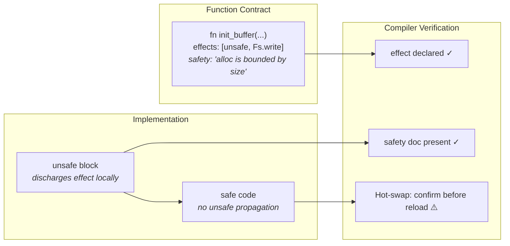

# 10. Systems Programming

## 10.1 The `unsafe` Effect

Operations that bypass the language's safety guarantees (raw pointer access, FFI calls, inline assembly, unchecked casts) require the `unsafe` effect.



### 10.1.1 Declaration

Functions that are entirely unsafe declare the `unsafe` effect:

```
fn alloc_buffer(size: Int) -> MutPtr<Byte> with unsafe
  MutPtr.alloc<Byte>(size)
```

When a function declares `with unsafe`, the `unsafe` effect propagates through the call graph: any caller must either declare `with unsafe` itself or wrap the call in an `unsafe` block.

### 10.1.2 Unsafe Blocks

An `unsafe` block **discharges** the `unsafe` effect locally, allowing unsafe operations at a specific point in otherwise-safe code:

```
fn init_buffer(size: Int) -> Buffer
  let data = unsafe
    let ptr = MutPtr.alloc<Byte>(size)
    ptr.write_bytes(0, size, 0)
    ptr
  Buffer { data, size, len: 0 }
```

The `unsafe` block:
- Permits all unsafe operations within its body.
- **Discharges** the `unsafe` effect, so the enclosing function does **not** need `with unsafe` in its signature.
- Callers of the enclosing function do **not** need to declare or handle `unsafe`.
- Must be as small as possible. The compiler warns on `unsafe` blocks that contain safe operations.

This distinction is critical: a function can **use** unsafe internally while presenting a **safe interface** to callers. In the example above, `init_buffer` performs raw pointer allocation inside an `unsafe` block, but its signature is safe, so callers treat it as an ordinary function. Compare with `alloc_buffer` in 10.1.1, which declares `with unsafe` and forces all callers to acknowledge the unsafe effect.

The rule:
- `unsafe` block inside a function → effect discharged locally, function signature is safe.
- `with unsafe` on a function → effect propagates, all callers must handle it.

### 10.1.3 Unsafe in Function Contracts

The function contract documents unsafe operations and the invariants they depend on:

```
fn init_pty(config: PtyConfig) -> Result<Pty, PtyError>
  doc: "initializes a PTY with the given configuration"
  effects: [unsafe, Fs.read, Fs.write]
  panics: never
  safety:
    requires: "config.rows > 0 and config.cols > 0"
    invariant: "returned Pty owns the file descriptor and will close it on drop"

  // implementation...
```

The `safety` block is required for any function that declares `unsafe`. It documents:
- `requires`: preconditions the caller must satisfy.
- `invariant`: postconditions the function establishes.
- `assumes`: assumptions about the environment (e.g., "platform supports POSIX PTY").

The compiler verifies that every `unsafe` block in the implementation corresponds to a documented safety invariant.

### 10.1.4 Unsafe and Hot-Swap

Functions with the `unsafe` effect require explicit confirmation for hot-swap during `monel dev` watch mode. The runtime displays:

```
[hot-swap] unsafe function modified: pty::init_pty
  safety invariants changed: no
  confirm reload? [y/n]
```

If the safety invariants have changed, the runtime refuses hot-swap entirely and requires a full restart.

---

## 10.2 Raw Pointer Types

Monel provides two raw pointer types for direct memory access.

### 10.2.1 `Ptr<T>`: Immutable Raw Pointer

`Ptr<T>` represents a non-null, unmanaged pointer to a value of type `T`. It permits reading but not writing.

```
struct Ptr<T>
```

**Operations** (all require `unsafe`):

| Operation | Signature | Description |
|-----------|-----------|-------------|
| `from_ref` | `fn from_ref(ref: T) -> Ptr<T>` | Create pointer from reference |
| `read` | `fn read(self) -> T` | Read the pointed-to value |
| `offset` | `fn offset(self, count: Int) -> Ptr<T>` | Pointer arithmetic |
| `cast<U>` | `fn cast<U>(self) -> Ptr<U>` | Reinterpret as different type |
| `is_aligned` | `fn is_aligned(self) -> Bool` | Check alignment |
| `as_mut` | `fn as_mut(self) -> MutPtr<T>` | Cast to mutable (unsafe) |
| `to_int` | `fn to_int(self) -> Int` | Convert to integer address |

### 10.2.2 `MutPtr<T>`: Mutable Raw Pointer

`MutPtr<T>` represents a non-null, unmanaged pointer to a value of type `T`. It permits both reading and writing.

```
struct MutPtr<T>
```

**Operations** (all require `unsafe`):

| Operation | Signature | Description |
|-----------|-----------|-------------|
| `alloc` | `fn alloc<T>(count: Int) -> MutPtr<T>` | Allocate `count` values |
| `alloc_zeroed` | `fn alloc_zeroed<T>(count: Int) -> MutPtr<T>` | Allocate zero-initialized |
| `dealloc` | `fn dealloc(self)` | Free the allocation |
| `read` | `fn read(self) -> T` | Read the pointed-to value |
| `write` | `fn write(self, value: T)` | Write a value |
| `read_at` | `fn read_at(self, index: Int) -> T` | Read at byte offset |
| `write_at` | `fn write_at(self, index: Int, value: T)` | Write at byte offset |
| `offset` | `fn offset(self, count: Int) -> MutPtr<T>` | Pointer arithmetic |
| `cast<U>` | `fn cast<U>(self) -> MutPtr<U>` | Reinterpret as different type |
| `copy_from` | `fn copy_from(self, src: Ptr<T>, count: Int)` | Copy `count` values |
| `copy_within` | `fn copy_within(self, src: Int, dst: Int, count: Int)` | Overlapping copy |
| `write_bytes` | `fn write_bytes(self, value: Byte, count: Int)` | Fill with byte value |
| `as_const` | `fn as_const(self) -> Ptr<T>` | Cast to immutable |
| `is_aligned` | `fn is_aligned(self) -> Bool` | Check alignment |

### 10.2.3 Null Pointers

Raw pointers in Monel are **non-null by default**. Nullable pointers use `Option<Ptr<T>>` or `Option<MutPtr<T>>`. The `None` variant represents null.

```
fn find_entry(table: Ptr<Entry>, key: Int) -> Option<Ptr<Entry>> with unsafe
  // returns None if not found
```

### 10.2.4 Pointer Provenance

Monel tracks pointer provenance at compile time. A pointer derived from an allocation may only access memory within that allocation's bounds. The compiler emits a warning (and in strict mode, an error) when provenance cannot be statically verified:

```
unsafe
  let a = MutPtr.alloc<Int>(10)
  let b = MutPtr.alloc<Int>(10)
  let c = a.offset(15)  // warning: may exceed allocation bounds
  a.copy_from(b.as_const(), 10)  // ok: both allocations are 10 elements
```

---

## 10.3 Memory Management

Monel uses ownership-based automatic memory management with no garbage collector. This section specifies the memory model.

### 10.3.1 Ownership

Every value in Monel has exactly one owner. When the owner goes out of scope, the value is dropped (its resources are released). Ownership can be transferred but not duplicated (unless the type implements `Copy` or `Clone`).

```
fn process()
  let buf = Buffer.new(1024)   // buf owns the allocation
  consume(buf)                  // ownership transferred to consume
  // buf is no longer valid here
```

### 10.3.2 Borrowing

Values can be borrowed without transferring ownership:

- `T` (non-mut parameter): immutable borrow (multiple allowed simultaneously)
- `mut T`: mutable borrow (exclusive: no other borrows while active)

```
fn print_len(buf: Buffer)
  println(buf.len)

fn append(buf: mut Buffer, data: Array<Byte>)
  // mutates buf
```

The borrow checker enforces at compile time that:
1. No mutable borrow coexists with any other borrow of the same value.
2. No borrow outlives the value it borrows.

### 10.3.3 The `Drop` Trait

Types that own resources implement `Drop` to define cleanup behavior:

```
trait Drop
  fn drop(self: mut Self)
```

```
impl Drop for Buffer
  fn drop(self: mut Self)
    unsafe
      self.data.dealloc()
```

Drop is called automatically when a value goes out of scope. Drop order is reverse declaration order within a scope. Drop is never called on a value that has been moved.

### 10.3.4 RAII (Resource Acquisition Is Initialization)

Resources are tied to object lifetimes. File handles, sockets, locks, and PTY descriptors are all closed/released when their owning value is dropped:

```
fn with_file()
  let f = File.open("data.txt")?     // acquires file handle
  let data = f.read_all()?            // uses file
  // f dropped here -- file handle closed automatically
```

This pattern is pervasive. There is no `finally`, no `defer`, no `using`. RAII handles all resource cleanup.

### 10.3.5 Arena Allocators

For performance-critical paths where individual allocations are too expensive, Monel provides arena allocators:

```
fn parse_document(input: String) -> Document
  let arena = Arena.new(64 * 1024)   // 64KB initial size
  let nodes = arena.alloc_slice<Node>(estimated_count)
  // ... parse into arena-allocated nodes ...
  // all arena memory freed when arena is dropped
  Document.from_arena(arena)
```

Arena types:
- `Arena`: general-purpose bump allocator, frees all memory at once.
- `TypedArena<T>`: arena for a single type, enables iteration over allocated values.
- `ScopedArena`: arena tied to a lexical scope, cannot escape.

Arena allocation requires the `unsafe` effect only for raw pointer access. The `Arena.alloc<T>()` method returns a safe reference bound to the arena's lifetime.

### 10.3.6 Custom Allocators

Functions can accept a custom allocator via the `Allocator` trait:

```
trait Allocator
  fn allocate(self: Self, size: Int, align: Int) -> Result<MutPtr<Byte>, AllocError>
  fn deallocate(self: Self, ptr: MutPtr<Byte>, size: Int, align: Int)
  fn resize(self: Self, ptr: MutPtr<Byte>, old_size: Int, new_size: Int, align: Int) -> Result<MutPtr<Byte>, AllocError>
```

Collections accept an optional allocator parameter:

```
let vec = Vec.new_in<Int>(arena_allocator)
```

---

## 10.4 Foreign Function Interface (FFI)

Monel provides FFI for interoperability with C libraries. All FFI operations require the `unsafe` effect.

### 10.4.1 Extern Blocks

Foreign functions are declared in `extern` blocks with a calling convention string:

```
extern "C"
  fn ioctl(fd: Int, request: ULong, ...) -> Int
  fn tcgetattr(fd: Int, termios: MutPtr<Termios>) -> Int
  fn tcsetattr(fd: Int, action: Int, termios: Ptr<Termios>) -> Int
  fn openpty(
    master: MutPtr<Int>,
    slave: MutPtr<Int>,
    name: MutPtr<Byte>,
    termp: Ptr<Termios>,
    winp: Ptr<Winsize>
  ) -> Int
  fn read(fd: Int, buf: MutPtr<Byte>, count: UInt) -> Int
  fn write(fd: Int, buf: Ptr<Byte>, count: UInt) -> Int
  fn close(fd: Int) -> Int
  fn mmap(
    addr: Option<MutPtr<Byte>>,
    len: UInt,
    prot: Int,
    flags: Int,
    fd: Int,
    offset: Int
  ) -> MutPtr<Byte>
  fn munmap(addr: MutPtr<Byte>, len: UInt) -> Int
```

Supported calling conventions:
- `"C"`: the platform's C calling convention (default).
- `"C-unwind"`: C calling convention that permits unwinding across the FFI boundary.
- `"system"`: the platform's system calling convention (stdcall on Windows, C elsewhere).

### 10.4.2 C Type Mappings

Monel provides C-compatible types in `std/ffi`:

| Monel Type | C Type | Size |
|------------|--------|------|
| `Int8` | `int8_t` | 1 byte |
| `Int16` | `int16_t` | 2 bytes |
| `Int32` | `int32_t` | 4 bytes |
| `Int64` | `int64_t` | 8 bytes |
| `UInt8` | `uint8_t` | 1 byte |
| `UInt16` | `uint16_t` | 2 bytes |
| `UInt32` | `uint32_t` | 4 bytes |
| `UInt64` | `uint64_t` | 8 bytes |
| `UInt` | `size_t` | platform |
| `ULong` | `unsigned long` | platform |
| `CFloat` | `float` | 4 bytes |
| `CDouble` | `double` | 8 bytes |
| `CChar` | `char` | 1 byte |
| `CStr` | `const char*` | pointer |
| `CString` | owned `char*` | pointer |
| `CVoid` | `void` | 0 bytes |
| `Ptr<T>` | `const T*` | pointer |
| `MutPtr<T>` | `T*` | pointer |

### 10.4.3 Struct Layout

Monel structs have unspecified layout by default. To match C struct layout, use the `@repr(C)` attribute:

```
@repr(C)
struct Termios
  c_iflag: UInt32
  c_oflag: UInt32
  c_cflag: UInt32
  c_lflag: UInt32
  c_cc: Array<UInt8, 20>
```

Additional repr options:
- `@repr(C)`: C-compatible layout with C alignment rules.
- `@repr(C, packed)`: C layout with no padding.
- `@repr(C, align(N))`: C layout with minimum alignment `N`.
- `@repr(transparent)`: same layout as the single field (for newtype wrappers).
- `@repr(Int8)`, `@repr(UInt32)`, etc.: for enum discriminant type.

### 10.4.4 Callbacks

Monel closures can be passed to C code as function pointers:

```
extern "C"
  fn signal(sig: Int, handler: fn(Int) -> Unit) -> fn(Int) -> Unit
```

The callback function must have a C-compatible signature (no closures that capture environment). Use `@extern_fn` for closures that must capture state:

```
@extern_fn
fn make_handler(state: mut State) -> fn(Int) -> Unit
  // compiler generates a trampoline
```

### 10.4.5 Linking

External libraries are linked via build configuration:

```
// monel.project
[dependencies.native]
openssl = { lib = "ssl", search_path = "/usr/lib" }
ncurses = { lib = "ncurses" }
```

Or via inline link attributes:

```
@link("ncurses")
extern "C"
  fn initscr() -> MutPtr<Window>
  fn endwin() -> Int
```

### 10.4.6 FFI Safety Wrapper Pattern

The idiomatic pattern is to wrap FFI calls in safe Monel APIs:

```
// Low-level FFI (unsafe)
extern "C"
  fn tcgetattr(fd: Int, termios: MutPtr<Termios>) -> Int
  fn tcsetattr(fd: Int, action: Int, termios: Ptr<Termios>) -> Int

// Safe wrapper with contract and implementation together
fn get_terminal_attrs(fd: Fd) -> Result<Termios, IoError>
  doc: "reads terminal attributes for the given file descriptor"
  effects: [Fs.read]
  panics: never

  let mut attrs = Termios.zeroed()
  let result = unsafe
    tcgetattr(fd.raw(), attrs.as_mut_ptr())
  if result == -1
    Err(IoError.last_os_error())
  else
    Ok(attrs)
```

The safe wrapper:
1. Converts raw return codes to `Result`.
2. Manages pointer lifetimes.
3. Does not require the `unsafe` effect on its signature. The `unsafe` block discharges it internally.

---

## 10.5 Low-Level I/O Types

Monel provides types for direct interaction with operating system I/O primitives.

### 10.5.1 `Fd`: File Descriptor

`Fd` is an owned file descriptor. It closes the descriptor on drop.

```
struct Fd
  raw: Int32
```

```
fn Fd.open(path: String, flags: OpenFlags) -> Result<Fd, IoError>
  doc: "opens a file descriptor with the given flags"
  effects: [unsafe, Fs.read]
  panics: never
  // ...

fn Fd.read(self: Fd, buf: mut Array<Byte>) -> Result<Int, IoError>
  doc: "reads bytes into the buffer, returns number of bytes read"
  effects: [unsafe, Fs.read]
  panics: never
  // ...

fn Fd.write(self: Fd, buf: Array<Byte>) -> Result<Int, IoError>
  doc: "writes bytes from the buffer, returns number of bytes written"
  effects: [unsafe, Fs.write]
  panics: never
  // ...

fn Fd.ioctl(self: Fd, request: ULong, arg: MutPtr<Byte>) -> Result<Int, IoError>
  doc: "performs an ioctl operation on the file descriptor"
  effects: [unsafe]
  panics: never
  // ...

impl Drop for Fd
  fn drop(self: mut Self)
    unsafe
      close(self.raw)
```

### 10.5.2 `Pty`: Pseudo-Terminal

`Pty` manages a pseudo-terminal pair (master and slave file descriptors):

```
struct Pty
  master: Fd
  slave: Fd
  name: String
```

```
fn Pty.open(config: PtyConfig) -> Result<Pty, PtyError>
  doc: "opens a new PTY pair with the given size and terminal attributes"
  effects: [unsafe, Fs.read, Fs.write]
  panics: never
  safety:
    requires: "config.rows > 0 and config.cols > 0"
    invariant: "returned Pty owns both master and slave fds"
  // ...

fn Pty.resize(self: Pty, rows: UInt16, cols: UInt16) -> Result<Unit, PtyError>
  doc: "resizes the PTY to the given dimensions"
  effects: [unsafe]
  panics: never
  // ...

fn Pty.spawn(self: Pty, cmd: String, args: Array<String>) -> Result<Process, PtyError>
  doc: "spawns a child process connected to the PTY slave"
  effects: [unsafe, Process.spawn]
  panics: never
  // ...
```

### 10.5.3 `Mmap`: Memory-Mapped I/O

`Mmap` provides memory-mapped file access:

```
struct Mmap
  ptr: Ptr<Byte>
  len: Int
```

```
struct MmapMut
  ptr: MutPtr<Byte>
  len: Int
```

```
fn Mmap.open(fd: Fd, offset: Int, len: Int) -> Result<Mmap, IoError>
  doc: "memory-maps a region of the file for reading"
  effects: [unsafe, Fs.read]
  panics: never
  safety:
    requires: "offset >= 0 and len > 0"
    invariant: "returned Mmap is valid for the lifetime of the Fd"
  // ...

fn MmapMut.open(fd: Fd, offset: Int, len: Int) -> Result<MmapMut, IoError>
  doc: "memory-maps a region of the file for reading and writing"
  effects: [unsafe, Fs.read, Fs.write]
  panics: never
  // ...

fn Mmap.as_slice(self: Mmap) -> Array<Byte>
  doc: "returns the mapped region as a byte slice"
  effects: []
  panics: never
  // ...

fn MmapMut.flush(self: MmapMut) -> Result<Unit, IoError>
  doc: "flushes changes to the underlying file"
  effects: [unsafe, Fs.write]
  panics: never
  // ...
```

`Mmap` and `MmapMut` implement `Drop` to call `munmap`.

---

## 10.6 Signal Handling

Signals are modeled as an effect.

### 10.6.1 The `Signal` Effect

```
effect Signal
  fn on_signal(sig: SignalKind) -> SignalAction
```

Signal kinds:

```
type SignalKind
  | Hup
  | Int
  | Quit
  | Term
  | Child
  | Winch
  | Usr1
  | Usr2
  | Pipe
  | Alarm
```

### 10.6.2 Signal Handler Registration

Signal handlers are registered through the `std/signal` module:

```
fn Signal.handle(sig: SignalKind, handler: fn() -> Unit) -> Result<SignalGuard, SignalError>
  doc: "registers a signal handler, returns a guard that unregisters on drop"
  effects: [unsafe, Signal]
  panics: never
  // ...
```

Signal handlers run in a restricted context: they may only set atomic flags and write to pipes. The compiler enforces this by requiring signal handler functions to have the signature `fn() -> Unit` with no captured mutable state except atomics.

### 10.6.3 Async Signal Integration

Signals integrate with the async event loop:

```
fn Signal.stream(sig: SignalKind) -> Result<SignalStream, SignalError>
  doc: "returns an async stream that yields each time the signal is received"
  effects: [unsafe, Signal, Async]
  panics: never
  // ...
```

```
let mut sigwinch = Signal.stream(SignalKind.Winch)?
loop
  select
    _ = sigwinch.next() =>
      let size = terminal.size()?
      app.resize(size)
    event = input.next() =>
      app.handle(event)
```

---

## 10.7 Zero-Cost Abstractions

Monel provides mechanisms to eliminate runtime overhead in performance-critical code.

### 10.7.1 Inline Functions

The `@inline` attribute requests that the compiler inline a function at every call site:

```
@inline
fn cell_index(row: Int, col: Int, width: Int) -> Int
  row * width + col
```

Variants:
- `@inline`: the compiler should inline this function (advisory).
- `@inline(always)`: the compiler must inline this function (mandatory).
- `@inline(never)`: the compiler must not inline this function.

### 10.7.2 Const Generics

Type parameters can be compile-time constants:

```
struct FixedBuffer<const N: Int>
  data: Array<Byte, N>
  len: Int

fn new_buffer<const N: Int>() -> FixedBuffer<N>
  FixedBuffer { data: Array.zeroed(), len: 0 }

let buf = new_buffer<4096>()
```

Const generic parameters can be used in:
- Array sizes: `Array<T, N>`
- Loop bounds (enables loop unrolling)
- Conditional compilation: `if N > 256 { ... } else { ... }` (dead branch eliminated)

### 10.7.3 Compile-Time Execution (`comptime`)

`comptime` blocks execute at compile time and produce values that are embedded in the binary:

```
let TABLE = comptime
  let mut t = Array.new<UInt32>(256)
  for i in 0..256
    let mut crc = i as UInt32
    for _ in 0..8
      if crc & 1 == 1
        crc = (crc >> 1) ^ 0xEDB88320
      else
        crc = crc >> 1
    t[i] = crc
  t
```

`comptime` blocks:
- Execute during compilation, not at runtime.
- May call any function marked `@comptime_compatible` (no I/O, no unsafe, deterministic).
- Produce values that must be serializable into the binary.
- Generate compile-time errors via `comptime_error("message")`.

Functions can be marked for compile-time execution:

```
@comptime_compatible
fn fibonacci(n: Int) -> Int
  match n
    0 => 0
    1 => 1
    n => fibonacci(n - 1) + fibonacci(n - 2)

let FIB_20 = comptime { fibonacci(20) }  // computed at compile time
```

### 10.7.4 Monomorphization

Generic functions are monomorphized: a specialized copy is generated for each concrete type used. This eliminates virtual dispatch overhead:

```
fn sum<T: Add>(items: Array<T>) -> T
  // monomorphized for each T: sum_int, sum_float, etc.
```

The compiler may share implementations when the generated code is identical (e.g., all pointer-sized types).

---

## 10.8 GPU Rendering

GPU rendering is provided as the standard library module `std/render`, not as a language primitive. This section describes the architecture for terminal and editor rendering.

### 10.8.1 Render Architecture

The rendering pipeline is:

```
Application State
    |
    v
Scene Graph (retained mode)
    |
    v
Diff Engine (computes minimal updates)
    |
    v
Render Backend (GPU or CPU fallback)
    |
    v
Display Output
```

### 10.8.2 Render Primitives

```
module std/render
  doc: "provides GPU-accelerated rendering for terminal and editor applications"
  effects: [unsafe, Gpu]
```

Key types:

```
struct Renderer
  // Manages the render pipeline and backend selection

struct Surface
  // A rectangular region that can be rendered to

struct Cell
  char: Char
  fg: Color
  bg: Color
  attrs: CellAttrs

struct Glyph
  // A rasterized character glyph

struct Atlas
  // Texture atlas for glyph caching

type Color
  | Rgb(r: UInt8, g: UInt8, b: UInt8)
  | Rgba(r: UInt8, g: UInt8, b: UInt8, a: UInt8)
  | Indexed(index: UInt8)
  | Default
```

### 10.8.3 Renderer Lifecycle

```
fn Renderer.new(config: RenderConfig) -> Result<Renderer, RenderError>
  doc: "initializes the GPU renderer with the given configuration"
  effects: [unsafe, Gpu]
  panics: never
  // ...

fn Renderer.draw(self: mut Renderer, scene: Scene) -> Result<Unit, RenderError>
  doc: "renders the scene to the display, computing minimal diff from previous frame"
  effects: [unsafe, Gpu]
  panics: never
  // ...

fn Renderer.resize(self: mut Renderer, width: UInt32, height: UInt32) -> Result<Unit, RenderError>
  doc: "handles display resize"
  effects: [unsafe, Gpu]
  panics: never
  // ...
```

### 10.8.4 GPU Effect

The `Gpu` effect tracks GPU resource usage:

```
effect Gpu
  fn acquire_context() -> GpuContext
  fn submit_commands(cmds: Array<GpuCommand>)
```

This ensures GPU operations are visible in the effect system and subject to compiler verification.

### 10.8.5 CPU Fallback

When GPU acceleration is unavailable, the renderer falls back to CPU rendering via ANSI escape codes:

```
fn Renderer.new(config: RenderConfig) -> Result<Renderer, RenderError>
  doc: "initializes the renderer, selecting GPU or CPU backend based on availability"
  effects: [unsafe, Gpu | Fs.write]
  panics: never
  // ...
```

The `Gpu | Fs.write` effect annotation indicates the function uses either the GPU effect or filesystem write (for terminal escape codes), depending on the backend selected at runtime.

---

## 10.9 Event Loops

The `EventLoop` type integrates with the async runtime to drive terminal and editor applications.

### 10.9.1 EventLoop Type

```
struct EventLoop
  // Manages I/O readiness, timers, signals, and user events
```

```
fn EventLoop.new() -> Result<EventLoop, IoError>
  doc: "creates a new event loop backed by the platform's I/O multiplexer (epoll/kqueue)"
  effects: [unsafe]
  panics: never
  // ...

fn EventLoop.run(self: mut EventLoop, handler: fn(Event) -> LoopControl) -> Result<Unit, IoError>
  doc: "runs the event loop, dispatching events to the handler until it returns Break"
  effects: [unsafe, Async]
  panics: never
  // ...
```

### 10.9.2 Event Types

```
type Event
  | Input(InputEvent)
  | Resize(width: UInt16, height: UInt16)
  | Signal(SignalKind)
  | Timer(TimerId)
  | IoReady(Fd, IoReadiness)
  | Custom(Box<dyn Any>)

type InputEvent
  | Key(KeyEvent)
  | Mouse(MouseEvent)
  | Paste(String)
  | FocusGained
  | FocusLost

type LoopControl
  | Continue
  | Break
```

### 10.9.3 Event Source Registration

```
fn EventLoop.register_fd(self: mut EventLoop, fd: Fd, interest: IoReadiness) -> Result<Unit, IoError>
  doc: "registers a file descriptor for I/O readiness notifications"
  effects: [unsafe]
  panics: never
  // ...

fn EventLoop.register_timer(self: mut EventLoop, duration: Duration, repeat: Bool) -> TimerId
  doc: "registers a timer that fires after the given duration"
  effects: []
  panics: never
  // ...

fn EventLoop.register_signal(self: mut EventLoop, sig: SignalKind) -> Result<Unit, IoError>
  doc: "registers a signal for event loop delivery"
  effects: [unsafe, Signal]
  panics: never
  // ...
```

---

## 10.10 Complete Example: Terminal Application

This example demonstrates how the systems programming features compose to build a terminal application. Contracts and implementation are in the same `.mn` file:

```
// terminal.mn

module terminal
  doc: "minimal terminal emulator using PTY and GPU rendering"
  effects: [unsafe, Fs.read, Fs.write, Gpu, Signal, Async]

fn run(config: TermConfig) -> Result<Unit, TermError>
  doc: "runs the terminal emulator with the given configuration"
  effects: [unsafe, Fs.read, Fs.write, Gpu, Signal, Async]
  panics: never

  let pty = Pty.open(PtyConfig {
    rows: config.rows,
    cols: config.cols,
    term: "xterm-256color"
  })?

  let renderer = Renderer.new(RenderConfig {
    font: config.font,
    font_size: config.font_size,
  })?

  let mut app = App.new(pty, renderer, config)
  let mut event_loop = EventLoop.new()?

  event_loop.register_fd(app.pty.master, IoReadiness.Read)?
  event_loop.register_signal(SignalKind.Winch)?

  pty.spawn(config.shell, [])?

  event_loop.run(|event|
    match event
      Event.Input(input) =>
        handle_input(app, input)
      Event.IoReady(fd, _) if fd == app.pty.master.raw() =>
        let n = app.pty.master.read(app.read_buf)?
        app.parser.advance(app.read_buf[..n])
        render_frame(app, app.renderer)?
        LoopControl.Continue
      Event.Resize(w, h) =>
        app.pty.resize(h, w)?
        app.renderer.resize(w as UInt32, h as UInt32)?
        render_frame(app, app.renderer)?
        LoopControl.Continue
      Event.Signal(SignalKind.Winch) =>
        let size = terminal.size()?
        app.pty.resize(size.rows, size.cols)?
        app.renderer.resize(size.cols as UInt32, size.rows as UInt32)?
        LoopControl.Continue
      _ => LoopControl.Continue
  )?
  Ok(())

fn handle_input(app: mut App, event: InputEvent) -> LoopControl
  doc: "processes keyboard and mouse input, sends to PTY"
  effects: [Fs.write]
  panics: never
  // ...

fn render_frame(app: App, renderer: mut Renderer) -> Result<Unit, RenderError>
  doc: "renders the current terminal state to the display"
  effects: [unsafe, Gpu]
  panics: never
  // ...
```

---

## 10.11 Safety Invariant Documentation

All unsafe code in Monel must document its safety invariants. The compiler enforces this requirement.

### 10.11.1 Required Documentation

Every `unsafe` block must have a corresponding safety comment or contract annotation:

```
// In implementation: safety comment
unsafe
  // SAFETY: ptr was allocated by MutPtr.alloc with count >= index + 1,
  // and no other references to this memory exist.
  ptr.write_at(index, value)
```

```
// In function contract: safety block
fn write_cell(grid: mut Grid, row: Int, col: Int, cell: Cell)
  doc: "writes a cell at the given position in the grid"
  effects: [unsafe]
  panics: "if row or col is out of bounds"
  safety:
    requires: "row < grid.rows and col < grid.cols"
    invariant: "grid's internal buffer remains valid"

  // implementation...
```

### 10.11.2 Compiler Verification for Unsafe Code

The compiler performs additional checks for unsafe code:

1. **Coverage**: every `unsafe` block has a safety comment or corresponding contract safety block.
2. **Consistency**: safety invariants in implementation comments match the contract's `safety` block.
3. **Containment**: `unsafe` blocks are as small as possible (warns on unnecessary operations inside unsafe).
4. **Audit trail**: `monel audit unsafe` lists all unsafe blocks with their safety justifications.

### 10.11.3 The `monel audit unsafe` Command

```bash
monel audit unsafe                    # list all unsafe blocks
monel audit unsafe --module <mod>     # filter by module
monel audit unsafe --uncovered        # find unsafe blocks missing safety docs
monel audit unsafe --format json      # machine-readable output
```

Output includes:
- File and line number of each `unsafe` block.
- The operations performed (pointer read/write, FFI call, etc.).
- The safety justification (from comment or contract).
- Whether the contract covers this unsafe usage.
