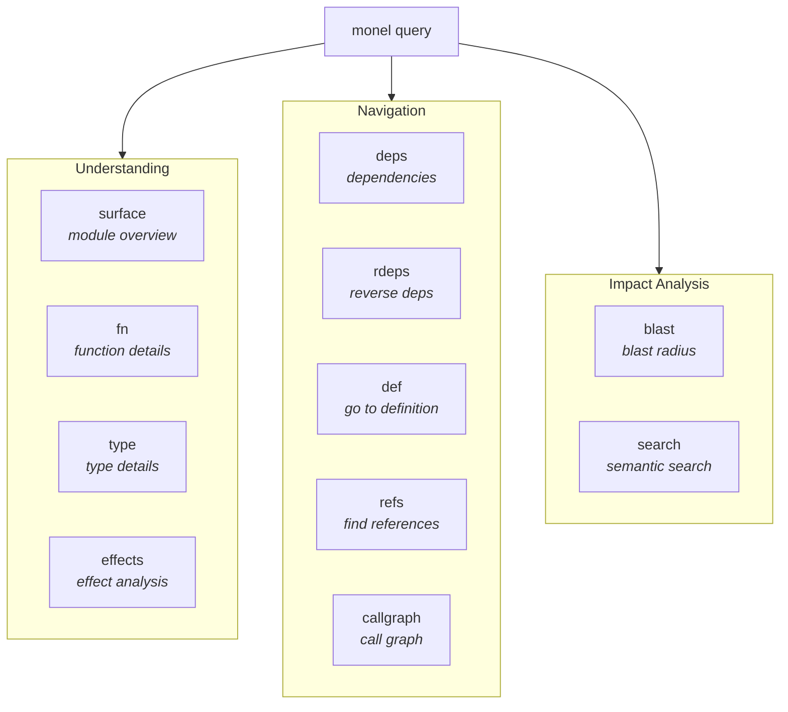

# 11. Tooling and AI Integration

This chapter specifies Monel's toolchain: the compiler as a query oracle, the context-gathering system, edit-compatible errors, refactoring commands, and the development server. These features replace ad-hoc file searching with structured, semantic queries for AI coding tools.

The design principle: **every question an AI tool would answer by grepping becomes a CLI command**. The compiler knows more about the code than any text search can discover. Monel exposes that knowledge directly.

---

## 11.1 The Query Oracle

The `monel query` command family exposes the compiler's semantic understanding as a CLI. Every subcommand returns structured data suitable for both human consumption and LLM context windows.



### 11.1.1 Output Formats

All query commands support the `--format` flag:

| Format | Flag | Description |
|--------|------|-------------|
| Text | `--format text` | Human-readable, colored terminal output (default) |
| JSON | `--format json` | Machine-readable structured JSON |
| Compact | `--format compact` | Condensed text, no decoration |
| LLM | `--format llm` | Maximum information-per-token, tuned for LLM context windows |

The `llm` format is specifically designed to maximize semantic density within a token budget:
- No blank lines or decorative separators.
- Abbreviated keywords (`fn` not `function`, `T` not `Type`).
- Omits information recoverable from context (e.g., module name when already scoped).
- Uses a consistent, terse syntax that LLMs can parse reliably.
- Includes structural markers (`>>>`, `---`, `<<<`) that models attend to strongly.

Example — `monel query surface std/json --format llm`:

```
>>>std/json
fn parse<T:Deserialize>(s: String)->Result<T,JsonError>
fn parse_value(s: String)->Result<JsonValue,JsonError>
fn to_string<T:Serialize>(v:&T)->String
fn to_string_pretty<T:Serialize>(v:&T)->String
fn from_value<T:Deserialize>(v:JsonValue)->Result<T,JsonError>
fn to_value<T:Serialize>(v:&T)->Result<JsonValue,JsonError>
type JsonValue=Null|Bool(Bool)|Number(Float64)|String(String)|Array(Vec<JsonValue>)|Object(Map<String,JsonValue>)
type JsonError{msg:String,line:Int,col:Int}
trait Serialize{fn serialize(&self,s:&mut Serializer)->Result<(),JsonError>}
trait Deserialize{fn deserialize(d:&mut Deserializer)->Result<Self,JsonError>}
<<<
```

Compared to `--format text`:

```
Module: std/json
Public API:

  Functions:
    fn parse<T: Deserialize>(s: String) -> Result<T, JsonError>
    fn parse_value(s: String) -> Result<JsonValue, JsonError>
    fn to_string<T: Serialize>(v: &T) -> String
    ...
```

### 11.1.2 Understanding Code

#### `monel query surface <module>`

Returns the public API surface of a module: all exported types, functions, traits, and constants with their signatures.

```bash
monel query surface std/net
monel query surface std/net --format llm
monel query surface myapp/handler --include-contracts  # include contract annotations
```

Options:
- `--include-contracts` — include `doc:`, `fails:`, and `panics:` annotations.
- `--include-private` — include non-exported items.
- `--depth N` — for nested modules, recurse N levels deep (default 1).

#### `monel query fn <module>::<fn>`

Returns the full contract for a function: signature, contracts, effects, source location, and body (if requested).

```bash
monel query fn std/json::parse
monel query fn myapp/handler::process_request --with-body
monel query fn myapp/handler::process_request --format json
```

Output includes:
- Full type signature with generic constraints.
- Contract block (`doc`, `fails`, `panics`, `safety`).
- Declared and transitive effects.
- Source file and line number.
- Parity status (verified, pending, failed) when contracts are present.
- Optionally, the implementation body (`--with-body`).

#### `monel query type <module>::<type>`

Returns a complete type definition: fields/variants, trait implementations, associated functions, and contracts.

```bash
monel query type std/net::TcpStream
monel query type myapp/model::User --format llm
```

Output includes:
- Type definition (struct fields, enum variants).
- Trait implementations.
- Associated functions and methods.
- Contract annotations.
- Size and alignment (with `--layout`).

#### `monel query effects <module>::<fn>`

Returns the transitive effect set for a function — every effect it produces, directly or through callees.

```bash
monel query effects myapp/handler::process_request
```

Output:

```
myapp/handler::process_request
  direct: [Db.read, Db.write, Log]
  transitive:
    via myapp/db::query -> [Db.read, Net.connect]
    via myapp/auth::verify -> [Crypto, Db.read]
  full set: [Db.read, Db.write, Log, Net.connect, Crypto]
```

### 11.1.3 Navigation

#### `monel query deps <module>`

Returns the dependency graph for a module.

```bash
monel query deps myapp/handler
monel query deps myapp/handler --transitive    # full closure
monel query deps myapp/handler --format json
```

#### `monel query rdeps <module>`

Returns the reverse dependency graph — which modules depend on this one.

```bash
monel query rdeps std/json
monel query rdeps myapp/model --transitive
```

#### `monel query def <symbol>`

Go-to-definition: returns the file and line where a symbol is defined.

```bash
monel query def std/json::parse          # function
monel query def myapp/model::User        # type
monel query def myapp/model::User.name   # field
```

Output:

```
std/json/mod.mn:42
```

With `--format json`:

```json
{
  "symbol": "std/json::parse",
  "file": "std/json/mod.mn",
  "line": 42,
  "col": 1,
  "kind": "function"
}
```

#### `monel query refs <symbol>`

Find all references to a symbol across the codebase.

```bash
monel query refs std/json::parse
monel query refs myapp/model::User --kind type   # only type references
monel query refs myapp/model::User --kind value  # only value references
```

#### `monel query callgraph <fn>`

Returns the call graph rooted at a function.

```bash
monel query callgraph myapp/handler::process_request
monel query callgraph myapp/handler::process_request --depth 2
monel query callgraph myapp/handler::process_request --format json
```

Output:

```
myapp/handler::process_request
  ├─ myapp/auth::verify
  │   ├─ myapp/db::find_user
  │   └─ std/crypto::verify_hash
  ├─ myapp/db::query
  │   └─ std/net::tcp_connect
  └─ myapp/handler::format_response
```

### 11.1.4 Impact Analysis

#### `monel query blast <symbol>`

Returns the "blast radius" — everything that could break if a symbol changes.

```bash
monel query blast myapp/model::User
monel query blast myapp/model::User.email
monel query blast myapp/handler::process_request --format json
```

Output:

```
myapp/model::User
  direct dependents: 14 functions in 6 modules
  transitive dependents: 47 functions in 12 modules
  affected tests: 23
  affected contracts: 14
  risk: high (public type, widely used)

  modules affected:
    myapp/handler — 5 functions
    myapp/db — 3 functions
    myapp/auth — 2 functions
    myapp/api — 4 functions
    ...
```

#### `monel query blast --changed`

Computes the blast radius of all uncommitted changes (uses `git diff` internally).

```bash
monel query blast --changed
monel query blast --changed --format json
monel query blast --changed --since <commit>
```

This is the single most valuable command for AI coding tools. Before making changes, an LLM can assess impact; after making changes, it can verify the blast radius is acceptable.

### 11.1.5 Semantic Search

#### `monel query search`

Search by type signature, effect, or contract description.

```bash
# Search by type signature
monel query search --type "Int -> String"
monel query search --type "Vec<T> -> Iterator<T>"
monel query search --type "Result<T, E> -> Option<T>"

# Search by effect
monel query search --effect "Net.listen"
monel query search --effect "Db.read, Db.write"

# Search by doc description (regex on doc: field)
monel query search --doc "parse.*JSON"
monel query search --doc "validate.*email"

# Combined
monel query search --type "String -> Result<*, *>" --effect "Net"
```

Type search supports wildcards (`*`), type variables, and structural matching (a query `A -> B` matches any function that takes `A` and returns `B`, regardless of other parameters).

---

## 11.2 Smart Context Gathering

The `monel context` command computes the minimal set of files an AI tool needs to accomplish a task.

### 11.2.1 Natural Language Context

```bash
monel context "Add rate limiting to the HTTP handler"
```

Output:

```json
{
  "primary_files": [
    {"path": "src/handler.mn", "reason": "HTTP handler (contracts + implementation)"}
  ],
  "reference_files": [
    {"path": "src/middleware.mn", "reason": "existing middleware pattern"},
    {"path": "src/config.mn", "reason": "configuration types"},
    {"path": "std/time/mod.mn", "reason": "Duration, Instant types"}
  ],
  "affected": [
    {"path": "src/handler.mn.test", "reason": "handler tests need updating"},
    {"path": "src/middleware.mn", "reason": "may need new middleware contract"}
  ],
  "suggested_reading_order": [
    "src/middleware.mn",
    "src/handler.mn",
    "src/config.mn"
  ],
  "estimated_tokens": 4200
}
```

This command uses the compiler's dependency graph and module index to determine relevance. When an LLM is configured (`[llm]` in `monel.project`), it uses embedding-based similarity for natural language queries. Without an LLM, it falls back to keyword matching against `doc:` fields.

### 11.2.2 Symbol-Based Context

```bash
monel context --for myapp/handler::process_request
monel context --for myapp/model::User
```

This variant does not require an LLM. It uses the compiler's pre-built index to gather:
- The symbol's definition and contracts.
- Direct dependencies (types referenced, functions called).
- Trait implementations used.
- Relevant test files.

### 11.2.3 Context Options

```bash
monel context "task description" --budget 8000         # token budget limit
monel context "task description" --include-tests       # include test files
monel context "task description" --include-deps        # include dependency source
monel context "task description" --depth 2             # dependency depth
monel context --for <symbol> --format json             # machine-readable
monel context --for <symbol> --format llm              # LLM-optimized
```

The `--budget` flag causes the context gatherer to prioritize files by relevance and truncate when the estimated token count exceeds the budget.

---

## 11.3 Edit-Compatible Compiler Errors

Every compiler error includes machine-actionable fix suggestions. This enables AI tools to apply fixes directly without parsing human-readable error messages.

### 11.3.1 Error Format

Standard error output (for humans):

```
error[E0312]: missing effect declaration
  --> src/handler.mn:15:3
   |
15 |   db.query(sql)
   |   ^^^^^^^^^^^^^ this call has effect `Db.read`
   |
   = help: add `Db.read` to the function's effect list
   = fix: change line 10 from:
          fn process(req: Request) -> Response
          to:
          fn process(req: Request) -> Response with Db.read
```

JSON error output (`monel check --format json`):

```json
{
  "errors": [
    {
      "code": "E0312",
      "severity": "error",
      "message": "missing effect declaration",
      "file": "src/handler.mn",
      "line": 15,
      "col": 3,
      "span": {"start": 342, "end": 355},
      "labels": [
        {
          "message": "this call has effect `Db.read`",
          "file": "src/handler.mn",
          "line": 15,
          "col": 3
        }
      ],
      "fix": {
        "description": "add `Db.read` to the function's effect list",
        "edits": [
          {
            "file": "src/handler.mn",
            "old_string": "fn process(req: Request) -> Response",
            "new_string": "fn process(req: Request) -> Response with Db.read"
          }
        ]
      },
      "related": [
        {
          "message": "effect originates here",
          "file": "src/db.mn",
          "line": 8,
          "col": 1
        }
      ]
    }
  ]
}
```

### 11.3.2 Fix Edit Structure

Every fix contains one or more edits, each with `old_string` and `new_string`:

```json
{
  "file": "path/to/file.mn",
  "old_string": "exact text to find and replace",
  "new_string": "replacement text"
}
```

This format is directly compatible with the edit operations used by AI coding tools (Claude Code, Cursor, Copilot, etc.). An AI tool can apply fixes by performing exact string replacement — no line-number arithmetic, no parsing, no ambiguity.

### 11.3.3 Fix Categories

Fixes are categorized by confidence:

| Category | Description | Auto-applicable |
|----------|-------------|-----------------|
| `certain` | The fix is unambiguously correct | Yes |
| `suggested` | The fix is likely correct but has alternatives | With confirmation |
| `possible` | One of several possible fixes | No — requires choice |

```json
{
  "fix": {
    "category": "certain",
    "description": "add missing import",
    "edits": [...]
  },
  "alternatives": [
    {
      "category": "possible",
      "description": "use fully qualified name instead",
      "edits": [...]
    }
  ]
}
```

### 11.3.4 Batch Fix Application

```bash
monel fix                         # apply all 'certain' fixes
monel fix --all                   # apply all fixes including 'suggested'
monel fix --error E0312           # apply fixes for specific error code
monel fix --dry-run               # show what would be applied
monel fix --format json           # output applied changes as JSON
```

---

## 11.4 Refactoring Commands

The `monel refactor` family provides semantic refactoring operations. Unlike text-based find-and-replace, these understand the language structure: they rename across modules, update imports, adjust contracts, and preserve formatting.

### 11.4.1 Rename

```bash
monel refactor rename myapp/model::User myapp/model::Account
monel refactor rename myapp/model::User.email myapp/model::User.email_address
monel refactor rename myapp/handler::process myapp/handler::handle_request
```

Rename updates:
- The definition site.
- All references across the codebase.
- Import statements.
- Test files.
- Documentation comments.

Options:
- `--dry-run` — show changes without applying.
- `--format json` — output changes as JSON edits.

### 11.4.2 Move

```bash
monel refactor move myapp/handler::validate myapp/validation
monel refactor move myapp/handler::RateLimit myapp/middleware
```

Move transfers a symbol to a different module, updating:
- The definition (moves code to target module file).
- All import statements.
- Re-exports if the symbol was part of the public API.

### 11.4.3 Extract Function

```bash
monel refactor extract src/handler.mn:25-40 validate_input
monel refactor extract src/handler.mn:25-40 validate_input --module myapp/validation
```

Extract takes a range of lines and lifts them into a new function. The compiler:
- Analyzes which variables are read (become parameters).
- Analyzes which variables are written (become return values or `&mut` parameters).
- Determines the effect set of the extracted code.
- Generates a contract stub for the new function.
- Replaces the original lines with a call to the new function.

### 11.4.4 Change Signature

```bash
monel refactor signature myapp/handler::process --add "timeout: Duration = 30s"
monel refactor signature myapp/handler::process --remove "legacy_flag"
monel refactor signature myapp/handler::process --reorder "req, ctx, timeout"
monel refactor signature myapp/handler::process --rename-param "req" "request"
```

Change signature updates:
- The function definition.
- All call sites (adding default values for new parameters, removing arguments for deleted parameters).
- Contracts in the same file.
- Test files.

### 11.4.5 Split Module

```bash
monel refactor split myapp/handler --extract process_request,validate_input --into myapp/request_handler
monel refactor split myapp/handler --extract "rate_*" --into myapp/rate_limiter
```

Split extracts functions from one module into a new module, creating:
- A new module file with the extracted functions and their contracts.
- Updated imports in all affected modules.
- Re-exports from the original module (optional, with `--re-export`).

### 11.4.6 Common Options

All refactoring commands support:

| Flag | Description |
|------|-------------|
| `--dry-run` | Show changes without applying |
| `--format json` | Output changes as JSON edits |
| `--format text` | Output changes as unified diff |
| `--no-test` | Skip test file updates |
| `--interactive` | Confirm each change |

---

## 11.5 Incremental Verification

The `monel check` command supports fine-grained incremental verification.

### 11.5.1 Scope Control

```bash
monel check                           # full check
monel check --changed                 # only files changed since last check
monel check --fn myapp/handler::process  # single function
monel check --module myapp/handler    # single module
monel check --parity                  # only parity verification
monel check --types                   # only type checking
monel check --effects                 # only effect checking
```

### 11.5.2 Verification Stages

`monel check` runs verification in stages, any of which can be run independently:

| Stage | Flag | Description | Typical Time |
|-------|------|-------------|--------------|
| 1. Parse | `--parse` | Syntax validation | < 10ms |
| 2. Types | `--types` | Type checking and inference | < 50ms |
| 3. Effects | `--effects` | Effect checking and propagation | < 20ms |
| 4. Safety | `--safety` | Borrow checking, lifetime analysis | < 50ms |

Parity verification (`--parity`) checks contract/implementation correspondence deterministically: signature matching, effect coverage, contract syntax, and `requires:`/`ensures:` clauses via SMT. It runs as part of `monel check` but is not a numbered pipeline stage. No LLM is involved in the build pipeline.

### 11.5.3 Check Output

```bash
monel check --format json
```

```json
{
  "status": "fail",
  "stages": {
    "parse": {"status": "pass", "duration_ms": 3},
    "types": {"status": "pass", "duration_ms": 18},
    "effects": {"status": "fail", "duration_ms": 12, "errors": 1},
    "safety": {"status": "pass", "duration_ms": 22}
  },
  "parity": {"status": "skip", "reason": "blocked by effects failure"},
  "errors": [...],
  "warnings": [...],
  "total_duration_ms": 55
}
```

### 11.5.4 Content-Addressed Caching

Verification results are cached per function hash. The hash includes:
- The function's AST (normalized).
- The function's contracts (if any).
- The signatures of all functions called (transitive).
- The effect set.
- The compiler version.

If a function's hash has not changed since the last successful verification, it is skipped. This enables sub-100ms incremental checks for typical edits.

```bash
monel check --cache-stats
```

```
Cache: 342/350 functions cached (97.7%)
  Invalidated: 8 functions (3 changed, 5 transitive)
  Check time: 12ms (vs 890ms uncached)
```

---

## 11.6 Semantic Diff

The `monel diff` command provides structured, symbol-level diffs.

### 11.6.1 Basic Usage

```bash
monel diff                            # diff working tree
monel diff --staged                   # diff staged changes
monel diff HEAD~1                     # diff against previous commit
monel diff main..feature              # diff between branches
```

### 11.6.2 Structured Output

Unlike `git diff`, `monel diff` understands the language structure:

```bash
monel diff --format json
```

```json
{
  "changes": [
    {
      "kind": "modified",
      "symbol": "myapp/handler::process_request",
      "symbol_kind": "function",
      "file": "src/handler.mn",
      "signature_changed": true,
      "old_signature": "fn process_request(req: Request) -> Response",
      "new_signature": "fn process_request(req: Request, ctx: Context) -> Response",
      "effects_changed": true,
      "old_effects": ["Db.read"],
      "new_effects": ["Db.read", "Log"],
      "contracts_updated": false,
      "parity_status": "broken",
      "blast_radius": 14
    },
    {
      "kind": "added",
      "symbol": "myapp/handler::RateLimit",
      "symbol_kind": "struct",
      "file": "src/handler.mn",
      "has_contracts": false
    },
    {
      "kind": "removed",
      "symbol": "myapp/handler::legacy_process",
      "symbol_kind": "function",
      "file": "src/handler.mn"
    }
  ],
  "summary": {
    "added": 1,
    "modified": 1,
    "removed": 1,
    "parity_broken": 1,
    "total_blast_radius": 14
  }
}
```

### 11.6.3 Semantic Diff for Review

```bash
monel diff --format text
```

```
Modified: myapp/handler::process_request
  Signature: + ctx: Context parameter
  Effects:   + Log
  Parity:    BROKEN (contracts not updated)
  Blast:     14 functions affected

Added: myapp/handler::RateLimit (struct)
  Contracts: MISSING

Removed: myapp/handler::legacy_process
  Refs:      0 remaining references (safe to remove)
```

---

## 11.7 AI-Assisted Commands

These commands integrate with configured LLMs for code generation and explanation. All are optional — the core toolchain works without an LLM.

### 11.7.1 `monel sketch`

Generates a contract stub from a natural-language description:

```bash
monel sketch "function that rate-limits HTTP requests by IP address"
```

Output:

```
fn rate_limit(req: &HttpRequest, config: &RateLimitConfig) -> Result<Unit, RateLimitError>
  doc: "checks if the request's IP address has exceeded the rate limit"
  fails: "if the IP has exceeded the configured requests per window"
  effects: [Time.now, Cache.read, Cache.write]
  panics: never
```

Options:
- `--module <mod>` — generate in the context of a specific module.
- `--output <file>` — write to file instead of stdout.

### 11.7.2 `monel explain`

Generates a natural-language explanation of code:

```bash
monel explain myapp/handler::process_request
monel explain src/handler.mn:25-40
monel explain --diff HEAD~1           # explain recent changes
```

### 11.7.3 `monel generate`

Generates an implementation from contracts in a `.mn` file:

```bash
monel generate src/handler.mn::rate_limit
monel generate src/handler.mn                        # all unimplemented contracts
```

The generated implementation:
- Satisfies the contract's type signature and effect declarations.
- Passes parity verification (deterministic checks).
- Is written into the same `.mn` file.
- Requires human review before committing.

### 11.7.4 `monel regen`

Regenerates a specific function's implementation, preserving the contracts:

```bash
monel regen myapp/handler::process_request
monel regen myapp/handler::process_request --reason "optimize for throughput"
```

This is useful when:
- The implementation has drifted from the contracts.
- Performance requirements have changed.
- The coding style should be updated.

---

## 11.8 CLI Command Reference

### 11.8.1 `monel init`

Initialize a new Monel project:

```bash
monel init                         # interactive setup
monel init --name myapp            # non-interactive
monel init --template lib          # library template
monel init --template cli          # CLI application template
monel init --template web          # web service template
```

Creates:
- `monel.project` — project configuration.
- `src/main.mn` — entry point (for applications).
- `src/lib.mn` — library root (for libraries).

### 11.8.2 `monel sync`

Install all project dependencies, dev dependencies, and tool binaries:

```bash
monel sync              # install deps + dev-deps + tools + dev-tools
monel sync --prod       # install deps only (no dev-deps, no tools)
monel sync --tools      # install/update tools only
```

`monel sync` is the single command that makes a freshly cloned project ready to build and run. It resolves library dependencies, fetches dev dependencies, and installs project-scoped tool binaries into `.monel/tools/`. The command is idempotent -- running it when everything is already installed completes in sub-100ms.

The `--prod` flag restricts installation to `[dependencies]` only, skipping dev dependencies and tools. This is intended for production container builds and CI release pipelines.

For full specification of tool dependencies and binary resolution, see Chapter 7, Section 7.7.4.

### 11.8.3 `monel build`

Compile the project:

```bash
monel build                        # debug build
monel build --release              # optimized build
monel build --target wasm32        # cross-compile to WASM
monel build --target native        # native binary (default)
monel build --emit llvm-ir         # emit LLVM IR
monel build --emit asm             # emit assembly
monel build --timings              # show compilation timing breakdown
```

### 11.8.4 `monel check`

See [Section 11.5](#115-incremental-verification).

### 11.8.5 `monel test`

Run tests:

```bash
monel test                              # all tests
monel test --module myapp/handler       # tests for a module
monel test --fn myapp/handler::test_process  # single test
monel test --filter "rate_limit"        # filter by name
monel test --changed                    # only tests affected by changes
monel test --coverage                   # with code coverage
monel test --property                   # only property-based tests
monel test --format json                # machine-readable results
monel test --gen-contract-tests         # generate property tests from contracts
monel test --gen-contract-tests src/auth.mn  # for specific file
monel test --gen-llm-tests src/auth.mn  # LLM generates additional tests (requires [llm] config)
```

### 11.8.6 `monel audit`

Security and safety auditing:

```bash
monel audit                        # full audit
monel audit unsafe                 # all unsafe blocks (see 10.11.3)
monel audit deps                   # dependency vulnerability scan
monel audit effects                # effect usage report
monel audit --format json
```

### 11.8.7 `monel semver-check`

Verify semantic versioning compliance:

```bash
monel semver-check                 # compare public API against last release
monel semver-check --baseline 1.2.0  # compare against specific version
```

Detects:
- Removed public symbols (breaking).
- Changed type signatures (breaking).
- Added required parameters (breaking).
- Changed effect sets (breaking if effects added).
- New public symbols (minor).
- Bug fixes with no API changes (patch).

### 11.8.8 `monel metrics`

Code quality metrics:

```bash
monel metrics                      # project summary
monel metrics --module myapp/handler
monel metrics --format json
```

Outputs:
- Lines of code (implementation, contracts, test).
- Contract coverage (% of functions with contracts).
- Parity status (% verified, % pending, % failed).
- Effect density (effects per function).
- Unsafe density (unsafe blocks per module).
- Test coverage.
- Dependency count and depth.

### 11.8.9 `monel dev`

Development server with watch mode. See [Section 11.9](#119-development-server).

### 11.8.10 `monel repl`

Interactive REPL:

```bash
monel repl                         # standalone REPL
monel repl --module myapp/handler  # REPL with module in scope
```

The REPL supports:
- Expression evaluation.
- Type queries (`:type <expr>`).
- Effect queries (`:effects <expr>`).
- Contract checking — `requires`/`ensures` contracts are checked at runtime.
- Parity checking — if contracts are in scope, the REPL verifies that evaluated expressions satisfy them.
- Loading and reloading modules (`:load`, `:reload`).

---

## 11.9 Development Server (`monel dev`)

The `monel dev` command runs a persistent development server that provides fast feedback during development.

### 11.9.1 Watch Mode

```bash
monel dev                          # start dev server
monel dev --port 4567              # LSP port
monel dev --no-hot-swap            # disable hot-swapping
monel dev --no-overlay             # disable error overlay
```

On file change, the dev server:
1. **Incrementally rebuilds** — only recompiles changed functions and their transitive dependents. Target: sub-100ms for deterministic checks.
2. **Runs parity checks** — verifies that changed implementations still match their contracts.
3. **Hot-swaps safe functions** — replaces function implementations in the running program without restart (see below).
4. **Updates error overlay** — displays errors in a terminal overlay or LSP diagnostics.
5. **Streams live effect visualization** — shows which effects are being exercised in real time.

### 11.9.2 Function-Level Hot-Swap

The dev server can hot-swap individual functions in a running program. Hot-swap eligibility depends on the function's effect set:

| Effect Category | Hot-Swap | Reason |
|----------------|----------|--------|
| Pure (no effects) | Automatic | No side effects, always safe |
| Read-only effects (`Db.read`, `Fs.read`) | Automatic | No state mutation |
| Write effects (`Db.write`, `Fs.write`) | Confirmed | May affect persisted state |
| `unsafe` | Confirmed + invariant check | Safety invariants may change |
| `Gpu` | Full restart | GPU state cannot be partially swapped |

Hot-swap notification:

```
[hot-swap] 3 functions updated:
  ✓ myapp/handler::format_response (pure → auto)
  ✓ myapp/handler::process_request (Db.read → auto)
  ? myapp/handler::save_result (Db.write → confirm? [y/n])
```

### 11.9.3 Snapshot-Restore

For stateful applications (terminal emulators, editors), the dev server supports snapshot-restore:

```bash
monel dev --snapshot
```

On restart:
1. The application state is serialized to a snapshot.
2. The new binary is compiled.
3. The application is restarted and state is deserialized.
4. The application resumes from where it left off.

This requires that the application's state types implement `Serialize` and `Deserialize`.

### 11.9.4 Live Parity Feedback

During `monel dev`, the dev server continuously checks parity between contracts and implementation. Results stream to the LSP client:

- Green: parity verified.
- Yellow: parity pending (contracts or implementation changed, not yet verified).
- Red: parity broken (implementation does not match contracts).

### 11.9.5 Error Overlay

For terminal applications, `monel dev` injects a transparent error overlay that displays:
- Compile errors with source location.
- Parity violations.
- Runtime panics with stack trace.

The overlay is non-intrusive: it appears in a corner of the terminal and auto-dismisses when errors are resolved.

---

## 11.10 Concrete Impact: Tool Call Comparison

This section quantifies the tooling advantage by comparing the number of tool calls needed for a common task: "Add rate limiting to the HTTP handler."

### 11.10.1 Traditional Language (e.g., Go, TypeScript)

An AI tool must:

1. Search for HTTP handler files (`grep`, `find`) — 2-3 calls.
2. Read candidate files to find the right one — 2-3 calls.
3. Understand the handler signature and middleware pattern — 1-2 calls.
4. Search for existing rate limiting code — 1-2 calls.
5. Search for configuration patterns — 1-2 calls.
6. Read test files to understand testing patterns — 1-2 calls.
7. Search for import conventions — 1 call.
8. Read related middleware for patterns — 1-2 calls.
9. Apply changes — 3-5 calls (handler, config, tests, etc.).
10. Run tests and fix errors — 2-5 calls.

**Total: ~15-30 tool calls**, many of which are speculative searches.

### 11.10.2 Monel

An AI tool uses structured commands:

1. `monel context "Add rate limiting"` — 1 call (returns exact file set).
2. Read primary file (handler contracts + implementation) — 1 call.
3. `monel query surface myapp/middleware --format llm` — 1 call (middleware patterns).
4. `monel sketch "rate limit by IP"` — 1 call (generates contract stub).
5. `monel generate rate_limit` — 1 call (generates implementation from contracts).
6. `monel check --changed --format json` — 1 call (verify, get actionable fixes).
7. `monel fix` — 0-1 calls (auto-apply certain fixes).

**Total: ~6-8 tool calls**, all targeted and productive.

The reduction comes from eliminating speculative searches. The compiler knows the codebase structure; the AI tool queries it directly instead of guessing.

---

## 11.11 LSP Integration

The Monel language server (`monel lsp`) exposes all query and refactoring capabilities through the Language Server Protocol.

### 11.11.1 Standard LSP Features

- Diagnostics (real-time error reporting).
- Go to definition / Find references.
- Hover information (type, contracts, effects).
- Code completion (type-aware, effect-aware).
- Signature help.
- Code actions (fix suggestions from Section 11.3).
- Rename (uses `monel refactor rename` internally).
- Formatting.

### 11.11.2 Custom LSP Extensions

- `monel/parity` — parity status for current file.
- `monel/effects` — effect visualization for current function.
- `monel/blast` — blast radius for symbol under cursor.
- `monel/context` — context gathering for selected code.
- `monel/contracts` — show/edit contracts for current function.
- `monel/hotswap` — hot-swap status and confirmation.

### 11.11.3 Editor Integration

The LSP server supports any editor that implements LSP. First-class integrations:
- VS Code extension (`monel-vscode`).
- Neovim plugin (`monel.nvim`).
- Zed extension.
- Helix (built-in LSP support).
- Monel's own editor (when built).
