# Monel — Claims Map

Every claim that supports Monel's value proposition, with evidence status and prior art.

```mermaid
graph LR
    classDef proven fill:#2d6a2d,stroke:#1a4a1a,color:#fff
    classDef partial fill:#8a6d1b,stroke:#5a4512,color:#fff
    classDef hypo fill:#8a1b1b,stroke:#5a1212,color:#fff
    classDef prior fill:#1b4a8a,stroke:#12305a,color:#fff
    classDef value fill:#4a1b6a,stroke:#301245,color:#fff

    VP["<b>VALUE PROP</b><br/>Compiler verifies what you specified.<br/>Tests find what you forgot to specify."]:::value

    %% ─── Pillar 1: Contract Verification ───
    P1["<b>PILLAR 1</b><br/>Contracts verified<br/>at compile time"]:::value
    VP --> P1

    C1A["SMT proves requires:/ensures:<br/>for all valid inputs"]:::hypo
    C1B["Per-error-variant postconditions<br/>err(X) => state unchanged"]:::hypo
    C1C["Type invariants enforced<br/>after every mutation"]:::hypo
    C1D["panics: never — compiler proves<br/>no reachable panic"]:::hypo
    C1E["complexity: O(n) — optimizer<br/>constraint, not just annotation"]:::hypo
    C1F["old() references in postconditions"]:::hypo

    P1 --> C1A & C1B & C1C & C1D & C1E & C1F

    PA1["🔵 SPARK Ada: Exceptional_Cases<br/>+ 'Old since SPARK 24"]:::prior
    PA2["🔵 Prusti: ensures + old()<br/>+ panic freedom for Rust"]:::prior
    PA3["🔵 Dafny/Verus: full SMT proof<br/>but high annotation burden"]:::prior
    PA4["🔵 Eiffel: invariant + old<br/>but no per-exception contracts"]:::prior

    C1B -.->|"prior art"| PA1
    C1B -.->|"prior art"| PA2
    C1A -.->|"prior art"| PA3
    C1F -.->|"prior art"| PA4

    %% ─── Pillar 2: Effect System ───
    P2["<b>PILLAR 2</b><br/>First-class<br/>effect tracking"]:::value
    VP --> P2

    C2A["Compiler infers effects from body,<br/>checks against declared effects:"]:::hypo
    C2B["Effect implication DAG<br/>Db.write implies Db.read"]:::proven
    C2C["Forbidden effect combinations<br/>Crypto.decrypt + Net.send"]:::hypo
    C2D["Effect budgets — compile-time<br/>instrumentation for runtime limits"]:::hypo
    C2E["Effect-aware codegen optimization<br/>pure → memoize, reorder, parallelize"]:::hypo

    P2 --> C2A & C2B & C2C & C2D & C2E

    PA5["🔵 Koka: algebraic effects<br/>research language, not production"]:::prior
    PA6["🔵 Effect-TS: monadic effects<br/>requires full code rewrite"]:::prior

    C2A -.->|"prior art"| PA5
    C2A -.->|"prior art"| PA6

    %% ─── Pillar 3: AI Agent Efficiency ───
    P3["<b>PILLAR 3</b><br/>AI agents work<br/>more efficiently"]:::value
    VP --> P3

    C3A["monel query context — minimal<br/>token set for any symbol"]:::hypo
    C3B["Contracts reduce agent tool<br/>calls ~2x vs Rust"]:::proven
    C3C["Edit-compatible errors with<br/>old_string/new_string suggestions"]:::hypo
    C3D["--format llm output with<br/>structural markers"]:::hypo
    C3E["Agent reads contracts first,<br/>gets effects/panics/errors upfront"]:::proven

    P3 --> C3A & C3B & C3C & C3D & C3E

    %% ─── Pillar 4: Verification Coverage ───
    P4["<b>PILLAR 4</b><br/>Proven or tested<br/>coverage metric"]:::value
    VP --> P4

    C4A["Compiler tracks: SMT-proven<br/>vs property-tested vs uncovered"]:::hypo
    C4B["Contract-driven test generation<br/>monel test --gen-contract-tests"]:::hypo
    C4C["Metric: (proven ∪ tested)<br/>/ total behavior"]:::hypo

    P4 --> C4A & C4B & C4C

    %% ─── Pillar 5: Integration ───
    P5["<b>PILLAR 5</b><br/>Purpose-built integration<br/>(the actual differentiator)"]:::value
    VP --> P5

    C5A["Contracts + effects + code<br/>in one file, one grammar"]:::proven
    C5B["No bolted-on annotations —<br/>first-class syntax"]:::proven
    C5C["Compiler exploits verification<br/>in codegen (panics elim, etc.)"]:::hypo
    C5D["Single parser, single AST —<br/>no annotation/language mismatch"]:::hypo

    P5 --> C5A & C5B & C5C & C5D

    %% ─── Foundational Claims ───
    F["<b>FOUNDATIONS</b><br/>(must be true for<br/>anything above to work)"]:::value
    VP --> F

    F1[".mn files can be parsed<br/>into ASTs"]:::hypo
    F2["Lifetime inference without<br/>explicit annotations"]:::hypo
    F3["Indentation-based syntax<br/>is unambiguous"]:::hypo

    F --> F1 & F2 & F3

    %% ─── Proven Infrastructure ───
    I["<b>PROVEN INFRA</b><br/>(running code,<br/>passing tests)"]:::value

    I1["Parity checker catches 5/5<br/>bug classes vs Rust 1/5"]:::proven
    I2["Effect subset checking with<br/>implication expansion"]:::proven
    I3["Generic type matching with<br/>parameter mapping"]:::proven
    I4["12 spec chapters + 5 examples<br/>syntax-consistent"]:::proven

    I --> I1 & I2 & I3 & I4
    I1 -->|"evidence for"| P1
    I2 -->|"evidence for"| P2
    I4 -->|"evidence for"| P5
```

## Legend

| Color | Meaning | Count |
|-------|---------|-------|
| 🟢 Green | **Proven** — running code, passing tests | 8 |
| 🟡 Gold | **Partial** — some evidence, not complete | 0 |
| 🔴 Red | **Hypothetical** — spec only, no code | 18 |
| 🔵 Blue | **Prior art** — another system does this | 6 |
| 🟣 Purple | **Value prop / pillar** — structural | 7 |

## High-Risk Hypotheticals

These three could kill the project if wrong:

| Claim | Risk |
|-------|------|
| **F1: Parser** — `.mn` files can be parsed into ASTs | No parser exists. All ASTs are hand-constructed in tests. If the grammar is ambiguous or indentation-based syntax is unparseable, everything downstream breaks. |
| **F2: Lifetime inference** — 3 elision rules + whole-program analysis | Rust spent years on lifetime inference and still has explicit lifetimes. The spec's "Rule 4: whole-program analysis" is a wish, not a specification. |
| **C1A: SMT verification** — `requires:`/`ensures:` verified by Z3 | Z3 integration is well-understood engineering, but contract expressions need precise semantics. Bounded quantifiers and `old()` references add complexity. |

## Key Takeaway

18 of 26 leaf claims are hypothetical. The entire value proposition rests on:

1. **Foundation F1** (parser) — if the grammar can't be parsed, nothing works
2. **Foundation F2** (lifetime inference) — if this fails, the ownership model breaks
3. **Claim C1A** (SMT verification) — without this, contracts are just documentation

**Pillar 5 (integration) is the actual differentiator.** Every individual capability (contracts, effects, panic proofs, `old()`) exists in another system. Monel's bet is that combining all of them in one purpose-built language with a single grammar produces a meaningfully better experience than bolting them onto existing languages.

## Prior Art Honesty

| Monel claim | Who did it first |
|-------------|-----------------|
| Per-error postconditions | SPARK Ada (`Exceptional_Cases`, 2024) |
| `old()` in postconditions | Eiffel (1986), SPARK (`'Old`) |
| Panic freedom proof | SPARK (absence of runtime errors), Prusti (default goal) |
| SMT contract verification | Dafny (2009), SPARK (2014), Verus (2023) |
| Effect tracking | Koka (2014), Effekt (2020) |
| Contract-driven test gen | QuickCheck (1999), Hypothesis (2013) from type signatures |

None of the prior art combines all six in one language with compiler-exploited codegen.
